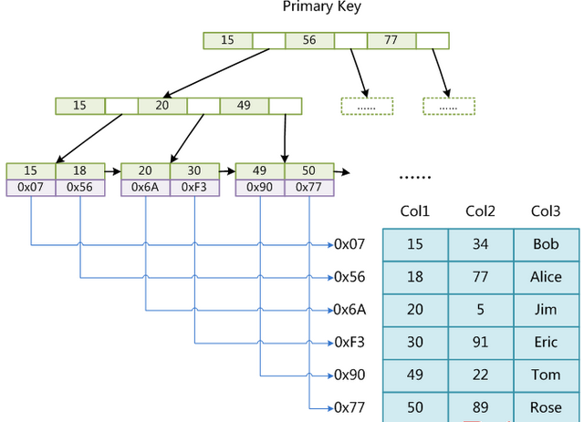

[toc]

# Mysql

时间：2020年6月29日23:20:30 大三下 [疫情]

作者：ndgwww

[官方文档地址](https://www.mysqlzh.com/)

优秀教程：

http://c.biancheng.net/mysql/

https://www.begtut.com/mysql/mysql-drop-user.html

https://www.yiibai.com/mysql/roles.html

https://www.w3cschool.cn/mysql/

## MySQL架构

mysql的与众不同主要体现在**存储引擎的架构**上，**插件式的存储引擎架构将查询处理和其它的系统任务以及数据的存储提取相分离**。这种架构可以根据业务的需求和实际需要选择合适的存储引擎。

**分为4层**

**连接层**：最上层是一些客户端和连接服务。**主要完成一些类似于连接处理、授权认证、及相关的安全方案**。在该层上引入了线程池的概念，为通过认证安全接入的客户端提供线程。同样在该层上可以实现基于SSL的安全链接。服务器也会为安全接入的每个客户端验证它所具有的操作权限。

**服务层**：第二层服务层，主要完成大部分的核心服务功能， 包括查询解析、分析、优化、缓存、以及所有的内置函数，所有跨存储引擎的功能也都在这一层实现，包括触发器、存储过程、视图等

**引擎层**：第三层存储引擎层，存储引擎真正的负责了MySQL中数据的存储和提取，服务器通过API与存储引擎进行通信。不同的存储引擎具有的功能不同，这样我们可以根据自己的实际需要进行选取

**存储层**：第四层为数据存储层，主要是将数据存储在运行于该设备的文件系统之上，并完成与存储引擎的交互

**MySQL基架**（这个可以看一下，我觉得没人要考这个吧太enmmm了）


1. MySQL向外提供的交互接口（Connectors组件）
   - MySQL向外提供的交互组件，如java,.net,php等语言可以通过该组件来操作SQL语句，实现与SQL的交互。
2. 管理服务组件和工具组件(Management Service & Utilities)
   - 提供对MySQL的集成管理，如备份(Backup),恢复(Recovery),安全管理(Security)等
3. 连接池组件(Connection Pool)
   - 负责监听对客户端向MySQL Server端的各种请求，接收请求，转发请求到目标模块
   - 每个成功连接MySQL Server的客户请求都会被创建或分配一个线程，该线程负责客户端与MySQL Server端的通信，接收客户端发送的命令，传递服务端的结果信息等。
4. SQL接口组件(SQL Interface)
   -  接收用户SQL命令，如DML,DDL和存储过程等，并将最终结果返回给用户。
5. 查询分析器组件(Parser)
   -  首先分析SQL命令语法的合法性，并尝试将SQL命令分解成数据结构，若分解失败，则提示SQL语句不合理。
6. 优化器组件（Optimizer）
   -  对SQL命令按照标准流程进行优化分析。
7. 缓存主件（Caches & Buffers）缓存和缓冲组件
8. MySQL存储引擎（专门章节介绍）
9. 物理文件（File System）
   - 实际存储MySQL 数据库文件和一些日志文件等的系统，如Linux，Unix,Windows等。

---


##面试： 一条SQL语句在MySQL中如何执行的？

客户端请求->连接器->查询缓存（存在缓存则直接返回查询结果，不存在则执行后续操作）->分析器->优化器（主要对执行的sql优化选择最优的执行方案方法）->执行器（执行时会先看用户是否有执行权限，有才去使用这个引擎提供的接口）->去引擎层获取数据返回


## MySQL存储引擎

存储引擎是**MySQL的组件**，用于处理不同表类型的SQL操作，不同的存储引擎提供不同的存储机制、索引技巧、锁定水平等功能，使用**不同的存储引擎**，还可以**获得特定的功能**。

**一个数据库中多个表可以使用不同引擎以满足各种性能和实际需求**，（**可以对每一个表使用不同的存储引擎**）使用合适的存储引擎，将会提高整个数据库的性能 。

MySQL服务器使用**可插拔**的存储引擎体系结构，可以从运行中的 MySQL 服务器加载或卸载存储引擎 。


### 设置存储引擎

```mysql
-- 建表时指定存储引擎。默认的就是INNODB，不需要设置
CREATE TABLE t1 (i INT) ENGINE = INNODB;
CREATE TABLE t3 (i INT) ENGINE = MEMORY;
...

-- 修改存储引擎
ALTER TABLE 表名 ENGINE = InnoDB;

-- 修改默认存储引擎，也可以在配置文件my.cnf中修改默认引擎
SET default_storage_engine=NDBCLUSTER;
```


### 查看存储引擎查看

```mysql
-- 查看支持的存储引擎
SHOW ENGINES

-- 查看默认存储引擎
SHOW VARIABLES LIKE 'storage_engine'

--查看具体某一个表所使用的存储引擎，这个默认存储引擎被修改了！
show create table tablename

--准确查看某个数据库中的某一表所使用的存储引擎
show table status like 'tablename'
或者
show table status from database where name="tablename"
```

- Support列的值表示某种引擎是否能使用：YES表示可以使用、NO表示不能使用，**DEFAULT表示该引擎为当前默认的存储引擎** 。
- 可以看到mysql数据库有9种数据库引擎。


### 存储引擎对比

常见的存储引擎就 InnoDB、MyISAM、Memory、NDB。

InnoDB 现在是 MySQL 默认的存储引擎，支持**事务、行级锁定和外键**


1. 如果要提供提交、回滚、崩溃恢复能力的事物安全（ACID兼容）能力，并要求实现并发控制，InnoDB是一个好的选择
2. 如果数据表主要用来插入和查询记录，则MyISAM引擎能提供较**高的处理效率**
3. 如果只是临时存放数据，数据量不大，并且不需要较高的数据安全性，可以选择将数据保存在内存中的Memory引擎，MySQL中使用**该引擎作为临时表，存放查询的中间结果**
4. 如果只有INSERT和SELECT操作，可以选择Archive，Archive支持高并发的插入操作，但是本身不是事务安全的。Archive非常适合存**储归档数据，如记录日志信息可以使用Archive


###  MyISAM 和 InnoDB 的区别（必记）

- InnoDB 支持事务，MyISAM 不支持事务。
  - 这是 MySQL 将默认存储引擎从 MyISAM 变成 InnoDB 的重要原因之一；
- InnoDB 支持外键，而 MyISAM 不支持外键。
  - 对一个包含外键的 InnoDB 表转为 MYISAM 会失败；
- InnoDB 是聚集索引，MyISAM 是非聚集索引。
  - 聚簇索引的文件存放在主键索引的叶子节点上，**因此 InnoDB 必须要有主键**，通过主键索引效率很高。
    - 但是 InnoDB的辅助索引需要两次查询，先查询到主键，然后再通过主键查询到数据，所以主键不应该过大。
  - MyISAM 是非聚集索引，数据文件是分离的，索引保存的是数据文件的指针。**主键索引和辅助索引是独立的**。
- InnoDB **最小的锁粒度是行锁**，MyISAM 最小的锁粒度是**表锁**
  - MyISAM 中一个更新语句会锁住整张表，导致其他查询和更新都会被阻塞，因此并发访问受限。
  - 这也是 MySQL 将默认存储引擎从 MyISAM 变成 InnoDB 的重要原因之一；
- InnoDB **不保存表的具体行数**，MyISAM **用一个变量**保存了整个表的行数。
  - 执行 select count(*) from table 时
  - `InnoDB`需要全表扫描而`MyISAM`只需要读出该变量即可速度很快。


**表格记忆**

<table>
<thead>
<tr>
<th>对比项</th>
<th>MyISAM</th>
<th>InnoDB</th>
</tr>
</thead>
<tbody>
<tr>
<td>主外键</td>
<td>不支持</td>
<td>支持</td>
</tr>
<tr>
<td>事务</td>
<td>不支持</td>
<td>支持</td>
</tr>
<tr>
<td>行表锁</td>
<td>表锁，即使操作一条记录也会锁住整个表，不适合高并发的操作</td>
<td>行锁,操作时只锁某一行，不对其它行有影响，适合高并发的操作</td>
</tr>
<tr>
<td>缓存</td>
<td>只缓存索引，不缓存真实数据</td>
<td>不仅缓存索引还要缓存真实数据，对内存要求较高，而且内存大小对性能有决定性的影响</td>
</tr>
<tr>
<td>表空间</td>
<td>小</td>
<td>大</td>
</tr>
<tr>
<td>关注点</td>
<td>性能</td>
<td>事务</td>
</tr>
<tr>
<td>默认安装</td>
<td>是</td>
<td>是</td>
</tr>
</tbody>
</table>


---


### InnoDB和MyISAM 文件存储结构的区别(了解)

> MySQL中建立任何一张数据表，在其数据目录对应的数据库目录下都有对应表的 `.frm` 文件，`.frm` 文件是用来保存每个数据表的元数据(meta)信息，包括表结构的定义等，与数据库存储引擎无关，也就是任何存储引擎的数据表都必须有`.frm`文件，命名方式为 数据表名.frm，如user.frm。
> 

查看MySQL 数据保存在哪里：`show variables like 'data%'`

MyISAM 物理文件结构为：表定义文件、数据文件、索引文件

- `.frm`文件：与表相关的元数据信息都存放在frm文件，包括表结构的定义信息等

- `.MYD` (`MYData`) 文件：MyISAM 存储引擎专用，用于存储MyISAM 表的数据

- `.MYI` (`MYIndex`)文件：MyISAM 存储引擎专用，用于存储MyISAM 表的索引相关信息

- MyISAM引擎的索引结构为**B+Tree**，其中**数据域存储的内容为实际数据的地址**，也就是说它的索引和实际的数据**是分开的**，只不过是用索引指向了实际的数据，这种索引就是所谓的**非聚集索引**。如下图所示：

  - 
  - `MyISAM`不支持事务，但是这也意味着他的存储速度更快，如果你的读写操作允许有错误数据的话，只是追求速度，可以选择这个存储引擎。

  

InnoDB 物理文件结构为：

- 所有的表都保存在同一个数据文件中（也可能是多个文件，或者是独立的表空间文件），InnoDB表的大小只受限于操作系统文件的大小，一般为2GB。

- InnoDB 的存储文件有两个，后缀名分别是 .frm 和 .idb，其中 .frm 是表的定义文件，而 idb 是数据文件。
  - `.frm` 文件：与表相关的元数据信息都存放在frm文件，包括**表结构的定义信息**等
  - `.ibd` 文件或 `.ibdata` 文件： 这两种文件都是**存放 InnoDB 数据**的文件。
    - 之所以有两种文件形式存放 InnoDB 的数据，是因为 InnoDB 的数据存储方式能够通过配置来决定是使用**共享表空间**存放存储数据，还是用**独享表空间**存放存储数据。
      - 独享表空间存储方式使用`.ibd`文件，并且每个表一个`.ibd`文件。
      - 共享表空间存储方式使用`.ibdata`文件，所有表共同使用一个`.ibdata`文件（或多个，可自己配置）

  

- InnoDB是**事务型数据库**的首选引擎，支持事务安全表（ACID），支持行锁定和外键，上图也看到了，**InnoDB是默认的MySQL引擎**。

- InnoDB是为处理巨大数据量的最大性能设计。

- InnoDB支持外键完整性约束，存储表中的数据时，每张表的存储都按主键顺序存放，如果没有显示在表定义时指定主键，InnoDB会为每一行生成一个6字节的ROWID，并以此作为主键

---


## mysql的ID自增主键（面试题）

> 一张表，里面有ID自增主键，当insert了17条记录之后，删除了第15,16,17条记录，再把Mysql重启，再insert一条记录，这条记录的ID是18还是15 ？

如果是MyISAM，那么是18。因为MyISAM表会把自增主键的最大ID 记录到数据文件中，重启MySQL自增主键的最大ID也不会丢失；

如果是InnoDB，那么是15。因为InnoDB 表只是把自增主键的最大ID记录到内存中，所以重启数据库或对表进行OPTION操作，都会导致最大ID丢失。


## 哪个存储引擎执行 select count(*) 更快(面试)

MyISAM更快，因为MyISAM内部维护了一个计数器，可以直接调取。

- 在 MyISAM 存储引擎中，把表的总行数存储在磁盘上，当执行 select count(*) from t 时，直接返回总数据。
- 在 InnoDB 存储引擎中，跟 MyISAM 不一样，没有将总行数存储在磁盘上，当执行 select count(*) from t 时，会先把数据读出来，一行一行的累加，最后返回总数量。

InnoDB 中 count(*) 语句是在执行的时候，全表扫描统计总数量，所以当数据越来越大时，语句就越来越耗时了。为什么 InnoDB 引擎不像 MyISAM 引擎一样，将总行数存储到磁盘上？

- 这跟 InnoDB 的**事务特性有关**，由于多版本并发控制（MVCC）的原因，InnoDB 表“应该返回多少行”也是不确定的。


----

## InnoDB逻辑存储单元:表空间，段，区，页

上面介绍的是物理结构，这里主要介绍逻辑存储单元。

**InnoDB逻辑存储单元**分为：表空间，段，区，页； 

- **层级关系为：tablespace -> segment -> extent(64个page，1MB)--> page**


### 表空间

InnoDB把**数据保存在表空间内**，表空间可以看作是InnoDB存储引擎逻辑结构的最高层

- 本质上是一个由一个或多个磁盘文件组成的虚拟文件系统。
- Innodb的所有数据保存在一个**单独的表空间**里面，而这个表空间可以**由很多个文件**组成，一个表可以**跨多个文件存在**，所以其大小限制不再是文件大小的限制。
- InnoDB用表空间并不只是存储表和索引，还保存了回滚段、双写缓冲区等。

<u>表空间分为**共享表空间**和**独立表空间**</u>

**共享表空间又称**为`system tablespace系统表空间:`

- **共享表空间:** 每一个数据库的所有的表数据，索引文件全部放在一个文件中，默认这个共享表空间的文件路径在data目录下。
  -  默认的文件名为:ibdata1 **初始化为10M。**
  - 

**独立表空间**

- **每一个表都将会生成以独立的文件方式来进行存储，每一个表都有一个.frm表描述文件，还有一个.ibd文件。 其中这个文件包括了单独一个表的数据内容以及索引内容，默认情况下它的存储位置也是在表的位置之中。**
- 独立表空间文件存储对应表的b+树数据，索引和插入缓冲等信息。其他信息还是储存在默认表空间中。

**共享表空间和独立表空间的区别：**

- 共享表空间以及独立表空间都是针对**数据的存储方式**而言的。
- **共享表空间与独占表空间可以通过参数innodb_file_per_table来转换，若为1，则开启独占表空间，否则，开启共享表存储。**
- 在服务器资源有限,单表数据不是特别多的情况下, 独立表空间明显比共享方式效率更高。
- **独立表空间**：在配置文件（my.cnf）中设置：开启独立表空间的参数: innodb_file_per_table =1
	- 优点：
		- 每个表都有自已独立的表空间。并且可以实现表空间的转移
		- 每个表的数据和索引都会存在自已的表空间中。
		- 空间可以回收使用：alter table Table_Name engine=innodb;或者pt-	online_schema_change命令即可回收不用的空间
		- 对于使用独立表空间的表，不管怎么删除，表空间的碎片不会太严重的影响性能，而且还有机会处理。
	- 缺点：
		- 每个表文件都会有.frm和.ibd文件两个文件描述符，如果单表增长过快容易有性能问题
- **共享表空间**：
  - 优点：
    - 可以放表空间分成多个文件存放到各个磁盘上（表空间文件大小不受表大小的限制，如一个表可以分布在不同步的文件上）。数据和文件放在一起方便管理。
  - 缺点：
    - 共享表空间无法在线回收空间。
    - 所有的数据和索引存放到一个文件中以为着将有一个很常大的文件，虽然可以把一个大文件分成多个小文件，但是多个表及索引在表空间中混合存储，这样对于一个表做了大量删除操作后表空间中将会有大量的空隙，特别是对于统计分析，日值系统这类应用最不适合用共享表空间。

**MySql 5.7后增加了临时表空间temporary tablespace和通用表空间**


### 段（segment）

- 表空间是由各个段组成的，常见的段有数据段、索引段、回滚段等。 每个段是有N个区和32个零散的页组成，段空间拓展是以区为单位进行拓展。通常情况下，创建一个索引的同事会创建两个段，分别为叶子节点和叶子节点段。
- 一个表有几个段了？答案是4个，是索引个数的2倍。


### 区/簇（extent）

- innodb存储引擎对于空间的申请**不是**每次以16KB的方式申请，**而是以区的方式**

- 区是由连续的页（Page）组成的空间，**在任何情况下每个区大小都为1MB**

- 为了保证页的连续性，InnoDB存储引擎每次从磁盘一次申请4-5个区。默认情况下，InnoDB存储引擎的页大小为16KB，即一个区中有64个连续的页。 （1MB／16KB=64）


### 页（Page）

- 页是InnoDB存储引擎磁盘管理的**最小单位**，每个页默认16KB。
- InnoDB存储引擎从1.2.x版本可以通过参数`innodb_page_size`将页的大小设置为4K、8K、16K。
- 若设置完成，则所有表中页的大小都为`innodb_page_size`，**不可以再次对其进行修改**，除非通过mysqldump导入和导出操作来产生新的库。
- 


### 行（row）

页里面有记录着行记录的信息，InnoDB存储引擎是面向列的（row-oriented)，也就是说**数据是按行进行存放的**，每个页存放的行记录也是有硬性定义的，最多允许存放16KB/2-200，即7992行记录。


---


## SQL触发器


> SQL触发器是一种特殊类型的[存储过程](http://www.yiibai.com/mysql/stored-procedure-tutorial.html)。 这是特别的，因为它不像直接像存储过程那样调用。

> > > 触发器和存储过程之间的主要区别在于，当对表执行数据修改事件时，会自动调用触发器，而存储过程必须要明确地调用。

>  触发器尽量少的使用，因为不管如何，它还是很消耗资源，如果使用的话要谨慎的使用，确定它是非常高效的：

> > > 触发器是针对每一行的；对增删改非常频繁的表上切记不要使用触发器，因为它会非常消耗资源。 

---


## MySQL触发语法:`CREATE TRIGGER`

```mysql
CREATE TRIGGER trigger_name 
  trigger_time trigger_event  ON tbl_name
  FOR EACH ROW
BEGIN
 ...
END;
```

参数讲解：

> trigger_name : 触发器名称，用户自行指定
>
> > > 触发器名称应遵循命名约定`[trigger time]_[table name]_[trigger event]`例如before_employees_update。
>
> trigger_time： 触发时机:    BEFORE（之前）、AFTER（之后）
>
> trigger_event : 出发事件，INSERT、UPDATE、DELETE。（插入、更新、删除）
>
> > >由上面，可以知道MYSQL可以创建6种类型的触发器。
> > >（BEFORE INSERT、BEFORE UPDATE、BEFORE DELETE）
> > >（AFTER INSERT、AFTER UODATE、AFTER DELETE）
> > >
> > >并且一张表上不能创建两个相同类型的触发器，因此一张表上面最多能创建6种类型的触发器。
>
> tbl_name : 需要建立触发器的表名。
>
> > > 触发器必须与特定表关联。没有表触发器将不存在
>
> 将SQL语句放在`BEGIN`和`END`块之间。这是定义触发器逻辑的位置。
>
> > > 一个或多个语句，每条语句都必须用分号（;）来结尾(默认值)


例子：

```mysql
DELIMITER $$
CREATE TRIGGER before_employee_update 
    BEFORE UPDATE ON employees
    FOR EACH ROW 
BEGIN
    INSERT INTO employees_audit
    SET action = 'update',
     employeeNumber = OLD.employeeNumber,
        lastname = OLD.lastname,
        changedat = NOW(); 
END$$


```


## Mysql权限与安全

5.7：教程：http://c.biancheng.net/mysql/

### 权限表

mysql通过权限表来控制用户的访问：

- 权限表是指在mysql数据库下的5张表：user, db, tables_priv, columns_priv, procs_priv
- 在安装MySQL时，会自动安装一个名为mysql的数据库，权限表存放在mysql数据库中由Mysql_install_db脚本初始化。

#### user表

它记录了允许连接到服务器的的账户的**账户信息**，里面的权限是全局级的。user表一共42个字段

这些字段分为4类：用户列，权限列，安全列，资源控制列


##### **用户列：**

<u>Host和User字段为user表的**联合主键**。</u>

用户登录时，只有这 3 个字段**同时匹配**，MySQL 数据库系统才会允许其登录。

- 创建新用户时，也是设置这 3 个字段的值。
- 修改用户密码时，实际就是修改 user 表的 authentication_string 字段的值。

| 字段名                | 字段类型 | 是否为空 | 默认值 | 说明   |
| --------------------- | -------- | -------- | ------ | ------ |
| Host                  | char(60) | NO       | 无     | 主机名 |
| User                  | char(32) | NO       | 无     | 用户名 |
| authentication_string | text     | YES      | 无     | 密码   |


(root,%)，%表示可以远程登录，任何登录

(root,localhost)， 表示可以本地登录，即可以在服务器上登陆

(root,127.0.0.1 )，表示可以本机登陆，即可以在服务器上登陆

(root,::1) ， 表示本机可以登陆，::1 是IPv6格式的 127.0.0.1 


##### 权限列:

权限列的字段决定了用户的权限，用来描述在全局范围内允许对数据和数据库进行的操作。

权限大致分为两大类，分别是**高级管理权限**和**普通权限**：

- 高级管理权限主要对数据库进行管理，例如关闭服务的权限、超级权限和加载用户等；
- 普通权限主要操作数据库，例如查询权限、修改权限等

user 表的权限列包括 Select_priv、Insert_ priv 等以 priv 结尾的字段，这些字段值的**数据类型为 ENUM**，

- **可取的值只有 Y 和 N**：Y 表示该用户有对应的权限，N 表示该用户没有对应的权限。从安全角度考虑，这些字段的默认值都为 N。
- 如果要修改权限，可以使用 GRANT 语句为用户赋予一些权限，也可以通过 UPDATE 语句更新 user 表的方式来设置权限。

| 字段名                 | 字段类型      | 是否为空 | 默认值 | 说明                                                         |
| ---------------------- | ------------- | -------- | ------ | ------------------------------------------------------------ |
| Select_priv            | enum('N','Y') | NO       | N      | 是否可以通过SELECT 命令查询数据                              |
| Insert_priv            | enum('N','Y') | NO       | N      | 是否可以通过 INSERT 命令插入数据                             |
| Update_priv            | enum('N','Y') | NO       | N      | 是否可以通过UPDATE 命令修改现有数据                          |
| Delete_priv            | enum('N','Y') | NO       | N      | 是否可以通过DELETE 命令删除现有数据                          |
| Create_priv            | enum('N','Y') | NO       | N      | 是否可以创建新的数据库和表                                   |
| Drop_priv              | enum('N','Y') | NO       | N      | 是否可以删除现有数据库和表                                   |
| Reload_priv            | enum('N','Y') | NO       | N      | 是否可以执行刷新和重新加载MySQL所用的各种内部缓存的特定命令，包括日志、权限、主机、查询和表 |
| Shutdown_priv          | enum('N','Y') | NO       | N      | 是否可以关闭MySQL服务器。将此权限提供给root账户之外的任何用户时，都应当非常谨慎 |
| Process_priv           | enum('N','Y') | NO       | N      | 是否可以通过SHOW PROCESSLIST命令查看其他用户的进程           |
| File_priv              | enum('N','Y') | NO       | N      | 是否可以执行SELECT INTO OUTFILE和LOAD DATA INFILE命令        |
| Grant_priv             | enum('N','Y') | NO       | N      | 是否可以将自己的权限再授予其他用户                           |
| References_priv        | enum('N','Y') | NO       | N      | 是否可以创建外键约束                                         |
| Index_priv             | enum('N','Y') | NO       | N      | 是否可以对索引进行增删查                                     |
| Alter_priv             | enum('N','Y') | NO       | N      | 是否可以重命名和修改表结构                                   |
| Show_db_priv           | enum('N','Y') | NO       | N      | 是否可以查看服务器上所有数据库的名字，包括用户拥有足够访问权限的数据库 |
| Super_priv             | enum('N','Y') | NO       | N      | 是否可以执行某些强大的管理功能，例如通过KILL命令删除用户进程；使用SET GLOBAL命令修改全局MySQL变量，执行关于复制和日志的各种命令。（超级权限） |
| Create_tmp_table_priv  | enum('N','Y') | NO       | N      | 是否可以创建临时表                                           |
| Lock_tables_priv       | enum('N','Y') | NO       | N      | 是否可以使用LOCK TABLES命令阻止对表的访问/修改               |
| Execute_priv           | enum('N','Y') | NO       | N      | 是否可以执行存储过程                                         |
| Repl_slave_priv        | enum('N','Y') | NO       | N      | 是否可以读取用于维护复制数据库环境的二进制日志文件           |
| Repl_client_priv       | enum('N','Y') | NO       | N      | 是否可以确定复制从服务器和主服务器的位置                     |
| Create_view_priv       | enum('N','Y') | NO       | N      | 是否可以创建视图                                             |
| Show_view_priv         | enum('N','Y') | NO       | N      | 是否可以查看视图                                             |
| Create_routine_priv    | enum('N','Y') | NO       | N      | 是否可以更改或放弃存储过程和函数                             |
| Alter_routine_priv     | enum('N','Y') | NO       | N      | 是否可以修改或删除存储函数及函数                             |
| Create_user_priv       | enum('N','Y') | NO       | N      | 是否可以执行CREATE USER命令，这个命令用于创建新的MySQL账户   |
| Event_priv             | enum('N','Y') | NO       | N      | 是否可以创建、修改和删除事件                                 |
| Trigger_priv           | enum('N','Y') | NO       | N      | 是否可以创建和删除触发器                                     |
| Create_tablespace_priv | enum('N','Y') | NO       | N      | 是否可以创建表空间                                           |


##### **安全列**

user表的安全列，用于管理用户的安全信息，包括6个字段
1、ssl_type和ssl_cipher，用于加密
2、x509_issuer和x509_subject标准，可以用来标识用户
3、plugin和authentication_string，用于存储和授权相关的插件

通常标准的发行版不支持ssl加密，可以使用`SHOW VARIABLES LIKE ‘have_openssl’`语句查看是否支持ssl功能，如果have_openssl的取值为DISABLED，则表示不支持加密

安全列主要用来判断用户是否能够登录成功

| 字段名                | 字段类型                          | 是否为空 | 默认值                | 说明                                                         |
| --------------------- | --------------------------------- | -------- | --------------------- | ------------------------------------------------------------ |
| ssl_type              | enum('','ANY','X509','SPECIFIED') | NO       |                       | 支持ssl标准加密安全字段                                      |
| ssl_cipher            | blob                              | NO       | NULL                  | 支持ssl标准加密安全字段                                      |
| x509_issuer           | blob                              | NO       | NULL                  | 支持x509标准字段                                             |
| x509_subject          | blob                              | NO       | NULL                  | 支持x509标准字段                                             |
| plugin                | char(64)                          | NO       | mysql_native_password | 引入plugins以进行用户连接时的密码验证，plugin创建外部/代理用户 |
| password_expired      | enum('N','Y')                     | NO       | N                     | 密码是否过期 (N 未过期，y 已过期)                            |
| password_last_changed | timestamp                         | YES      |                       | 记录密码最近修改的时间                                       |
| password_lifetime     | smallint(5) unsigned              | YES      |                       | 设置密码的有效时间，单位为天数                               |
| account_locked        | enum('N','Y')                     | NO       | N                     | 用户是否被锁定（Y 锁定，N 未锁定）                           |

注意：即使 password_expired 为“Y”，用户也可以使用密码登录 MySQL，但是不允许做任何操作。


##### **资源控制列**：用来限制用户使用资源。

| 控制字段名称         | 字段类型        | 是否为空 | 默认值 | 备注说明                                |
| -------------------- | --------------- | -------- | ------ | --------------------------------------- |
| max_questions        | int(11)unsigned | NO       | 0      | 每小时允许执行多少次查询：0表示无限制   |
| max_updates          | int(11)unsigned | NO       | 0      | 每小时可以执行多少次更新：0表示无限制   |
| max_connections      | int(11)unsigned | NO       | 0      | 每小时可以建立的多少次连接：0表示无限制 |
| max_user_connections | int(11)unsigned | NO       | 0      | 单用户可以同时具有的连接数：0表示无限制 |


#### db表

表中存储了**用户**对某个数据库的操作权限，决定了用户能从哪个主机存取哪个数据库。

表中的字段大致可以分为两类，分别是用户列和权限列。

##### 用户列

db 表用户列有 3 个字段，分别是 Host、User、Db，标识从某个主机连接某个用户对某个数据库的操作权限，**这 3 个字段的组合构成了 db 表的主键。**

db 表的用户列如下表所示：

| 字段名 | 字段类型 | 是否为空 | 默认值 | 说明     |
| ------ | -------- | -------- | ------ | -------- |
| Host   | char(60) | NO       | 无     | 主机名   |
| Db     | char(64) | NO       | 无     | 数据库名 |
| User   | char(32) | NO       | 无     | 用户名   |

##### 权限列

**db 表中的权限列和 user 表中的权限列大致相同**

但是user 表中的权限是针对所有数据库的，**而 db 表中的权限只针对指定的数据库**。如果希望用户只对某个数据库有操作权限，可以先将 user 表中对应的权限设置为 N，然后在 db 表中设置对应数据库的操作权限。

db表中的`Create_routine_priv `和` Alter_routine_priv`两个字段表示用户是否有创建和修改存储过程的权限，

其他的权限列和user表中的权限列一致


#### tables_priv表和columns_priv表

tables_priv 表用来对**单个表**进行权限设置，columns_priv 表用来对**单个数据列**进行权限设置。

tables_priv 表结构如下表所示：

| 字段名      | 字段类型                                                     | 是否为空 | 默认值            | 说明                                                         |
| ----------- | ------------------------------------------------------------ | -------- | ----------------- | ------------------------------------------------------------ |
| Host        | char(60)                                                     | NO       | 无                | 主机                                                         |
| Db          | char(64)                                                     | NO       | 无                | 数据库名                                                     |
| User        | char(32)                                                     | NO       | 无                | 用户名                                                       |
| Table_name  | char(64)                                                     | NO       | 无                | 表名                                                         |
| Grantor     | char(93)                                                     | NO       | 无                | 修改该记录的用户                                             |
| Timestamp   | timestamp                                                    | NO       | CURRENT_TIMESTAMP | 修改该记录的时间                                             |
| Table_priv  | set('Select','Insert','Update','Delete',' Create','Drop','Grant','References', 'Index','Alter','Create View','Show view','Trigger') | NO       | 无                | 表示对表的操作权限，包括 Select、Insert、Update、Delete、Create、Drop、Grant、References、Index 和 Alter 等 |
| Column_priv | set('Select','Insert','Update','References')                 | NO       | 无                | 表示对表中的列的操作权限，包括 Select、Insert、Update 和 References |


columns_priv 表结构如下表所示：

| 字段名      | 字段类型                                     | 是否为空 | 默认值            | 说明                                                         |
| ----------- | -------------------------------------------- | -------- | ----------------- | ------------------------------------------------------------ |
| Host        | char(60)                                     | NO       | 无                | 主机                                                         |
| Db          | char(64)                                     | NO       | 无                | 数据库名                                                     |
| User        | char(32)                                     | NO       | 无                | 用户名                                                       |
| Table_name  | char(64)                                     | NO       | 无                | 表名                                                         |
| Column_name | char(64)                                     | NO       | 无                | 数据列名称，用来指定对哪些数据列具有操作权限                 |
| Timestamp   | timestamp                                    | NO       | CURRENT_TIMESTAMP | 修改该记录的时间                                             |
| Column_priv | set('Select','Insert','Update','References') | NO       | 无                | 表示对表中的列的操作权限，包括 Select、Insert、Update 和 References |


#### procs_priv表

procs_priv 表可以对存储过程和存储函数进行权限设置，procs_priv 的表结构如表所示：

| 字段名       | 字段类型                               | 是否为空 | 默认值            | 说明                                                         |
| ------------ | -------------------------------------- | -------- | ----------------- | ------------------------------------------------------------ |
| Host         | char(60)                               | NO       | 无                | 主机名                                                       |
| Db           | char(64)                               | NO       | 无                | 数据库名                                                     |
| User         | char(32)                               | NO       | 无                | 用户名                                                       |
| Routine_name | char(64)                               | NO       | 无                | 表示存储过程或函数的名称                                     |
| Routine_type | enum('FUNCTION','PROCEDURE')           | NO       | 无                | 表示存储过程或函数的类型，Routine_type 字段有两个值，分别是 FUNCTION 和 PROCEDURE。FUNCTION 表示这是一个函数；PROCEDURE 表示这是一个 存储过程。 |
| Grantor      | char(93)                               | NO       | 无                | 插入或修改该记录的用户                                       |
| Proc_priv    | set('Execute','Alter Routine','Grant') | NO       | 无                | 表示拥有的权限，包括 Execute、Alter Routine、Grant 3种       |
| Timestamp    | timestamp                              | NO       | CURRENT_TIMESTAMP | 表示记录更新时间                                             |


---


### Mysql用户

分为：普通用户和root用户（超级管理员）

MySQL中，用户分为root用户和普通用户
root用户，为超级管理员，具有所有权限，比如，创建用户、删除用户、管理用户等
普通用户，只有被赋予的某些权限


#### 登录和退出

登录mysql命令

mysql -h 主机地址如localhost  -u 用户名如root  -p  数据库名

如：mysql -h locahost -u root -p test    ：使用root用户登录到本地mysql服务器的test库中

回车后会要求输入密码：

- -p后面**不接空格**直接跟一串字段，则该字段将作为用户密码直接登录，若后面没有内容或者有空格会在后面提示你输入密码
- -P 指定端口号格式如下端口号默认为3306 
  - -P 3306
- -e 参数后面接一串命令或者sql语句，将在登录后执行
  - -e "DESC person"
- 可在命令的最后指定数据库名

退出mysql命令：只要在命令行输入 EXIT 或 QUIT 后回车


#### 创建普通用户

MySQL 提供了以下 3 种方法创建用户。

1. 使用 CREATE USER 语句创建用户
2. 使用 GRANT 语句创建用户
3. 在 mysql.user 表中添加用户

如果两个用户的用户名相同，但主机名不同，MySQL 会将它们视为两个用户，并允许为这两个用户分配不同的权限集合。


##### **使用CREATE USER语句创建用户**

```mysql
CREATE USER <用户> [ IDENTIFIED BY [ PASSWORD ] 'password' ] [ ,用户 [ IDENTIFIED BY [ PASSWORD ] 'password' ]]
```

案例：

```
CREATE USER 'test1'@'localhost'IDENTIFIED BY '123456';
```


**参数讲解：**

用户：格式为 user_name'@'host_name。

- 这里的user_name是用户名，host_name为主机名，即用户连接 MySQL 时所用主机的名字。
- 如果在创建的过程中，只给出了用户名，而没指定主机名，**那么主机名默认为“%”，**表示一组主机，即对所有主机开放权限。

IDENTIFIED BY子句

- 用于指定用户密码。
- 新用户可以没有初始密码，若该用户不设密码，可省略此子句。

PASSWORD 'password' 

- **这个在mysql5.8中没有PASSWORD函数好像失效了**

- PASSWORD 表示使用哈希值设置密码，该参数可选。

- 如果密码是一个普通的字符串，则不需要使用 PASSWORD 关键字。'password' 表示用户登录时使用的密码，需要用单引号括起来。

  

**使用 CREATE USER 语句时应注意以下几点：**

- CREATE USER 语句可以不指定初始密码。但是从安全的角度来说，不推荐这种做法。
- 使用 CREATE USER 语句必须拥有 mysql 数据库的 INSERT 权限或全局 CREATE USER 权限。
- 使用 CREATE USER 语句创建一个用户后，MySQL 会在 mysql 数据库的 user 表中添加一条新记录。
- CREATE USER 语句可以同时创建多个用户，多个用户用逗号隔开。


##### 使用 INSERT 语句新建用户

使用 INSERT 语句将用户的信息添加到 mysql.user 表中，但必须拥有对 mysql.user 表的 INSERT 权限。

- **通常 INSERT 语句只添加 Host、User 和 authentication_string 这 3 个字段的值。**
- 由于 mysql 数据库的 user 表中，ssl_cipher、x509_issuer 和 x509_subject 这 3 个字段没有默认值，所以向 user 表插入新记录时，一定要设置这 3 个字段的值，否则 INSERT 语句将不能执行。

```mysql
INSERT INTO mysql.user(Host, User, authentication_string, ssl_cipher, x509_issuer, x509_subject) VALUES ('localhost','test2','123456','','','');
FLUSH PRIVILEGES;
//刷新系统权限相关表。执行 FLUSH 命令需要 RELOAD 权限。
```


##### 使用GRANT语句新建用户（推荐）

虽然 CREATE USER 和 INSERT INTO 语句都可以创建普通用户，**但是这两种方式不便授予用户权限**。于是 MySQL 提供了 GRANT 语句。

使用 **GRANT** 语句创建用户的基本语法形式如下:

```mysql
GRANT priv_type ON database.table TO user [IDENTIFIED BY [PASSWORD] 'password']
-- 使用 GRANT 语句创建名为 test3 的用户，主机名为 localhost，密码为 test3。该用户对所有数据库的所有表都有 SELECT 权限。
GRANT SELECT ON*.* TO 'test3'@localhost IDENTIFIED BY 'test3';
```

其中：

- priv_type 参数表示新用户的权限；
- database.table 参数表示新用户的权限范围，即只能在指定的数据库和表上使用自己的权限；
- user 参数指定新用户的账号，由用户名和主机名构成；
- IDENTIFIED BY 关键字用来设置密码；
- password 参数表示新用户的密码。


#### 删除用户

在 MySQL 数据库中，可以使用 DROP USER 语句删除用户，也可以直接在 mysql.user 表中删除用户以及相关权限。

```mysql
DROP USER <用户1> [ , <用户2> ]…
案例：
DROP USER 'test1'@'localhost';
```

其中，用户用来指定需要删除的用户账号。使用 DROP USER 语句应注意以下几点：

- DROP USER 语句可用于删除一个或多个用户，并撤销其权限。
- 使用 DROP USER 语句必须拥有 mysql 数据库的 DELETE 权限或全局 CREATE USER 权限。
- 在 DROP USER 语句的使用中，若没有明确地给出账户的主机名，则该主机名默认为“%”。

> 注意：用户的删除不会影响他们之前所创建的表、索引或其他数据库对象，因为 MySQL 并不会记录是谁创建了这些对象。


可以使用 DELETE 语句直接删除 mysql.user 表中相应的用户信息，但必须拥有 mysql.user 表的 DELETE 权限。其基本语法格式如下：

```mysql
DELETE FROM mysql.user WHERE Host='hostname' AND User='username';
案例：
DELETE FROM mysql.user WHERE Host='localhost'AND User='test2';
```

Host 和 User 这两个字段都是 mysql.user 表的主键。因此，需要两个字段的值才能确定一条记录。


#### 修改用户

```mysql
RENAME USER <旧用户> TO <新用户>
案例：
RENAME USER 'test1'@'localhost' TO 'testUser1'@'localhost';
```

其中：

- <旧用户>：系统中已经存在的 MySQL 用户账号。
- <新用户>：新的 MySQL 用户账号。


使用 RENAME USER 语句时应注意以下几点：

- RENAME USER 语句用于对原有的 MySQL 用户进行重命名。
- 若系统中旧账户不存在或者新账户已存在，该语句执行时会出现错误。
- 使用 RENAME USER 语句，必须拥有 mysql 数据库的 UPDATE 权限或全局 CREATE USER 权限。

#### 修改密码

##### root修改普通用户密码

1：直接修改user表中的内容：

```mysql
update mysql.user set password=password('newpwd') where user='root'and Host='localhost';
-- 注意，执行 UPDATE 语句后，需要执行 FLUSH PRIVILEGES 语句重新加载用户权限。
flush privileges;
```

2：使用SET语句修改普通用户的密码

```mysql
set password for 用户名@localhost=password('新密码');
-- 这里password('')中的password会自动进行加密.
注意：新密码必须使用 PASSWORD() 函数来加密，如果不使用 PASSWORD() 加密，也会执行成功，但是用户会无法登录。
```

如果是普通用户修改自己密码，可省略 FOR 子句来更改自己的密码。语法格式如下：

SET PASSWORD = PASSWORD('newpwd');

3: 使用 GRANT 语句修改普通用户密码

还可以在全局级别使用 GRANT USAGE 语句指定某个账户的密码而不影响账户当前的权限。需要注意的是，使用 GRANT 语句修改密码，必须拥有 GRANT 权限。一般情况下最好使用该方法来指定或修改密码。语法格式如下：

```mysql
GRANT USAGE ON *.* TO 'user'@’hostname’ IDENTIFIED BY 'newpwd';
-- 其中，username 参数是普通用户的用户名，hostname 参数是普通用户的主机名，newpwd 是要更改的新密码。
案例
GRANT USAGE ON *.* TO 'testuser'@'localhost' IDENTIFIED BY 'newpwd3';
```


#####  root修改自己的密码

1：使用mysqladmin命令在命令行指定新密码

```mysql
mysqladmin -u username -h hostname -p password "newpwd"
案例：
mysqladmin -u root -p password "rootpwd"
-- 输入 mysqladmin 命令后，按回车键，然后输入 root 用户原来的密码。执行完毕后，密码修改成功，root 用户登录时将使用新的密码。
```

语法参数说明如下：

- usermame 指需要修改密码的用户名称，在这里指定为 root 用户；
- hostname 指需要修改密码的用户主机名，该参数可以不写，默认是 localhost；
- password 为关键字，而不是指旧密码；
- newpwd 为新设置的密码，必须用双引号括起来。如果使用单引号会引发错误，可能会造成修改后的密码不是你想要的。


2：使用 UPDATA 语句修改 root 用户密码的语法格式如下：

```mysql
 UPDATE mysql.user set authentication_string = PASSWORD ("rootpwd) WHERE User = "root" and Host="localhost";
 FLUSH PRIVILEGES;
```

新密码必须使用 PASSWORD() 函数来加密。执行UPDATE语句后，需要执行FLUSH PRIVILEGES语句重新加载用户权限。


3：使用SET语句修改root用户的密码

SET PASSWORD 语句可以用来重新设置其他用户的登录密码或者自己使用的账户的密码。使用 SET 语句修改密码的语法结构如下：

```mysql
SET PASSWORD = PASSWORD ("rootpwd");
案例
SET PASSWORD = password ("rootpwd3");
```


### 权限管理

#### 查看用户权限

SELECT * FROM mysql.user;

除了使用 SELECT 语句之外，还可以使用 SHOW GRANTS FOR 语句查看权限。

SHOW GRANTS FOR 'username'@'hostname';

其中，username 表示用户名，hostname 表示主机名或主机 IP。

#### 用户授权

在 MySQL 中，拥有 GRANT 权限的用户才可以执行 **GRANT** 语句，其语法格式如下：

``` 没那么，kk///
GRANT priv_type [(column_list)] ON database.table
TO user [IDENTIFIED BY [PASSWORD] 'password']
[, user[IDENTIFIED BY [PASSWORD] 'password']] ...
[WITH with_option [with_option]...]
```

其中：

- priv_type 参数表示权限类型；
- columns_list 参数表示权限作用于哪些列上，省略该参数时，表示作用于整个表；
- database.table 用于指定权限的级别；
- user 参数表示用户账户，由用户名和主机名构成，格式是“'username'@'hostname'”；
- IDENTIFIED BY 参数用来为用户设置密码；
- password 参数是用户的新密码。 

WITH 关键字后面带有一个或多个 with_option 参数。这个参数有 5 个选项，详细介绍如下：

- GRANT OPTION：被授权的用户可以将这些权限赋予给别的用户；
- MAX_QUERIES_PER_HOUR count：设置每个小时可以允许执行 count 次查询；
- MAX_UPDATES_PER_HOUR count：设置每个小时可以允许执行 count 次更新；
- MAX_CONNECTIONS_PER_HOUR count：设置每小时可以建立 count 个连接;
- MAX_USER_CONNECTIONS count：设置单个用户可以同时具有的 count 个连接。

####  权限类型，权限级别参数

MySQL 中可以授予的权限有如下几组：

- 列权限，和表中的一个具体列相关。例如，可以使用 UPDATE 语句更新表 students 中 name 列的值的权限。
- 表权限，和一个具体表中的所有数据相关。例如，可以使用 SELECT 语句查询表 students 的所有数据的权限。
- 数据库权限，和一个具体的数据库中的所有表相关。例如，可以在已有的数据库 mytest 中创建新表的权限。
- 用户权限，和 MySQL 中所有的数据库相关。例如，可以删除已有的数据库或者创建一个新的数据库的权限。

对应地，在 GRANT 语句中可用于指定权限级别的值有以下几类格式：

- *：表示当前数据库中的所有表。
- *.*：表示所有数据库中的所有表。
- db_name.*：表示某个数据库中的所有表，db_name 指定数据库名。
- db_name.tbl_name：表示某个数据库中的某个表或视图，db_name 指定数据库名，tbl_name 指定表名或视图名。
- db_name.routine_name：表示某个数据库中的某个存储过程或函数，routine_name 指定存储过程名或函数名。
- TO 子句：如果权限被授予给一个不存在的用户，MySQL 会自动执行一条 CREATE USER 语句来创建这个用户，但同时必须为该用户设置密码。


授予**数据库**权限时，<权限类型>可以指定为以下值：

| 权限名称                       | 对应user表中的字段    | 说明                                                         |
| ------------------------------ | --------------------- | ------------------------------------------------------------ |
| SELECT                         | Select_priv           | 表示授予用户可以使用 SELECT 语句访问特定数据库中所有表和视图的权限。 |
| INSERT                         | Insert_priv           | 表示授予用户可以使用 INSERT 语句向特定数据库中所有表添加数据行的权限。 |
| DELETE                         | Delete_priv           | 表示授予用户可以使用 DELETE 语句删除特定数据库中所有表的数据行的权限。 |
| UPDATE                         | Update_priv           | 表示授予用户可以使用 UPDATE 语句更新特定数据库中所有数据表的值的权限。 |
| REFERENCES                     | References_priv       | 表示授予用户可以创建指向特定的数据库中的表外键的权限。       |
| CREATE                         | Create_priv           | 表示授权用户可以使用 CREATE TABLE 语句在特定数据库中创建新表的权限。 |
| ALTER                          | Alter_priv            | 表示授予用户可以使用 ALTER TABLE 语句修改特定数据库中所有数据表的权限。 |
| SHOW VIEW                      | Show_view_priv        | 表示授予用户可以查看特定数据库中已有视图的视图定义的权限。   |
| CREATE ROUTINE                 | Create_routine_priv   | 表示授予用户可以为特定的数据库创建存储过程和存储函数的权限。 |
| ALTER ROUTINE                  | Alter_routine_priv    | 表示授予用户可以更新和删除数据库中已有的存储过程和存储函数的权限。 |
| INDEX                          | Index_priv            | 表示授予用户可以在特定数据库中的所有数据表上定义和删除索引的权限。 |
| DROP                           | Drop_priv             | 表示授予用户可以删除特定数据库中所有表和视图的权限。         |
| CREATE TEMPORARY TABLES        | Create_tmp_table_priv | 表示授予用户可以在特定数据库中创建临时表的权限。             |
| CREATE VIEW                    | Create_view_priv      | 表示授予用户可以在特定数据库中创建新的视图的权限。           |
| EXECUTE ROUTINE                | Execute_priv          | 表示授予用户可以调用特定数据库的存储过程和存储函数的权限。   |
| LOCK TABLES                    | Lock_tables_priv      | 表示授予用户可以锁定特定数据库的已有数据表的权限。           |
| ALL 或 ALL PRIVILEGES 或 SUPER | Super_priv            | 表示以上所有权限/超级权限                                    |

授予**表权限**时，<权限类型>可以指定为以下值：

| 权限名称                       | 对应user表中的字段 | 说明                                                       |
| ------------------------------ | ------------------ | ---------------------------------------------------------- |
| SELECT                         | Select_priv        | 授予用户可以使用 SELECT 语句进行访问特定表的权限           |
| INSERT                         | Insert_priv        | 授予用户可以使用 INSERT 语句向一个特定表中添加数据行的权限 |
| DELETE                         | Delete_priv        | 授予用户可以使用 DELETE 语句从一个特定表中删除数据行的权限 |
| DROP                           | Drop_priv          | 授予用户可以删除数据表的权限                               |
| UPDATE                         | Update_priv        | 授予用户可以使用 UPDATE 语句更新特定数据表的权限           |
| ALTER                          | Alter_priv         | 授予用户可以使用 ALTER TABLE 语句修改数据表的权限          |
| REFERENCES                     | References_priv    | 授予用户可以创建一个外键来参照特定数据表的权限             |
| CREATE                         | Create_priv        | 授予用户可以使用特定的名字创建一个数据表的权限             |
| INDEX                          | Index_priv         | 授予用户可以在表上定义索引的权限                           |
| ALL 或 ALL PRIVILEGES 或 SUPER | Super_priv         | 所有的权限名                                               |

授予**列权限**时，<权限类型>的值只能指定为 SELECT、INSERT 和 UPDATE，同时权限的后面需要加上列名列表 column-list。


最有效率的权限是**用户权限**。

授予用户权限时，<权限类型>除了可以指定为授予数据库权限时的所有值之外，还可以是下面这些值：

- CREATE USER：表示授予用户可以创建和删除新用户的权限。
- SHOW DATABASES：表示授予用户可以使用 SHOW DATABASES 语句查看所有已有的数据库的定义的权限。


案例：使用 GRANT 语句创建一个新的用户 testUser，密码为 testPwd。用户 testUser 对所有的数据有查询、插入权限，并授予 GRANT 权限。

```
mysql> GRANT SELECT,INSERT ON *.*
    -> TO 'testUser'@'localhost'
    -> IDENTIFIED BY 'testPwd'
    -> WITH GRANT OPTION;
```

使用 SHOW GRANTS 语句查询用户 testUser 的权限，如下所示。

```
mysql> SHOW GRANTS FOR 'testUser'@'localhost';
+-------------------------------------------------------------------------+
| Grants for testUser@localhost                                           |
+-------------------------------------------------------------------------+
| GRANT SELECT, INSERT ON *.* TO 'testUser'@'localhost' WITH GRANT OPTION |
+-------------------------------------------------------------------------+
1 row in set (0.00 sec)
```

结果显示，testUser 对所有数据库的所有表有查询、插入权限，并可以将这些权限赋予给别的用户。


#### 删除用户权限

使用 REVOKE 语句删除权限的语法格式有两种形式，如下所示：

**第一种**

删除用户某些特定的权限，语法格式如下：

```
REVOKE priv_type [(column_list)]...
ON database.table
FROM user [, user]...
```

REVOKE 语句中的参数与 GRANT 语句的参数意思相同。其中：

- priv_type 参数表示权限的类型；
- column_list 参数表示权限作用于哪些列上，没有该参数时作用于整个表上；
- user 参数由用户名和主机名构成，格式为“username'@'hostname'”。

**第二种**

**删除用户的所有权限**，语法格式如下：

```
REVOKE ALL PRIVILEGES, GRANT OPTION FROM user [, user] ...
```

删除用户权限需要注意以下几点：

- REVOKE 语法和 GRANT 语句的语法格式相似，但具有相反的效果。
- 要使用 REVOKE 语句，必须拥有 MySQL 数据库的全局 CREATE USER 权限或 UPDATE 权限。

**案例：**

```
REVOKE INSERT ON *.* FROM 'testUser'@'localhost';
```


### root用户密码丢失：	

以skip-grant-tables选项启动mysql服务时不会加载权限判断。

mysqld和mysqld-nt启动mysql服务

mysqld --skip-grant-tables

mysqld-nt --skip-grant-tables

在linux下可以通过mysqld_safe来启动

mysqld_safe --skip-grant-tables user=mysql

或者

/etc/init.d/mysql start-mysqld --skip-grant-tables


## 角色

要创建新角色，请使用`CREATE ROLE`语句：

```mysql
-- 创建3个角色crm_dev, crm_read, crm_write
CREATE ROLE crm_dev, crm_read, crm_write; 
CREATE ROLE IF NOT EXISTS 'crm_dev', 'crm_read', 'crm_write';
```

角色名称类似于由用户和主机部分组成的用户帐户：`role_name@host_name` 。

如果省略主机部分，则默认为“`%`”，表示任何主机。


**授予角色权限**：要授予角色权限，您可以使用`GRANT`语句。

 以下语句是向`crm_dev`角色授予`crmdb`数据库的所有权限：

```sql
GRANT ALL ON crmdb.* TO crm_dev;
```

以下语句授予`crm_read`角色`SELECT`权限：

```sql
GRANT SELECT ON crmdb.* TO crm_read;
```

以下语句赋予`crm_write`角色`INSERT`，`UPDATE`和`DELETE`权限：

```sql
GRANT INSERT, UPDATE, DELETE ON crmdb.* TO crm_write;
```


**将角色分配给用户帐户**

要创建新用户，请使用[CREATE USER](http://www.yiibai.com/mysql/create-user.html)语句：

假设您需要一个用户帐户是开发人员，一个是具有只读访问权限的用户帐户和两个具有读/写访问权限的用户帐户。

```mysql
-- developer user 
CREATE USER crm_dev1@localhost IDENTIFIED BY 'passwd1990';
-- read access user
CREATE USER crm_read1@localhost IDENTIFIED BY 'passwd1990';    
-- read/write users
CREATE USER crm_write1@localhost IDENTIFIED BY 'passwd1990';   
CREATE USER crm_write2@localhost IDENTIFIED BY 'passwd1990';
-- 为了方便演示使用，所有用户密码都设置成一样的。
```

要为用户分配角色，请使用`GRANT`语句：

```mysql
GRANT crm_dev TO crm_dev1@localhost;
GRANT crm_read TO crm_read1@localhost;
-- 请注意：crm_write1 @ localhost和crm_write2 @ localhost帐户的GRANT语句同时授予crm_read和crm_write角色。
GRANT crm_read, crm_write TO crm_write1@localhost, crm_write2@localhost;
```

要验证角色分配，请使用`SHOW GRANTS`语句，如下所示：

```mysql
SHOW GRANTS FOR crm_dev1@localhost;
```

但是：它只返回授予的角色。要显示角色所代表的权限，请使用`USING`带有已授予角色名称的子句，如下所示：

```mysql
SHOW GRANTS FOR crm_write1@localhost USING crm_write; 
```


**设置默认角色**

现在，如果您使用`crm_read1`用户帐户连接到MySQL，并尝试访问`crmdb`数据库

```mysql
mysql -u crm_read1 -p
Enter password: ***********
mysql>USE crmdb;
-- 上面语句发出以下错误信息：
ERROR 1044 (42000): Access denied for user 'crm_read1'@'localhost' to database 'crmdb'
```

这是因为在向用户帐户授予角色时，当用户帐户连接到数据库服务器时，它不会自动使角色变为活动状态。

如果调用`CURRENT_ROLE()`函数：

```mysql
SELECT current_role();   -- 它返回NONE，意味着没有启用角色。
```

要在每次用户帐户连接到数据库服务器时指定哪些角色应该处于活动状态，请使用`SET DEFAULT ROLE`语句。

以下语句为`crm_read1@localhost`帐户的所有分配角色设置默认值。

```sql
SET DEFAULT ROLE ALL TO crm_read1@localhost;
```

现在，如果当使用`crm_read1`用户帐户连接到MySQL数据库服务器并调用`CURRENT_ROLE()`函数：

```sql
> mysql -u crm_read1 -p
Enter password: ***********
>SELECT CURRENT_ROLE();
-- 您将看到crm_read1用户帐户的默认角色，
```

可以通过将当前数据库切换到`crmdb`数据库，执行`SELECT`语句和`DELETE`语句来测试`crm_read`帐户的权限，如下所示：

```sql
mysql> use crmdb;
Database changed
mysql> SELECT COUNT(*) FROM customer;
+----------+
| COUNT(*) |
+----------+
|        2 |
+----------+
1 row in set (0.00 sec)

mysql> DELETE FROM customer;
ERROR 1142 (42000): DELETE command denied to user 'crm_read1'@'localhost' for table 'customer'
```

如上面结果所示，它的确按预期那样工作。当我们发出`DELETE`语句时，就收到一个错误，因为`crm_read1`用户帐户只能读取访问权限。


**设置活动角色**

用户帐户可以通过指定哪个授权角色处于活动状态来修改当前用户在当前会话中的有效权限。

以下语句将活动角色设置为`NONE`，表示没有活动角色。

```sql
SET ROLE NONE;
```

要将活动角色设置为所有授予的角色，请使用：

```sql
SET ROLE ALL;
```

要将活动角色设置为由`SET DEFAULT ROLE`语句设置的默认角色，请使用：

```sql
SET ROLE DEFAULT;
```

要设置活动的命名角色，请使用：

```sql
SET ROLE granted_role_1, granted_role_2, ...
```


**撤销角色的权限**

要从特定角色撤销权限，请使用`REVOKE`语句。`REVOKE`语句不仅起到角色的作用，而且也赋予任何授予角色的帐户。

例如，要临时使所有读/写用户只读，您可以更改`crm_write`角色，如下所示：

```sql
REVOKE INSERT, UPDATE, DELETE ON crmdb.* FROM crm_write;
```

要恢复权限，需要重新授予它们权限，如下所示：

```sql
GRANT INSERT, UPDATE, DELETE ON crmdb.* FOR crm_write;
```


**删除角色**

要删除一个或多个角色，请使用`DROP ROLE`语句，如下所示：

```sql
DROP ROLE role_name, role_name, ...;
```

像`REVOKE`语句一样，`DROP ROLE`语句从其授予的每个用户帐户中撤销角色。

例如，要删除`crm_read`，`crm_write`角色，请使用以下语句：

```sql
DROP ROLE crm_read, crm_write;
```


**将权限从用户帐户复制到另一个用户**

MySQL将用户帐户视为角色，因此，可以将用户帐户授予另一个用户帐户，例如向该用户帐户授予角色。这允许将用户的权限复制到另一个用户。

假设您需要`crmdb`数据库的另一个开发人员帐户：

首先，创建新的用户帐户：

```sql
CREATE USER crm_dev2@localhost IDENTIFIED BY 'passwd1990';
```

其次，将`crm_dev1`用户帐户的权限复制到`crm_dev2`用户帐户，如下所示：

```mysql
GRANT crm_dev1@localhost TO crm_dev2@localhost;
```


