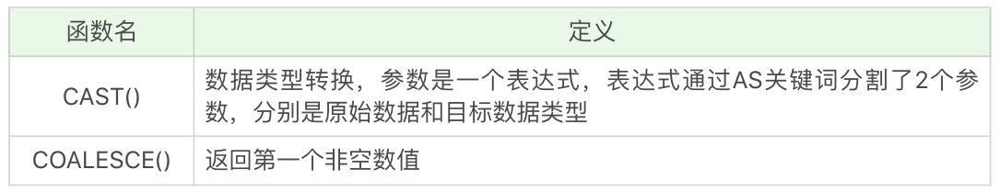

# sql 介绍

 https://github.com/cystanford/SQL-XMind

SQL 作为与数据直接打交道的语言，是与各种前端、后端语言进行交互的“中台”语言。

管技术人员或多或少地会使用 SQL，但不同的人编写出来的 SQL 的效率是不同的，比如说一份好的 SQL 执行计划就会尽量减少 I/O 操作，因为 I/O 是 DBMS 最容易出现瓶颈的地方，可以说数据库操作中有大量的时间都花在了 I/O 上。

此外，你还需要考虑如何降低 CPU 的计算量，在 SQL 语句中使用 GROUP BY、ORDER BY 等这些语句会消耗大量的 CPU 计算资源，因此我们需要从全局出发，不仅需要考虑数据库的 I/O 性能，还需要考虑 CPU 计算、内存使用情况等。


我们可以把 SQL 语言按照功能划分成以下的 4 个部分：

- DDL，英文叫做 Data Definition Language，也就是数据定义语言，它用来定义我们的数据库对象，包括数据库、数据表和列。通过使用 DDL，我们可以创建，删除和修改数据库和表结构。
- DML，英文叫做 Data Manipulation Language，数据操作语言，我们用它操作和数据库相关的记录，比如增加、删除、修改数据表中的记录。
- DCL，英文叫做 Data Control Language，数据控制语言，我们用它来定义访问权限和安全级别。
- DQL，英文叫做 Data Query Language，数据查询语言，我们用它查询想要的记录，它是 SQL 语言的重中之重。在实际的业务中，我们绝大多数情况下都是在和查询打交道，因此学会编写正确且高效的查询语句，是学习的重点。


SQL 是我们与 DBMS （数据库管理系统）交流的语言，我们在创建 DBMS 之前，还需要对它进行设计，对于 RDBMS 来说采用的是 ER 图（Entity Relationship Diagram），即实体 - 关系图的方式进行设计。

- 在这个模型中有 3 个要素：实体、属性、关系。
- ER 图评审通过后，我们再用 SQL 语句或者可视化管理工具（如 Navicat）创建数据表。


## 大小写问题

关于 SQL 大小写的问题，我总结了下面两点：

- SQL Style Guide：https://github.com/mattm/sql-style-guide

- 表名、表别名、字段名、字段别名等都小写；
- SQL 保留字、函数名、绑定变量等都大写。


## DB、DBS 和 DBMS

DBMS 的英文全称是 DataBase Management System，数据库管理系统，实际上它可以对多个数据库进行管理，所以你可以理解为 DBMS = 多个数据库（DB） + 管理程序。

DB 的英文是 DataBase，也就是数据库。数据库是存储数据的集合，你可以把它理解为多个数据表。

DBS 的英文是 DataBase System，数据库系统。它是更大的概念，包括了数据库、数据库管理系统以及数据库管理人员 DBA。

这里需要注意的是，虽然我们有时候把 Oracle、MySQL 等称之为数据库，但确切讲，它们应该是数据库管理系统，即 DBMS。


## 数据库分类

关系型数据库（RDBMS）就是建立在关系模型基础上的数据库，SQL 就是关系型数据库的查询语言。

- 关系型数据库绝对是 DBMS 的主流，其中使用最多的 DBMS 分别是 Oracle、MySQL 和 SQL Server。

NoSQL 泛指非关系型数据库，包括了榜单上的键值型数据库、文档型数据库、搜索引擎和列存储等，除此以外还包括图形数据库。

键值型数据库通过 Key-Value 键值的方式来存储数据，其中 Key 和 Value 可以是简单的对象，也可以是复杂的对象。Key 作为唯一的标识符，优点是查找速度快，在这方面明显优于关系型数据库，同时缺点也很明显，它无法像关系型数据库一样自由使用条件过滤（比如 WHERE），如果你不知道去哪里找数据，就要遍历所有的键，这就会消耗大量的计算。

- 键值型数据库典型的使用场景是作为内容缓存。Redis 是最流行的键值型数据库。

文档型数据库用来管理文档，在数据库中文档作为处理信息的基本单位，一个文档就相当于一条记录，MongoDB 是最流行的文档型数据库。

搜索引擎也是数据库检索中的重要应用，常见的全文搜索引擎有 Elasticsearch、Splunk 和 Solr。

- 虽然关系型数据库采用了索引提升检索效率，但是针对全文索引效率却较低。
- **搜索引擎的优势在于采用了全文搜索的技术，核心原理是“倒排索引”。**

列式数据库是相对于行式存储的数据库，而列式数据库是将数据按照列存储到数据库中，这样做的好处是可以大量降低系统的 I/O，适合于分布式文件系统，不足在于功能相对有限。

- Oracle、MySQL、SQL Server 等数据库都是采用的行式存储（Row-based）
- 行式存储是把一行的数据都串起来进行存储，然后再存储下一行。 同样，列式存储是把一列的数据都串起来进行存储，然后再存储下一列。 这样做的好处，就是相邻的数据的数据类型是一样的，因此也更容易压缩。压缩之后就自然降低了IO

图形数据库，利用了图这种数据结构存储了实体（对象）之间的关系。最典型的例子就是社交网络中人与人的关系，数据模型主要是以节点和边（关系）来实现，特点在于能高效地解决复杂的关系问题。


# 全局-SQL是如何执行的

## Oracle 中的 SQL 是如何执行的


- 语法检查：检查 SQL 拼写是否正确，如果不正确，Oracle 会报语法错误。
- 语义检查：检查 SQL 中的访问对象是否存在。比如我们在写 SELECT 语句的时候，列名写错了，系统就会提示错误。语法检查和语义检查的作用是保证 SQL 语句没有错误。
- 权限检查：看用户是否具备访问该数据的权限。
- 共享池检查：Oracle 通过检查共享池是否存在 SQL 语句的执行计划**，来判断进行软解析，还是硬解析。**
  - 软解析:从共享池中获取到执行计划，获取不到就是硬解析
  - 在共享池中，Oracle 首先对 SQL 语句进行 Hash 运算，然后根据 Hash 值在库缓存（Library Cache）中查找，如果存在 SQL 语句的执行计划，就直接拿来执行，直接进入“执行器”的环节，这就是**软解析。**
  - 如果没有找到 SQL 语句和执行计划，Oracle 就需要创建解析树进行解析，生成执行计划，进入“优化器”这个步骤，这就是**硬解析。**

- 优化器：优化器中就是要进行硬解析，也就是决定怎么做，比如创建解析树，生成执行计划。
- 执行器：当有了解析树和执行计划之后，就知道了 SQL 该怎么被执行，这样就可以在执行器中执行语句了。

### 共享池（Shared Pool）

共享池（Shared Pool）是一块内存池，最主要的作用是缓存 SQL 语句和该语句的执行计划，Oracle 通过检查共享池是否存在 SQL 语句的执行计划，来判断进行软解析，还是硬解析。

共享池（Shared Pool）是 Oracle 中的术语，包括了库缓存，数据字典缓冲区等。

- 库缓存区：它主要缓存 SQL 语句和执行计划。

- 数据字典缓冲区存储的是 Oracle 中的对象定义，比如表、视图、索引等对象。
  - 当对 SQL 语句进行解析的时候，如果需要相关的数据，会从数据字典缓冲区中提取。

库缓存这一个步骤，决定了 SQL 语句是否需要进行硬解析。**为了提升 SQL 的执行效率，我们应该尽量避免硬解析，因为在 SQL 的执行过程中，创建解析树，生成执行计划是很消耗资源的。**


## Oracle 怎么避免硬解析

为了提升 SQL 的执行效率，我们应该尽量避免硬解析，因为在 SQL 的执行过程中，创建解析树，生成执行计划是很消耗资源的。**如何避免硬解析，尽量使用软解析呢。**

- 在 Oracle 中，绑定变量就是在 SQL 语句中使用变量，通过不同的变量取值来改变 SQL 的执行结果。这样做的好处是能提升软解析的可能性，不足之处在于可能会导致生成的执行计划不够优化，因此是否需要绑定变量还需要视情况而定。
- 因此我们可以通过使用绑定变量来减少硬解析，减少 Oracle 的解析工作量。但是这种方式也有缺点，使用动态 SQL 的方式，因为参数不同，会导致 SQL 的执行效率不同，同时 SQL 优化也会比较困难。
- 关于绑定变量，更详细的参考https://blog.csdn.net/gumengkai/article/details/53130449

举个例子，我们可以使用下面的查询语句：

```
select * from player where player_id = 10001;
```

你也可以使用绑定变量，如：

```

SQL> select * from player where player_id = :player_id;
```

这两个查询语句的效率在 Oracle 中是完全不同的。

- 如果你在查询 player_id = 10001 之后，还会查询 10002、10003 之类的数据，那么每一次查询都会创建一个新的查询解析。
- 而第二种方式使用了绑定变量，那么在第一次查询之后，在共享池中就会存在这类查询的执行计划，也就是软解析。


## MySQL 中的 SQL 是如何执行的

首先 MySQL 是典型的 C/S 架构，即 Client/Server 架构，服务器端程序使用的 mysqld。你能看到 MySQL 由三层组成：

- 连接层：客户端和服务器端建立连接，客户端发送 SQL 至服务器端；
- SQL 层：对 SQL 语句进行查询处理；
- 存储引擎层：与数据库文件打交道，负责数据的存储和读取。
  - 其中 SQL 层与数据库文件的存储方式无关


我们来看下 SQL 层的结构：你能看到 SQL 语句在 MySQL 中的流程是：SQL 语句→缓存查询→解析器→优化器→执行器。在一部分中，MySQL 和 Oracle 执行 SQL 的原理是一样的。与 Oracle 不同的是，MySQL 的存储引擎采用了插件的形式。

- 相同的地方在于 Oracle 和 MySQL 都是通过解析器→优化器→执行器这样的流程来执行 SQL 的。

- 查询缓存：Server 如果在查询缓存中发现了这条 SQL 语句，就会直接将结果返回给客户端；如果没有，就进入到解析器阶段。需要说明的是，因为查询缓存往往效率不高，所以在 MySQL8.0 之后就抛弃了这个功能。
- 解析器：在解析器中对 SQL 语句进行语法分析、语义分析。
- 优化器：在优化器中会确定 SQL 语句的执行路径，比如是根据全表检索，还是根据索引来检索等
- 执行器：在执行之前需要判断该用户是否具备权限，如果具备权限就执行 SQL 查询并返回结果。在 MySQL8.0 以下的版本，如果设置了查询缓存，这时会将查询结果进行缓存。


## 总结

Oracle 和 MySQL 在进行 SQL 的查询差异：

Oracle 提出了共享池的概念，通过共享池来判断是进行软解析，还是硬解析。而在 MySQL 中，8.0 以后的版本不再支持查询缓存，而是直接执行解析器→优化器→执行器的流程，这一点从 MySQL 中的 show profile 里也能看到。同时 MySQL 的一大特色就是提供了各种存储引擎以供选择，不同的存储引擎有各自的使用场景，我们可以针对每张表选择适合的存储引擎。


# Mysql常见存储引擎

与 Oracle 不同的是，MySQL 的存储引擎采用了插件的形式，每个存储引擎都面向一种特定的数据库应用环境。同时开源的 MySQL 还允许开发人员设置自己的存储引擎，下面是一些常见的存储引擎：

需要注意的是，数据库的设计在于表的设计，而**在 MySQL 中每个表的设计都可以采用不同的存储引擎，我们可以根据实际的数据处理需要来选择存储引擎，这也是 MySQL 的强大之处。**

- InnoDB 存储引擎：它是 MySQL 5.5 版本之后默认的存储引擎，最大的特点是支持事务、行级锁定、外键约束等。
- MyISAM 存储引擎：在 MySQL 5.5 版本之前是默认的存储引擎，不支持事务，也不支持外键，最大的特点是速度快，占用资源少。
- Memory 存储引擎：使用系统内存作为存储介质，以便得到更快的响应速度。不过如果 mysqld 进程崩溃，则会导致所有的数据丢失，因此我们只有当数据是临时的情况下才使用 Memory 存储引擎。
- NDB 存储引擎：也叫做 NDB Cluster 存储引擎，主要用于 MySQL Cluster 分布式集群环境，类似于 Oracle 的 RAC 集群
- Archive 存储引擎：它有很好的压缩机制，用于文件归档，在请求写入时会进行压缩，所以也经常用来做仓库。


# DDL 表设计和约束


## 设计数据表的原则

DDL 的英文全称是 Data Definition Language，中文是数据定义语言。它定义了数据库的结构和数据表的结构

在 DDL 中，我们常用的功能是增删改，分别对应的命令是 CREATE、DROP 和 ALTER。需要注意的是，在执行 DDL 的时候，不需要 COMMIT，就可以完成执行任务。

数据表中联合主键的字段个数越少越好：联合主键中的字段越多，占用的索引空间越大，不仅会加大理解难度，还会增加运行时间和索引空间，因此联合主键的字段个数越少越好。

使用主键和外键越多越好：数据库的设计实际上就是定义各种表，以及各种字段之间的关系。这些关系越多，证明这些实体之间的冗余度越低，利用度越高。这样做的好处在于不仅保证了数据表之间的独立性，还能提升相互之间的关联使用率。

“三少一多”原则的核心就是简单可复用。简单指的是用更少的表、更少的字段、更少的联合主键字段来完成数据表的设计。可复用则是通过主键、外键的使用来增强数据表之间的复用率。因为一个主键可以理解是一张表的代表。键设计得越多，证明它们之间的利用率越高。


## 数据表的常见约束

介绍了 7 种常见的约束，它们都是数据表设计中会用到的约束：主键、外键、唯一性、NOT NULL、DEFAULT、CHECK 约束等。

当我们创建数据表的时候，还会对字段进行约束，约束的目的在于保证 RDBMS 里面数据的准确性和一致性。

对键约束

- 主键约束: 键起的作用是唯一标识一条记录，不能重复，不能为空，即 UNIQUE+NOT NULL。一个数据表的主键只能有一个。主键可以是一个字段，也可以由多个字段复合组成。
- 外键约束: 外键确保了表与表之间引用的完整性。一个表中的外键对应另一张表的主键。外键可以是重复的，也可以为空。

字段约束

- 唯一性约束表明了字段在表中的数值是唯一的，即使我们已经有了主键，还可以对其他字段进行唯一性约束。
  - 唯一性约束：唯一性约束+普通索引，保证字段正确性； 普通索引：仅提升数据检索速度，不对字段进行唯一约束

- NOT NULL 约束。对字段定义了 NOT NULL，即表明该字段不应为空，必须有取值。
- DEFAULT，表明了字段的默认值。如果在插入数据的时候，这个字段没有取值，就设置为默认值。
- CHECK 约束，用来检查特定字段取值范围的有效性，CHECK 约束的结果不能为 FALSE。


# 范式设计


我们在设计关系型数据库模型的时候，需要对关系内部各个属性之间联系的合理化程度进行定义，这就有了不同等级的规范要求，这些规范要求被称为范式（NF）。你可以把范式理解为，一张数据表的设计结构需要满足的某种设计标准的级别。

- 数据表的设计和工作流程的设计很像，我们既需要规范性，也要考虑到执行时的方便性。

目前关系型数据库一共有 6 种范式，按照范式级别，从低到高分别是：1NF（第一范式）、2NF（第二范式）、3NF（第三范式）、BCNF（巴斯 - 科德范式）、4NF（第四范式）和 5NF（第五范式，又叫做完美范式）。

- 数据库的范式设计越高阶，冗余度就越低，同时高阶的范式一定符合低阶范式的要求，比如满足 2NF 的一定满足 1NF，满足 3NF 的一定满足 2NF，依次类推。

一般来说数据表的设计应尽量满足 3NF。但也不绝对，有时候为了提高某些查询性能，我们还需要破坏范式规则，也就是反规范化。

1NF 需要保证表中每个属性都保持原子性；2NF 需要保证表中的非主属性与候选键完全依赖；3NF 需要保证表中的非主属性与候选键不存在传递依赖。

- 1NF 指的是数据库表中的任何属性都是原子性的，不可再分。
- 2NF 指的数据表里的非主属性都要和这个数据表的候选键有完全依赖关系。
- 3NF 在满足 2NF 的同时，对任何非主属性都不传递依赖于候选键。

- 1NF：列的原子性，不可拆分 2NF：针对于联合主键，非主属性完全依赖于联合主键，而非部分 3NF：非主属性只能直接依赖于主键

 	

## 数据表中的那些键

范式的定义会使用到主键和候选键（因为主键和候选键可以唯一标识元组），数据库中的键（Key）由一个或者多个属性组成。我总结了下数据表中常用的几种键和属性的定义：

- 超键：能唯一标识元组的属性集叫做超键。
- 候选键：如果超键不包括多余的属性，那么这个超键就是候选键。
- 主键：用户可以从候选键中选择一个作为主键。
- 外键：如果数据表 R1 中的某属性集不是 R1 的主键，而是另一个数据表 R2 的主键，那么这个属性集就是数据表 R1 的外键。
- 主属性：包含在任一候选键中的属性称为主属性。
- 非主属性：与主属性相对，指的是不包含在任何一个候选键中的属性。

通常，我们也将候选键称之为“码”，把主键也称为“主码”。因为键可能是由多个属性组成的，针对单个属性，我们还可以用主属性和非主属性来进行区分。

例子：这里我可以把球员表定义为包含球员编号、姓名、身份证号、年龄和球队编号；球队表包含球队编号、主教练和球队所在地。

- 对于球员表来说，超键就是包括球员编号或者身份证号的任意组合，比如（球员编号）（球员编号，姓名）（身份证号，年龄）等。
- 候选键就是最小的超键，对于球员表来说，候选键就是（球员编号）或者（身份证号）。
- 主键是我们自己选定，也就是从候选键中选择一个，比如（球员编号）。
- 外键就是球员表中的球队编号。
- 在球员表中，主属性是（球员编号）（身份证号），其他的属性（姓名）（年龄）（球队编号）都是非主属性。


# SQL常用函数

**MySQL 在 Linux 的环境下，数据库名、表名、变量名是严格区分大小写的，而字段名是忽略大小写的。**

- 关键字和函数名称全部大写；数据库名、表名、字段名称全部小写；SQL 语句必须以分号结尾。

SQL 提供了一些常用的内置函数，当然你也可以自己定义 SQL 函数。SQL 的内置函数对于不同的数据库软件来说具有一定的通用性，我们可以把内置函数分成四类：

- 算术函数,字符串函数,日期函数，转换函数
- 这 4 类函数分别代表了算术处理、字符串处理、日期处理、数据类型转换，它们是 SQL 函数常用的划分形式，因为数据字段的类型主要是这四种。

算术函数


常用的字符串函数操作包括了字符串拼接，大小写转换，求长度以及字符串替换和截取等。具体的函数名称及含义如下表所示：


日期函数是对数据表中的日期进行处理，常用的函数包括

- DATE 日期格式必须是 yyyy-mm-dd 的形式。如果要进行日期比较，就要使用 DATE 函数，不要直接使用日期与字符串进行比较


转换函数



## 日期筛选

对应字段 birthdate：上线日期

```
-- 提取上线日期（对应字段 birthdate）的年份，筛选上线日期不为空
SELECT name, EXTRACT(YEAR FROM birthdate) AS birthdate FROM heros WHERE birthdate is NOT NULL
或者
SELECT name, YEAR(birthdate) AS birthdate FROM heros WHERE birthdate is NOT NULL


-- 找出在 2016 年 10 月 1 日之后上线的
SELECT * FROM heros WHERE DATE(birthdate)>'2016-10-01'
-- 需要注意的是下面这种写法是不安全的：
SELECT * FROM heros WHERE birthdate>'2016-10-01'
```

因为很多时候你无法确认 birthdate 的数据类型是字符串，还是 datetime 类型，如果你想对日期部分进行比较，那么使用DATE(birthdate)来进行比较是更安全的。


## 聚集函数


# 视图

**视图，也就是我们今天要讲的虚拟表，本身是不具有数据的**，它是 SQL 中的一个重要概念。

- 注意：视图总是显示最新的数据！每当用户查询视图时，数据库引擎通过使用视图的 SQL 语句重建数据。
- 更新视图会更新到具体的表数据，通常我们是把视图用于查询，也就是对 SQL 查询的一种封装。

从下面这张图中，你能看到，虚拟表的创建连接了一个或多个数据表，不同的查询应用都可以建立在虚拟表之上。

- 视图作为一张虚拟表，帮我们封装了底层与数据表的接口。它相当于是一张表或多张表的数据结果集。
- 视图的这一特点，可以帮我们简化复杂的 SQL 查询，比如在编写视图后，我们就可以直接重用它，而不需要考虑视图中包含的基础查询的细节。同样，我们也可以根据需要更改数据格式，返回与底层数据表格式不同的数据。


通常情况下，小型项目的数据库可以不使用视图，但是在大型项目中，以及数据表比较复杂的情况下，视图的价值就凸显出来了，它可以帮助我们把经常查询的结果集放到虚拟表中，提升使用效率。理解和使用起来都非常方便。

使用视图有很多好处，比如安全、简单清晰。

- 安全性：虚拟表是基于底层数据表的，我们在使用视图时，一般不会轻易通过视图对底层数据进行修改，即使是使用单表的视图，也会受到限制，比如计算字段，类型转换等是无法通过视图来对底层数据进行修改的，这也在一定程度上保证了数据表的数据安全性。同时，我们还可以针对不同用户开放不同的数据查询权限，比如人员薪酬是个敏感的字段，那么只给某个级别以上的人员开放，其他人的查询视图中则不提供这个字段。
- 简单清晰：视图是对 SQL 查询的封装，它可以将原本复杂的 SQL 查询简化，在编写好查询之后，我们就可以直接重用它而不必要知道基本的查询细节。同时我们还可以在视图之上再嵌套视图。这样就好比我们在进行模块化编程一样，不仅结构清晰，还提升了代码的复用率。


场景：使用GROUP BY子句后，select 语句中只能出现group by语句中出现的字段，或者聚合函数

- mysql语法松散，允许出现select语句中出现group by语句未出现的字段，但这样展示没有意义，因为记录并没有对应 因为聚合函数通过作用一组值而只返回一个单一值，因此，在SELECT语句中出现的字段要么为一个聚合函数的输入值
- 要么为GROUP BY语句中指定的字段，要么是常数，否则会出错。 简而言之：使用GROUP BY子句时，SELECT子句中只能有聚合键、聚合函数、常数。

语法：

```
-- 创建 ：其中 view_name 为视图名称，column1、column2 代表列名，condition 代表查询过滤条件。
CREATE VIEW view_name AS
SELECT column1, column2
FROM table
WHERE condition
-- 使用
SELECT * FROM view_name

-- 嵌套视图，在虚拟表 player_above_avg_height 的基础上创建新视图player_above_above_avg_height
CREATE VIEW player_above_above_avg_height AS
SELECT player_id, height
FROM player
WHERE height > (SELECT AVG(height) from player_above_avg_height)

-- 修改视图：ALTER VIEW ， 你能看出来它的语法和创建视图一样，只是对原有视图的更新
ALTER VIEW view_name AS
SELECT column1, column2
FROM table
WHERE condition

-- 删除视图：DROP VIEW
DROP VIEW view_name
```


# 存储过程


SQL 的存储过程，它是 SQL 中另一个重要应用，和视图一样，都是对 SQL 代码进行封装，可以反复利用。它和视图有着同样的优点，清晰、安全，还可以减少网络传输量。

存储过程可以说是**由 SQL 语句和流控制语句构成的语句集合**，它和我们之前学到的函数一样，可以接收输入参数，也可以返回输出参数给调用者，返回计算结果。

如果用的是 MySQL，你还需要用 DELIMITER 来临时定义新的结束符。因为默认情况下 SQL 采用（；）作为结束符，这样当存储过程中的每一句 SQL 结束之后，采用（；）作为结束符，就相当于告诉 SQL 可以执行这一句了。但是存储过程是一个整体，我们不希望 SQL 逐条执行，而是采用存储过程整段执行的方式，因此我们就需要临时定义新的 DELIMITER。

- 首先我用（//）作为结束符，又在整个存储过程结束后采用了（//）作为结束符号，告诉 SQL 可以执行了，然后再将结束符还原成默认的（;）。

```
CREATE PROCEDURE 存储过程名称([参数列表])
BEGIN
    需要执行的语句
END    
-- 例子
DELIMITER //
CREATE PROCEDURE `add_num`(IN n INT)
BEGIN
       DECLARE i INT;
       DECLARE sum INT;
       
       SET i = 1;
       SET sum = 0;
       WHILE i <= n DO
              SET sum = sum + i;
              SET i = i +1;
       END WHILE;
       SELECT sum;
END //
DELIMITER ;
-- 使用
CALL add_num(50);
```

看下存储过程的 3 种参数类型。

- IN 和 OUT 的结合，既用于存储过程的传入参数，同时又可以把计算结果放到参数中，调用者可以得到返回值。
- IN 参数必须在调用存储过程时指定，而在存储过程中修改该参数的值不能被返回。而 OUT 参数和 INOUT 参数可以在存储过程中被改变，并可返回。


```
-- 定义了 4 个参数类型，其中 3 个为 OUT 类型，分别为 max_max_hp、min_max_mp 和 avg_max_attack，另一个参数 s 为 IN 类型。
CREATE PROCEDURE `get_hero_scores`(
       OUT max_max_hp FLOAT,
       OUT min_max_mp FLOAT,
       OUT avg_max_attack FLOAT,  
       s VARCHAR(255)
       )
BEGIN
       SELECT MAX(hp_max), MIN(mp_max), AVG(attack_max) FROM heros WHERE role_main = s INTO max_max_hp, min_max_mp, avg_max_attack;
END

-- 调用
CALL get_hero_scores(@max_max_hp, @min_max_mp, @avg_max_attack, '战士');
SELECT @max_max_hp, @min_max_mp, @avg_max_attack;
```


# 流控制语句

BEGIN…END：BEGIN…END 中间包含了多个语句，每个语句都以（;）号为结束符。

DECLARE：DECLARE 用来声明变量，使用的位置在于 BEGIN…END 语句中间，而且需要在其他语句使用之前进行变量的声明。

SET：赋值语句，用于对变量进行赋值。

SELECT…INTO：把从数据表中查询的结果存放到变量中，也就是为变量赋值。

IF…THEN…ENDIF：条件判断语句，我们还可以在 IF…THEN…ENDIF 中使用 ELSE 和 ELSEIF 来进行条件判断。

CASE：CASE 语句用于多条件的分支判断，使用的语法是下面这样的。

LOOP、LEAVE 和 ITERATE：LOOP 是循环语句，使用 LEAVE 可以跳出循环，使用 ITERATE 则可以进入下一次循环。如果你有面向过程的编程语言的使用经验，你可以把 LEAVE 理解为 BREAK，把 ITERATE 理解为 CONTINUE。

REPEAT…UNTIL…END REPEAT：这是一个循环语句，首先会执行一次循环，然后在 UNTIL 中进行表达式的判断，如果满足条件就退出，即 END REPEAT；如果条件不满足，则会就继续执行循环，直到满足退出条件为止。

WHILE…DO…END WHILE：这也是循环语句，和 REPEAT 循环不同的是，这个语句需要先进行条件判断，如果满足条件就进行循环，如果不满足条件就退出循环。


# 游标

我们不需要对查询结果集中的所有数据行都采用相同的处理方式，**需要每次处理一行或者一部分行**，这时就需要面向过程的编程方法了。

- 游标让 SQL 这种面向集合的语言有了面向过程开发的能力。
- 游标实际上是一种控制数据集的更加灵活的处理方式。

在 SQL 中，游标是一种临时的数据库对象，可以指向存储在数据库表中的数据行指针。这里游标充当了指针的作用，我们可以通过操作游标来对数据行进行操作。


相关语法和案例：

```
-- 定义游标，这个语法适用于 MySQL，SQL Server，DB2 和 MariaDB。
DECLARE cursor_name CURSOR FOR select_statement
-- 如果是用 Oracle 或者 PostgreSQL，需要写成：
DECLARE cursor_name CURSOR IS select_statement

-- 第二步，打开游标， 如果想要使用游标，必须先打开游标
OPEN cursor_name

-- 第三步，从游标中取得数据。
-- 使用 cursor_name 这个游标来读取当前行，并且将数据保存到 var_name 这个变量中，游标指针指到下一行。如果游标读取的数据行有多个列名，则在 INTO 关键字后面赋值给多个变量名即可。
FETCH cursor_name INTO var_name ...

-- 第四步，关闭游标。
CLOSE cursor_name

-- 最后一步，释放游标。
-- 游标会一直存在于内存中，直到进程结束后才会自动释放。当你不需要使用游标的时候，释放游标可以减少资源浪费。
DEALLOCATE cursor_namec
```

案例：我先创建一个存储过程 calc_hp_max，然后在存储过程中定义游标 cur_hero，使用 FETCH 获取每一行的具体数值，然后赋值给变量 hp，再用变量 hp_sum 做累加求和，最后再输出 hp_sum，代码如下：

```sql

CREATE PROCEDURE `calc_hp_max`()
BEGIN
       -- 创建接收游标的变量
       DECLARE hp INT;  
       -- 创建总数变量 
       DECLARE hp_sum INT DEFAULT 0;
       -- 创建结束标志变量  
       DECLARE done INT DEFAULT false;
       -- 定义游标     
       DECLARE cur_hero CURSOR FOR SELECT hp_max FROM heros;
       
       OPEN cur_hero;
       read_loop:LOOP 
       FETCH cur_hero INTO hp;
       SET hp_sum = hp_sum + hp;
       END LOOP;
       CLOSE cur_hero;
       SELECT hp_sum;
END
```

你会发现执行`call calc_hp_max()`这一句的时候系统会提示 1329 错误，也就是在 LOOP 中当游标没有取到数据时会报的错误。

- 当游标溢出时（也就是当游标指向到最后一行数据后继续执行会报的错误），我们可以定义一个 continue 的事件，指定这个事件发生时修改变量 done 的值，以此来判断游标是否已经溢出，即：

- ```
  DECLARE CONTINUE HANDLER FOR NOT FOUND SET done = true;  
  ```

- 同时在循环中我们需要加上对 done 的判断，如果游标的循环已经结束，就需要跳出 read_loop 循环，完善的代码如下：

  - 在游标中的循环中，除了使用 LOOP 循环以外，你还可以使用 REPEAT… UNTIL…以及 WHILE 循环。它们同样需要设置 CONTINUE 事件来处理游标溢出的情况。

- ```sql
  CREATE PROCEDURE `calc_hp_max`()
  BEGIN
         -- 创建接收游标的变量
         DECLARE hp INT;  
  
         -- 创建总数变量 
         DECLARE hp_sum INT DEFAULT 0;
         -- 创建结束标志变量  
       DECLARE done INT DEFAULT false;
         -- 定义游标     
         DECLARE cur_hero CURSOR FOR SELECT hp_max FROM heros;
         -- 指定游标循环结束时的返回值  
       DECLARE CONTINUE HANDLER FOR NOT FOUND SET done = true;  
         
         OPEN cur_hero;
         read_loop:LOOP 
         FETCH cur_hero INTO hp;
         -- 判断游标的循环是否结束  
         IF done THEN  
                       LEAVE read_loop;
         END IF; 
                
         SET hp_sum = hp_sum + hp;
         END LOOP;
         CLOSE cur_hero;
         SELECT hp_sum;
  END
  ```

  

# 事务控制

## 事务的特性：ACID

**原子性是基础，隔离性是手段，一致性是约束条件，而持久性是我们的目的。**

原子性（Atomicity）。原子的概念就是不可分割，你可以把它理解为组成物质的基本单位，也是我们进行数据处理操作的基本单位。

一致性（Consistency）。一致性指的就是数据库在进行事务操作后，会由原来的一致状态，变成另一种一致的状态。也就是说当事务提交后，或者当事务发生回滚后，数据库的完整性约束不能被破坏。

隔离性（Isolation）。它指的是每个事务都是彼此独立的，不会受到其他事务的执行影响。也就是说一个事务在提交之前，对其他事务都是不可见的。

持久性（Durability）。事务提交之后对数据的修改是持久性的，即使在系统出故障的情况下，比如系统崩溃或者存储介质发生故障，数据的修改依然是有效的。因为当事务完成，数据库的日志就会被更新，这时可以通过日志，让系统恢复到最后一次成功的更新状态。

## 事务的控制

START TRANSACTION 或者 BEGIN，作用是显式开启一个事务

COMMIT：提交事务。当提交事务后，对数据库的修改是永久性的。

- 执行 COMMIT 的时候会提交事务，在执行下一个事务时，还需要我们使用 START TRANSACTION 或者 BEGIN 来开启。

ROLLBACK 或者 ROLLBACK TO [SAVEPOINT]，意为回滚事务。意思是撤销正在进行的所有没有提交的修改，或者将事务回滚到某个保存点。

RELEASE SAVEPOINT：删除某个保存点。

SET TRANSACTION，设置事务的隔离级别。

**使用事务有两种方式，分别为隐式事务和显式事务。隐式事务实际上就是自动提交，Oracle 默认不自动提交，需要手写 COMMIT 命令，而 MySQL 默认自动提交，当然我们可以配置 MySQL 的参数：**

```
mysql> set autocommit =0; //关闭自动提交
mysql> set autocommit =1;  //开启自动提交
```


案例：

```
BEGIN;
INSERT INTO test SELECT '关羽';
COMMIT;
BEGIN;
INSERT INTO test SELECT '张飞1';
INSERT INTO test SELECT '张飞2';
ROLLBACK;
SELECT * FROM test;  -- 只有关羽一条数据
```

## 事务的隔离级别


# 锁

实际上加锁是为了保证数据的一致性，这个思想在程序开发领域中同样很重要。


## 按照锁粒度进行划分

锁用来对数据进行锁定，我们可以从锁定对象的粒度大小来对锁进行划分，分别为行锁、页锁和表锁。

行锁、页锁和表锁是相对常见的三种锁，除此以外我们还可以在区和数据库的粒度上锁定数据，对应区锁和数据库锁。不同的数据库和存储引擎支持的锁粒度不同，InnoDB 和 Oracle 支持行锁和表锁。而 MyISAM 只支持表锁，MySQL 中的 BDB 存储引擎支持页锁和表锁。SQL Server 可以同时支持行锁、页锁和表锁，如下表所示：

- 

- 行锁就是**按照行的粒度对数据进行锁定**。锁定力度小，发生锁冲突概率低，可以实现的并发度高，但是对于锁的开销比较大，加锁会比较慢，容易出现死锁情况。

- 页锁就是在**页的粒度上进行锁定**，锁定的数据资源比行锁要多，因为一个页中可以有多个行记录。当我们使用页锁的时候，会出现数据浪费的现象，但这样的浪费最多也就是一个页上的数据行。页锁的开销介于表锁和行锁之间，会出现死锁。锁定粒度介于表锁和行锁之间，并发度一般。

- **表锁就是对数据表进行锁定，锁定粒度很大**，同时发生锁冲突的概率也会较高，数据访问的并发度低。不过好处在于对锁的使用开销小，加锁会很快。

这里需要说明下，每个层级的锁数量是有限制的，因为锁会占用内存空间，锁空间的大小是有限的。当某个层级的锁数量超过了这个层级的阈值时，就会进行锁升级。锁升级就是用更大粒度的锁替代多个更小粒度的锁，比如 InnoDB 中行锁升级为表锁，这样做的好处是占用的锁空间降低了，但同时数据的并发度也下降了。


## 共享锁，排它锁案例：

除了按照锁粒度大小对锁进行划分外，我们还可以从数据库管理的角度对锁进行划分。共享锁和排它锁，是我们经常会接触到的两把锁。

- **共享锁也叫读锁或 S 锁，共享锁锁定的资源可以被其他用户读取，但不能修改**。
  - 在进行SELECT的时候，会将对象进行共享锁锁定，当数据读取完毕之后，就会释放共享锁，这样就可以保证数据在读取时不被修改。也就是当共享锁没有释放时，不能对锁住的数据进行修改。

- **排它锁也叫独占锁、写锁或 X 锁。**
  - 排它锁锁定的数据只允许进行锁定操作的事务使用，其他事务无法对已锁定的数据进行查询或修改。
  - 当我们对数据进行更新的时候，也就是INSERT、DELETE或者UPDATE的时候，数据库也会自动使用排它锁，防止其他事务对该数据行进行操作。

- 当我们想要获取某个数据表的排它锁的时候，需要先看下这张数据表有没有上了排它锁。如果这个数据表中的某个数据行被上了行锁，我们就无法获取排它锁。这时需要对数据表中的行逐一排查，检查是否有行锁，如果没有，才可以获取这张数据表的排它锁。这个过程是不是有些麻烦？这里就需要用到意向锁。
- 意向锁（Intent Lock），简单来说就是给更大一级别的空间示意里面是否已经上过锁。
  - 如果我们给某一行数据加上了排它锁，数据库会自动给更大一级的空间，比如数据页或数据表加上意向锁，告诉其他人这个数据页或数据表已经有人上过排它锁了。

**共享锁案例：**

比如我们想给 product_comment 在表上加共享锁： `LOCK TABLE product_comment READ;`

- 当对数据表加上共享锁的时候，该数据表就变成了只读模式，此时我们想要更新 product_comment 表中的数据会报错

如果我们想要给product_comment表的某一行加上共享锁呢，比如想对 user_id=912178 的数据行加上共享锁，可以像下面这样：

- ```
  SELECT comment_id, product_id, comment_text, user_id FROM product_comment WHERE user_id = 912178 LOCK IN SHARE MODE
  ```

也就是当共享锁没有释放时，不能对锁住的数据进行修改, 如果我们想要对表上的共享锁进行解锁，可以使用下面这行命令：

```
UNLOCK TABLE;
```


**排它锁案例：**

如果我们想给 product_comment 数据表添加排它锁，可以使用下面这行命令：

- 这时只有获得排它锁的事务可以对 product_comment 进行查询或修改，其他事务如果想要在 product_comment 表上查询数据，则需要等待。

```
LOCK TABLE product_comment WRITE;
```

我们释放掉排它锁，使用这行命令即可。

```
UNLOCK TABLE;
```

同样的，如果我们想要在某个数据行上添加排它锁，比如针对 user_id=912178 的数据行，则写成如下这样

```
SELECT comment_id, product_id, comment_text, user_id FROM product_comment WHERE user_id = 912178 FOR UPDATE;
```


## 乐观锁和悲观锁

乐观锁和悲观锁并不是锁，而是锁的设计思想。

如果从程序员的视角来看锁的话，可以将锁分成乐观锁和悲观锁，从名字中也可以看出这两种锁是两种看待数据并发的思维方式。

- **乐观、悲观，是指对并发的乐观或悲观**
- 乐观锁（Optimistic Locking）认为对同一数据的并发操作不会总发生，属于小概率事件，不用每次都对数据上锁，也就是不采用数据库自身的锁机制，而是通过程序来实现。在程序上，**我们可以采用版本号机制或者时间戳机制实现。**
- 悲观锁（Pessimistic Locking）也是一种思想，对数据被其他事务的修改持保守态度，会通过数据库自身的锁机制来实现，从而保证数据操作的排它性。


从这两种锁的设计思想中，**你能看出乐观锁和悲观锁的适用场景：**

- 乐观锁适合读操作多的场景，相对来说写的操作比较少。它的优点在于程序实现，不存在死锁问题，不过适用场景也会相对乐观，因为它阻止不了除了程序以外的数据库操作。

- 悲观锁适合写操作多的场景，因为写的操作具有排它性。采用悲观锁的方式，可以在数据库层面阻止其他事务对该数据的操作权限，防止读 - 写和写 - 写的冲突。

**乐观锁的版本号机制**

- 在表中设计一个版本字段 version，第一次读的时候，会获取 version 字段的取值。然后对数据进行更新或删除操作时，会执行UPDATE ... SET version=version+1 WHERE version=version。此时如果已经有事务对这条数据进行了更改，修改就不会成功。
- 这种方式类似我们熟悉的 SVN、CVS 版本管理系统，**当我们修改了代码进行提交时，首先会检查当前版本号与服务器上的版本号是否一致，如果一致就可以直接提交，如果不一致就需要更新服务器上的最新代码，然后再进行提交。**

**乐观锁的时间戳机制**

- 时间戳和版本号机制一样，也是在更新提交的时候，将当前数据的时间戳和更新之前取得的时间戳进行比较，如果两者一致则更新成功，否则就是版本冲突。

- 你能看到乐观锁就是程序员自己控制数据并发操作的权限，基本是通过给数据行增加一个戳（版本号或者时间戳），从而证明当前拿到的数据是否最新。


## 采取一些方法避免死锁的发生

既然有锁的存在，就有可能发生死锁的情况。死锁就是多个事务（如果是在程序层面就是多个进程）在执行过程中，因为竞争某个相同的资源而造成阻塞的现象。发生死锁，往往是因为在事务中，锁的获取是逐步进行的。

我们都不希望出现死锁的情况，可以采取一些方法避免死锁的发生：

- 如果事务涉及多个表，操作比较复杂，那么可以尽量一次锁定所有的资源，而不是逐步来获取，这样可以减少死锁发生的概率；
- 如果事务需要更新数据表中的大部分数据，数据表又比较大，这时可以采用锁升级的方式，比如将行级锁升级为表级锁，从而减少死锁产生的概率；
- 不同事务并发读写多张数据表，可以约定访问表的顺序，采用相同的顺序降低死锁发生的概率。

当然在数据库中，也有一些情况是不会发生死锁的，比如采用乐观锁的方式。另外在 MySQL MyISAM 存储引擎中也不会出现死锁，这是因为 MyISAM 总是一次性获得全部的锁，这样的话要么全部满足可以执行，要么就需要全部等待。


# 大部分RDBMS都会支持MVCC

MVCC，它就是采用乐观锁思想的一种方式：

我们知道事务有 4 个隔离级别，以及可能存在的三种异常问题，如下图所示：


在 MySQL 中，<u>默认的隔离级别是可重复读</u>，可以解决脏读和不可重复读的问题，但不能解决幻读问题。

- 如果我们想要解决幻读问题，就需要采用串行化的方式，也就是将隔离级别提升到最高，但会大幅降低数据库的事务并发能力。
- 通过乐观锁的方式来解决不可重复读和幻读问题，不采用锁机制。
- **MVCC 机制的设计，就是用来解决这个问题的，它可以在大多数情况下替代行级锁，降低系统的开销。**

MVCC 的英文全称是 Multiversion Concurrency Control，中文翻译过来就是多版本并发控制技术。

- MVCC 是通过数据行的多个版本管理来实现数据库的并发控制，简单来说它的思想就是保存数据的历史版本。这样我们就可以通过比较版本号决定数据是否显示出来（具体的规则后面会介绍到），读取数据的时候不需要加锁也可以保证事务的隔离效果。

通过 MVCC 我们可以解决以下几个问题：

- 读写之间阻塞的问题，通过 MVCC 可以让读写互相不阻塞，即读不阻塞写，写不阻塞读，这样就可以提升事务并发处理能力。
- 降低了死锁的概率。这是因为 MVCC 采用了乐观锁的方式，读取数据时并不需要加锁，对于写操作，也只锁定必要的行。
- 解决一致性读的问题。一致性读也被称为快照读，当我们查询数据库在某个时间点的快照时，只能看到这个时间点之前事务提交更新的结果，而不能看到这个时间点之后事务提交的更新结果。


## 什么是快照读，什么是当前读

快照读就是普通的读操作，而当前读包括了加锁的读取和 DML 操作

- 快照读读取的是快照数据。不加锁的简单的 SELECT 都属于快照读
- 当前读就是读取最新数据，而不是历史版本的数据。加锁的 SELECT，或者对数据进行增删改都会进行当前读

## InnoDB 中的 MVCC 是如何实现的

事务版本号：

- 每开启一个事务，我们都会从数据库中获得一个事务 ID（也就是事务版本号），这个事务 ID 是自增长的，通过 ID 大小，我们就可以判断事务的时间顺序。

行记录的隐藏列：

- InnoDB 的叶子段存储了数据页，数据页中保存了行记录，而在行记录中有一些重要的隐藏字段，如下图所示：
- 
- db_row_id：隐藏的行 ID，用来生成默认聚集索引。如果我们创建数据表的时候没有指定聚集索引，这时 InnoDB 就会用这个隐藏 ID 来创建聚集索引。采用聚集索引的方式可以提升数据的查找效率。
- db_trx_id：操作这个数据的事务 ID，也就是最后一个对该数据进行插入或更新的事务 ID。
- db_roll_ptr：回滚指针，也就是指向这个记录的 Undo Log 信息。

在 MVCC 机制中，多个事务对同一个行记录进行更新会产生多个历史快照，这些历史快照保存在 Undo Log 里。

- InnoDB 将行记录快照保存在了 Undo Log 里，我们可以在回滚段中找到它们：

- 从图中你能看到回滚指针将数据行的所有快照记录都通过链表的结构串联了起来，每个快照的记录都保存了当时的 db_trx_id，也是那个时间点操作这个数据的事务 ID。这样如果我们想要找历史快照，就可以通过遍历回滚指针的方式进行查找。


## Read View 是如何工作的

如果一个事务想要查询这个行记录，需要读取哪个版本的行记录呢？这时就需要用到 Read View 了，它帮我们解决了行的可见性问题。

- Read View 保存了当前事务开启时所有活跃（还没有提交）的事务列表，换个角度你可以理解为 Read View 保存了不应该让这个事务看到的其他的事务 ID 列表。
- 因为这些事务（也就是当前事务开启时，所有活跃的事务）还没有提交，没有提交的内容，其他事务原则上是不允许看到的。 这就有点类似于之前说的，脏读（Dirty Read 在 Read Uncommited 的事务隔离级别情况下，是有可能发生的） 的情况一般是不允许的。

在 Read VIew 中有几个重要的属性：

- trx_ids，系统当前正在活跃的事务 ID 集合。
- low_limit_id，活跃的事务中最大的事务 ID。
- up_limit_id，活跃的事务中最小的事务 ID。
- creator_trx_id，创建这个 Read View 的事务 ID。 

如图所示，trx_ids 为 trx2、trx3、trx5 和 trx8 的集合，活跃的最大事务 ID（low_limit_id）为 trx8，活跃的最小事务 ID（up_limit_id）为 trx2。


假设当前有事务 creator_trx_id 想要读取某个行记录，这个行记录的事务 ID 为 trx_id，那么会出现以下几种情况。

- 如果 trx_id < 活跃的最小事务 ID（up_limit_id），也就是说这个行记录在这些活跃的事务创建之前就已经提交了，那么这个行记录对该事务是可见的。
- 如果 trx_id > 活跃的最大事务 ID（low_limit_id），这说明该行记录在这些活跃的事务创建之后才创建，那么这个行记录对当前事务不可见。
- 如果 up_limit_id < trx_id < low_limit_id，说明该行记录所在的事务 trx_id 在目前 creator_trx_id 这个事务创建的时候，可能还处于活跃的状态，因此我们需要在 trx_ids 集合中进行遍历，如果 trx_id 存在于 trx_ids 集合中，证明这个事务 trx_id 还处于活跃状态，不可见。否则，如果 trx_id 不存在于 trx_ids 集合中，证明事务 trx_id 已经提交了，该行记录可见。


了解了这些概念之后，我们来看下当查询一条记录的时候，系统如何通过多版本并发控制技术找到它：


你能看到 InnoDB 中，MVCC 是通过 Undo Log + Read View 进行数据读取，Undo Log 保存了历史快照，而 Read View 规则帮我们判断当前版本的数据是否可见。

需要说明的是，在隔离级别为读已提交（Read Commit）时，一个事务中的每一次 SELECT 查询都会获取一次 Read View。如表所示：

- 你能看到，在读已提交的隔离级别下，同样的查询语句都会重新获取一次 Read View，这时如果 Read View 不同，就可能产生不可重复读或者幻读的情况。


当隔离级别为可重复读的时候，就避免了不可重复读，这是因为一个事务只在第一次 SELECT 的时候会获取一次 Read View，而后面所有的 SELECT 都会复用这个 Read View，如下表所示：


## InnoDB 是如何解决幻读的

不过这里需要说明的是，在可重复读的情况下，InnoDB 可以通过 Next-Key 锁 +MVCC 来解决幻读问题。

在读已提交的情况下，即使采用了 MVCC 方式也会出现幻读。如果我们同时开启事务 A 和事务 B，先在事务 A 中进行某个条件范围的查询，读取的时候采用排它锁，在事务 B 中增加一条符合该条件范围的数据，并进行提交，然后我们在事务 A 中再次查询该条件范围的数据，就会发现结果集中多出一个符合条件的数据，这样就出现了幻读。


出现幻读的原因是在读已提交的情况下，InnoDB 只采用记录锁（Record Locking）。这里要介绍下 InnoDB 三种行锁的方式：

- 记录锁：针对单个行记录添加锁。
- 间隙锁（Gap Locking）：可以帮我们锁住一个范围（索引之间的空隙），但不包括记录本身。采用间隙锁的方式可以防止幻读情况的产生。
- Next-Key 锁：帮我们锁住一个范围，同时锁定记录本身，相当于间隙锁 + 记录锁，可以解决幻读的问题。

在隔离级别为可重复读时，InnoDB 会采用 Next-Key 锁的机制，帮我们解决幻读问题。

还是这个例子，我们能看到当我们想要插入球员艾利克斯·伦（身高 2.16 米）的时候，事务 B 会超时，无法插入该数据。这是因为采用了 Next-Key 锁，会将 height>2.08 的范围都进行锁定，就无法插入符合这个范围的数据了。然后事务 A 重新进行条件范围的查询，就不会出现幻读的情况。


## 总结

我们需要记住，MVCC 的核心就是 Undo Log+ Read View，“MV”就是通过 Undo Log 来保存数据的历史版本，实现多版本的管理，“CC”是通过 Read View 来实现管理，通过 Read View 原则来决定数据是否显示。同时针对不同的隔离级别，Read View 的生成策略不同，也就实现了不同的隔离级别。

MVCC 是一种机制，MySQL、Oracle、SQL Server 和 PostgreSQL 的实现方式均有不同，我们在学习的时候，更主要的是要理解 MVCC 的设计思想。

为什么隔离级别为读未提交时，不适用于 MVCC 机制呢？

- 因为隔离级别是读未提交，所以跟本就不需要版本控制，直接读取最新的数据就好了。

读已提交和可重复读这两个隔离级别的 Read View 策略有何不同？

- 读已提交每一次Select都会重新查询Read View，保证可以读到其它事务的提交。 可重复读会复用第一次查询到的Read View,不会读到其它事务的提交，加上Next-Key锁的配合，从而避免幻读。


# 查询优化器是如何工作的（重置版）

事务和索引的使用是数据库中的两个重要核心，事务可以让数据库在增删查改的过程中，保证数据的正确性和安全性，而索引可以帮数据库提升数据的查找效率。

如果我们想要知道如何获取更高的 SQL 查询性能，最好的方式就是理解数据库是如何进行查询优化和执行的。

## 查询优化器的两个阶段（组成）


我们先来看看一条 SQL 语句的执行都需要经历哪些环节，如下图所示：

- 分析器，进行语法分析和语义检查。我们之前讲过语法分析是检查 SQL 拼写和语法是否正确，语义检查是检查 SQL 中的访问对象是否存在。
- **查询优化器的目标是找到执行 SQL 查询的最佳执行（查询）计划**，执行计划就是查询树，它由一系列物理操作符组成，这些操作符按照一定的运算关系组成查询的执行计划。


在查询优化器中，可以分为逻辑查询优化阶段和物理查询优化阶段。

- **逻辑查询优化**就是通过改变 SQL 语句的内容来使得 SQL 查询更高效，同时为物理查询优化提供更多的候选执行计划。
  - 通常采用的方式是对 SQL 语句进行等价变换，对查询进行重写，而查询重写的数学基础就是关系代数。对条件表达式进行等价谓词重写、条件简化，对视图进行重写，对子查询进行优化，对连接语义进行了外连接消除、嵌套连接消除等
- 逻辑查询优化是基于关系代数进行的查询重写，**而关系代数的每一步都对应着物理计算**，这些物理计算往往存在多种算法，因此需要计算各种物理路径的代价，从中选择代价最小的作为执行计划。
  - 在这个阶段里，对于单表和多表连接的操作，需要高效地使用索引，提升查询效率。
  - 在这两个阶段中，查询重写属于代数级、语法级的优化，也就是属于逻辑范围内的优化，而基于代价的估算模型是从连接路径中选择代价最小的路径，属于物理层面的优化。
- 优化器是逻辑范围内的优化中嵌套着物理查询优化
  - 

## 生成最佳执行计划的策略

**查询优化器的目的就是生成最佳的执行（查询）计划**，而生成最佳执行计划的策略通常有以下两种方式。

- 第一种是基于规则的优化器（RBO，Rule-Based Optimizer），**规则就是人们以往的经验**，或者是采用已经被证明是有效的方式。通过在优化器里面嵌入规则，来判断 SQL 查询符合哪种规则，就按照相应的规则来制定执行计划，同时采用启发式规则去掉明显不好的存取路径。
- 第二种是基于代价的优化器（CBO，Cost-Based Optimizer），这里会根据代价评估模型，计算每条可能的执行计划的代价，**也就是 COST，从中选择代价最小的作为执行计划**。
  - 大部分 RDBMS 都支持基于代价的优化器（CBO），CBO 随着版本的迭代也越来越成熟，但是 CBO 依然存在缺陷。

- RBO 的方式更像是一个出租车老司机，凭借自己的经验来选择从 A 到 B 的路径。而 CBO 更像是手机导航，通过数据驱动，来选择最佳的执行路径。
  - 相比于 RBO 来说，**CBO 对数据更敏感，因为它会利用数据表中的统计信息来做判断，针对不同的数据表，查询得到的执行计划可能是不同的，因此制定出来的执行计划也更符合数据表的实际情况。**


**但SQL 是面向集合的语言，并没有指定执行的方式，因此在优化器中会存在各种组合的可能。**

- 我们需要通过优化器来制定数据表的扫描方式、连接方式以及连接顺序，从而得到最佳的 SQL 执行计划。

## 策略- 模型CBO 是如何计算代价的

**大部分 RDBMS 都支持基于代价的优化器（CBO），CBO 随着版本的迭代也越来越成熟，但是 CBO 依然存在缺陷。**

我们来看一下 MySQL 中的COST Model代价模型的参数有哪些

- COST Model就是优化器用来统计各种步骤的代价模型，在 5.7.10 版本之后，MySQL 会引入两张数据表，里面规定了各种步骤预估的代价（Cost Value） ，我们可以从mysql.server_cost和mysql.engine_cost这两张表中获得这些步骤的代价：

  - server_cost 数据表是在 server 层统计的代价
  - engine_cost数据表是在存储引擎层都包括了哪些代价

  

server_cost 数据表是在 server 层统计的代价`SELECT * FROM mysql.server_cost`

- 由这张表中可以看到，如果想要创建临时表，尤其是在磁盘中创建相应的文件，代价还是很高的。


- disk_temptable_create_cost，表示临时表文件（MyISAM 或 InnoDB）的创建代价，默认值为 20。

-  disk_temptable_row_cost，表示临时表文件（MyISAM 或 InnoDB）的行代价，默认值 0.5。
-  key_compare_cost，表示键比较的代价。键比较的次数越多，这项的代价就越大，这是一个重要的指标，默认值 0.05。
-  memory_temptable_create_cost，表示内存中临时表的创建代价，默认值 1。
-  memory_temptable_row_cost，表示内存中临时表的行代价，默认值 0.1。
-  row_evaluate_cost，统计符合条件的行代价，如果符合条件的行数越多，那么这一项的代价就越大，因此这是个重要的指标，默认值 0.1。


engine_cost  数据表表示存储引擎层都包括了哪些代价：`SQL > SELECT * FROM mysql.engine_cost`

- 我们之前了解到，一个页的加载根据页所在位置的不同，读取的位置也不同，可以从磁盘 I/O 中获取，也可以从内存中读取。因此在engine_cost数据表中对这两个读取的代价进行了定义：

- io_block_read_cost，从磁盘中读取一页数据的代价，默认是 1。
- memory_block_read_cost，从内存中读取一页数据的代价，默认是 0.25。


### 根据实际情况修改 io_block_read_cost

我们可以根据实际情况去修改这些参数。因为随着硬件的提升，各种硬件的性能对比也可能发生变化，比如针对普通硬盘的情况，可以考虑适当增加io_block_read_cost的数值，这样就代表从磁盘上读取一页数据的成本变高了。当我们执行全表扫描的时候，相比于范围查询，成本也会增加很多。

- 比如我想将io_block_read_cost参数设置为 2.0，那么使用下面这条命令就可以：

```mysql
UPDATE mysql.engine_cost
  SET cost_value = 2.0
  WHERE cost_name = 'io_block_read_cost';
-- 更新内存
FLUSH OPTIMIZER_COSTS;
```


如果我们想要专门针对某个存储引擎，比如 InnoDB 存储引擎设置io_block_read_cost，比如设置为 2，可以这样使用：

```mysql
INSERT INTO mysql.engine_cost(engine_name, device_type, cost_name, cost_value, last_update, comment)
  VALUES ('InnoDB', 0, 'io_block_read_cost', 2,
  CURRENT_TIMESTAMP, 'Using a slower disk for InnoDB');
  
-- 更新内存
FLUSH OPTIMIZER_COSTS;
```


### 代价模型如何计算

那么总的代价的计算

- 你可以简单地认为，**总的执行代价等于 I/O 代价 +CPU 代价。**
- 在这里 PAGE FETCH **就是 I/O 代价**，也就是页面加载的代价，包括数据页和索引页加载的代价
- W*(RSI CALLS) **就是 CPU 代价**。
  - W 在这里是个权重因子，表示了 CPU 到 I/O 之间转化的相关系数
  - RSI CALLS 代表了 CPU 的代价估算，包括了键比较（compare key）以及行估算（row evaluating）的代价
  - W 和 RSI CALLS 的英文解释：W is an adjustable weight between I/O and CPU utilization. The number of RSI calls is used to approximate CPU utilization。
- 在 MySQL5.7 版本之后，代价模型又进行了完善，不仅考虑到了 I/O 和 CPU 开销，还对内存计算和远程操作的代价进行了统计，也就是说总代价的计算公式演变成下面这样：
  - 总代价 = I/O 代价 + CPU 代价 + 内存代价 + 远程代价
  - 这里对内存代价和远程代价不进行讲解，我们只需要关注 I/O 代价和 CPU 代价即可。


## 总结

查询优化器，它在 RDBMS 中是个非常重要的角色。

在优化器中会经历逻辑查询优化和物理查询优化阶段。

RBO和CBO都基于规则，RBO使用静态规则，CBO使用动态规则。 

- RBO的输出可以预期，稳定的输入得到稳定的输出。 
- CBO的输出并不稳定，由很多不断改变的参数共同调节。
  - CBO由很多参数共同决定，系统需要不断地调节它们，尽量保持其准确性。


---


# 如何使用性能分析工具定位SQL执行慢的原因 （重置版）

在上一篇文章中，我们了解了查询优化器，知道在查询优化器中会经历逻辑查询优化和物理查询优化。需要注意的是，查询优化器只能在已经确定的情况下（SQL 语句、索引设计、缓冲池大小、查询优化器参数等已知的情况）决定最优的查询执行计划。

今天的内容主要包括以下几个部分：

- 数据库服务器的优化分析的步骤是怎样的？中间有哪些需要注意的地方？
- 如何使用慢查询日志查找执行慢的 SQL 语句？
- 如何使用 EXPLAIN 查看 SQL 执行计划？
- 如何使用 SHOW PROFILING 分析 SQL 执行步骤中的每一步的执行时间？

**当我们发现执行 SQL 时存在不规则延迟或卡顿的时候，就可以采用分析工具帮我们定位有问题的 SQL，这三种分析工具你可以理解是 SQL 调优的三个步骤：**

- **慢查询、EXPLAIN 和 SHOW PROFILE。**


## 优化思考和步骤

当我们遇到数据库调优问题的时候，该如何思考呢？我把思考的流程整理成了下面这张图。

整个流程划分成了观察（Show status）和行动（Action）两个部分。字母 S 的部分代表观察（会使用相应的分析工具），字母 A 代表的部分是行动（对应分析可以采取的行动）

- 我们可以通过观察了解数据库整体的运行状态，通过性能分析工具可以让我们了解执行慢的 SQL 都有哪些，查看具体的 SQL 执行计划，甚至是 SQL 执行中的每一步的成本代价，这样才能定位问题所在，找到了问题，再采取相应的行动。


我来详细解释一下这张图。

- 首先在 S1 部分，我们需要观察服务器的状态是否存在周期性的波动。如果存在周期性波动，有可能是周期性节点的原因，比如双十一、促销活动等。这样的话，我们可以通过 A1 这一步骤解决，也就是加缓存，或者更改缓存失效策略。
- 如果缓存策略没有解决，或者不是周期性波动的原因，我们就需要进一步分析查询延迟和卡顿的原因。接下来进入 S2 这一步，我们需要开启慢查询。慢查询可以帮我们定位执行慢的 SQL 语句。我们可以通过设置long_query_time参数定义“慢”的阈值，如果 SQL 执行时间超过了long_query_time，则会认为是慢查询。当收集上来这些慢查询之后，我们就可以通过分析工具对慢查询日志进行分析。
- 在 S3 这一步骤中，我们就知道了执行慢的 SQL 语句，这样就可以针对性地用 EXPLAIN 查看对应 SQL 语句的执行计划，或者使用 SHOW PROFILE 查看 SQL 中每一个步骤的时间成本。这样我们就可以了解 SQL 查询慢是因为执行时间长，还是等待时间长。
- 如果是 SQL 等待时间长，我们进入 A2 步骤。在这一步骤中，我们可以调优服务器的参数，比如适当增加数据库缓冲池等。如果是 SQL 执行时间长，就进入 A3 步骤，这一步中我们需要考虑是索引设计的问题？还是查询关联的数据表过多？还是因为数据表的字段设计问题导致了这一现象。然后在这些维度上进行对应的调整。
- 如果 A2 和 A3 都不能解决问题，我们需要考虑数据库自身的 SQL 查询性能是否已经达到了瓶颈，如果确认没有达到性能瓶颈，就需要重新检查，重复以上的步骤。如果已经达到了性能瓶颈，进入 A4 阶段，需要考虑增加服务器，采用读写分离的架构，或者考虑对数据库分库分表，比如垂直分库、垂直分表和水平分表等。
- 以上就是数据库调优的流程思路。

**当我们发现执行 SQL 时存在不规则延迟或卡顿的时候，就可以采用分析工具帮我们定位有问题的 SQL，这三种分析工具你可以理解是 SQL 调优的三个步骤：**

- **慢查询、EXPLAIN 和 SHOW PROFILE。**


## 使用慢查询定位慢 SQL

慢查询可以帮我们找到执行慢的 SQL

### 检查是否开启了慢查询

在使用前，我们需要先看下慢查询是否已经开启，`mysql > show variables like '%slow_query_log';`

- 我们能看到slow_query_log=OFF，也就是说慢查询日志此时是关上的。我们可以把慢查询日志打开，注意设置变量值的时候需要使用 global，否则会报错：

- `mysql > set global slow_query_log='ON';`

然后我们再来查看下慢查询日志是否开启，以及慢查询日志文件的位置：

- 你能看到这时慢查询分析已经开启，同时文件保存在 DESKTOP-4BK02RP-slow 文件中。


看慢查询的时间阈值设置，使用如下命令：`mysql > show variables like '%long_query_time%';`

- 这里如果我们想把时间缩短，比如设置为 3 秒，可以这样设置：`mysql > set global long_query_time = 3;`


### `mysqldumpslow `工具统计慢查询日志

使用 MySQL 自带的 mysqldumpslow 工具统计慢查询日志（这个工具是个 Perl 脚本，你需要先安装好 Perl）。

mysqldumpslow 命令的具体参数如下：

- -s：采用 order 排序的方式，排序方式可以有以下几种。分别是 c（访问次数）、t（查询时间）、l（锁定时间）、r（返回记录）、ac（平均查询次数）、al（平均锁定时间）、ar（平均返回记录数）和 at（平均查询时间）。其中 at 为默认排序方式。
- -t：返回前 N 条数据 。
- -g：后面可以是正则表达式，对大小写不敏感。

比如我们想要按照查询时间排序，查看前两条 SQL 语句，这样写即可：

- 能看到开启了慢查询日志，并设置了相应的慢查询时间阈值之后，只要查询时间大于这个阈值的 SQL 语句都会保存在慢查询日志中，然后我们就可以通过 mysqldumpslow 工具提取想要查找的 SQL 语句了。

```
perl mysqldumpslow.pl -s t -t 2 "C:\ProgramData\MySQL\MySQL Server 8.0\Data\DESKTOP-4BK02RP-slow.log"
```


##  EXPLAIN 查看执行计划

- https://blog.csdn.net/why15732625998/article/details/80388236

定位了查询慢的 SQL 之后，我们就可以使用 EXPLAIN 工具做针对性的分析，对于自己编写的SQL查询语句，尽量使用`EXPLAIN`命令分析一下，做一个对SQL性能有追求的程序员。

EXPLAIN关键字可以模拟优化器执行SQL查询语句，可以帮助我们了解数据表的读取顺序、SELECT 子句的类型、数据表的访问类型、可使用的索引、实际使用的索引、使用的索引长度、上一个表的连接匹配条件、被优化器查询的行的数量以及额外的信息（比如是否使用了外部排序，是否使用了临时表等）等。

- 表的读取顺序，数据读取操作的操作类型，哪些索引可以使用，哪些索引被实际使用，表之间的引用，每张表有多少行被优化器查询
- 使用方式：`EXPLAIN +SQL语句` 如：`EXPLAIN SELECT * FROM t1 `
- 执行计划包含的信息如下：下面我们将一一介绍
  - 

SQL 执行的顺序是根据 id 从大到小执行的，也就是 id 越大越先执行，当 id 相同时，从上到下执行。

id: 查询的序列号 ，表示执行sql的顺序，id的结果共有3中情况

- id相同，执行顺序由上至下
- id不同，如果是子查询，id的序号会递增，id值越大优先级越高，越先被执行
- id相同和id不同，同时存在，相同的id可以认为是一组组内执行顺序由上至下，所有组中id值越大优先级越高，越先被执行
- 
- 可以看到先执行的是T3 在执行的是`<derived2>`:这里指的是指向id为2的表，即t3表的衍生表。


select_type值：常见和常用的值有如下几种： 分别用来表示查询的类型，主要是用于区别普通查询、联合查询、子查询等的复杂查询。

- `SIMPLE` 简单的select查询，查询中不包含子查询或者UNION
- `PRIMARY `查询中若包含任何复杂的子部分，最外层查询则被标记为PRIMARY
- `SUBQUERY `在SELECT或WHERE列表中包含了子查询
- `DERIVED` 在FROM列表中包含的子查询被标记为DERIVED（衍生），MySQL会递归执行这些子查询，把结果放在临时表中
- `UNION` 若第二个SELECT出现在UNION之后，则被标记为UNION：若UNION包含在FROM子句的子查询中，外层SELECT将被标记为：DERIVED
- `UNION RESULT` 从UNION表获取结果的SELECT

table:显示这一行数据属于哪张表，若在查询中为select起了别名，则显示别名。


type 列：数据表的访问类型，type 可能有以下几种情况：

- all 是最坏的情况，因为采用了全表扫描的方式。
- index 和 all 差不多，只不过 index 对索引表进行全扫描，这样做的好处是不再需要对数据进行排序，但是开销依然很大。
- 效率从低到高依次为 all < index < range < index_merge < ref < eq_ref < const/system。
  - **我们需要尽量让 SQL 查询可以使用到 range 这一级别及以上的 type 访问方式。**
- **Extral 列中看到 Using index，说明采用了索引覆盖，也就是索引可以覆盖所需的 SELECT 字段，就不需要进行回表，这样就减少了数据查找的开销**
- index_merge 说明查询同时使用了两个或以上的索引，最后取了交集或者并集。
- ref 类型表示采用了非唯一索引，或者是唯一索引的非唯一性前缀。
- eq_ref 类型是使用主键或唯一索引时产生的访问方式，通常使用在多表联查中。
- const 类型表示我们使用了主键或者唯一索引（所有的部分）与常量值进行比较
  - 需要说明的是 const 类型和 eq_ref 都使用了主键或唯一索引，不过这两个类型有所区别，const 是与常量进行比较，查询效率会更快，而 eq_ref 通常用于多表联查中。
- system 类型一般用于 MyISAM 或 Memory 表，属于 const 类型的特例，当表只有一行时连接类型为 system


如果两表关联查询，可以这样理解：

- 按照循环次数递减的顺序排列它们，应该是 ref > eq_ref > const，循环次数越少，查询效率越高。

- ref - 双层循环，直到找出所有匹配。 
- eq_ref - 双层循环，借助索引的唯一性，找到匹配就马上退出内层循环。 
- const: 单层循环。


案例：比如对 product_comment 数据表comment_id 为主键：设计了联合索引 composite_index  字段为 （user_id, comment_text)

- `EXPLAIN SELECT comment_id, comment_text, user_id FROM product_comment `
  - 可以看到：访问方式采用了 index 的方式， key 列采用了联合索引进行扫描。
  - Extral 列为 Using index，告诉我们索引可以覆盖 SELECT 中的字段，也就不需要回表查询了。
  - 

- `EXPLAIN SELECT comment_id, product_id, comment_text, user_id FROM product_comment WHERE comment_id = 500000 OR user_id = 500000`
  - 数据表中 comment_id 为主键，user_id 是普通索引
  - 能看到这里同时使用到了两个索引，分别是主键和 user_id，采用的数据表访问类型是 index_merge，通过 union 的方式对两个索引检索的数据进行合并
  - 

- `EXPLAIN SELECT comment_id, comment_text, user_id FROM product_comment WHERE user_id = 500000 `
  - 

- `EXPLAIN SELECT comment_id, comment_text, user_id FROM product_comment WHERE comment_id = 500000 `

  - 

- `EXPLAIN SELECT * FROM product_comment JOIN user WHERE product_comment.user_id = user.user_id `

  - 

  

## 使用 SHOW PROFILE 查看 SQL 的具体执行成本

SHOW PROFILE 相比 EXPLAIN 能看到更进一步的执行解析，包括 SQL 都做了什么、所花费的时间等。

**在 8.0 版本之后，MySQL 不再支持缓存的查询，**

### 开启profiling 

默认情况下，profiling 是关闭的，我们可以在会话级别开启这个功能。`set profiling = 'ON';`

- 查看命令：`mysql > show variables like 'profiling';`
- 

网上也有一种开启方法是

```
mysql> select @@profiling;
-- profiling=0 代表关闭，我们需要把 profiling 打开，即设置为 1：
mysql> set profiling=1;
```


### 案例使用和分析

执行SQL 查询（你可以执行任何一个 SQL 查询）：

```
select @@profiling;
select * from wucai.heros;
```

查看当前会话所产生的所有 profile，使用命令：`show profiles;`

- 你会发现我们刚才执行了两次查询，Query ID 分别为 1 和 2。


如果我们想要获取上一次查询的执行时间，可以使用：

```
mysql> show profile;
```

也可以查询指定的 Query ID，比如：下面sql和上面sql 效果是一样的

- 通过结果，我们可以弄清楚每一步骤的耗时，以及在不同部分，比如 CPU、block.io 的执行时间，这样我们就可以判断出来 SQL 到底慢在哪里。

```
mysql> show profile for query 2;
```


**在 8.0 版本之后，MySQL 不再支持缓存的查询，**原因我在上文已经说过。一旦数据表有更新，缓存都将清空，因此只有数据表是静态的时候，或者数据表很少发生变化时，使用缓存查询才有价值，否则如果数据表经常更新，反而增加了 SQL 的查询时间。

-  SHOW PROFILE 命令将被弃用，我们可以从 information_schema 中的 profiling 数据表进行查看。

- 你可以使用 select version() 来查看 MySQL 的版本情况。


# 百万条数据导入MySQL的方法

https://blog.csdn.net/weixin_41013322/article/details/105658594

https://blog.csdn.net/weixin_41013322/article/details/105955223


# 数据库调优：哪些维度

通过监控服务器的 CPU、内存、I/O 等使用情况，可以实时了解服务器的性能使用，与历史情况进行对比。

在数据库的监控中，活动会话（Active Session）监控是一个重要的指标。通过它，你可以清楚地了解数据库当前是否处于非常繁忙的状态，是否存在 SQL 堆积等。

除了活动会话监控以外，我们也可以对事务、锁等待等进行监控，这些都可以帮助我们对数据库的运行状态有更全面的认识。

我们需要调优的对象是整个数据库管理系统，它不仅包括 SQL 查询，还包括数据库的部署配置、架构等。从这个角度来说，我们思考的维度就不仅仅局限在 SQL 优化上了

第一步，选择适合的 DBMS

第二步，优化表设计

- 表结构要尽量遵循第三范式的原则
- 如果分析查询应用比较多，尤其是需要进行多表联查的时候，可以采用反范式进行优化。反范式采用空间换时间的方式，通过增加冗余字段提高查询的效率
- 表字段的数据类型选择，关系到了查询效率的高低以及存储空间的大小。一般来说，如果字段可以采用数值类型就不要采用字符类型；字符长度要尽可能设计得短一些。针对字符类型来说，当确定字符长度固定时，就可以采用 CHAR 类型；当长度不固定时，通常采用 VARCHAR 类型。

第三步，优化逻辑查询

- SQL 查询优化，可以分为逻辑查询优化和物理查询优化。逻辑查询优化就是通过改变 SQL 语句的内容让 SQL 执行效率更高效，采用的方式是对 SQL 语句进行等价变换，对查询进行重写。重写查询的数学基础就是关系代数。
- SQL 的查询重写包括了子查询优化、等价谓词重写、视图重写、条件简化、连接消除和嵌套连接消除等。
- 比如我们在讲解 EXISTS 子查询和 IN 子查询的时候，会根据小表驱动大表的原则选择适合的子查询。**在 WHERE 子句中会尽量避免对字段进行函数运算，它们会让字段的索引失效。**

第四步，优化物理查询：它的核心是高效地建立索引，并通过这些索引来做各种优化。

- 多张表的连接：多张数据表进行连接的时候，顺序很重要，因为不同的连接路径查询的效率不同，搜索空间也会不同。我们在进行多表连接的时候，搜索空间可能会达到很高的数据量级，巨大的搜索空间显然会占用更多的资源，因此我们需要通过调整连接顺序，将搜索空间调整在一个可接收的范围内。
- 物理查询优化是在确定了逻辑查询优化之后，采用物理优化技术（比如索引等），通过计算代价模型对各种可能的访问路径进行估算，从而找到执行方式中代价最小的作为执行计划。在这个部分中，我们需要掌握的重点是对索引的创建和使用。

第五步，使用 Redis 或 Memcached 作为缓存

第六步，库级优化：库级优化是站在数据库的维度上进行的优化策略，比如控制一个库中的数据表数量。另外我们可以采用主从架构优化我们的读写策略。

- 如果读和写的业务量都很大，并且它们都在同一个数据库服务器中进行操作，那么数据库的性能就会出现瓶颈，这时为了提升系统的性能，优化用户体验，我们可以采用读写分离的方式降低主数据库的负载，比如用主数据库（master）完成写操作，用从数据库（slave）完成读操作。
- 我们还可以对数据库分库分表。当数据量级达到亿级以上时，有时候我们需要把一个数据库切成多份，放到不同的数据库服务器上，减少对单一数据库服务器的访问压力。如果你使用的是 MySQL，就可以使用 MySQL 自带的分区表功能，当然你也可以考虑自己做垂直切分和水平切分。

另外，你可以把 SQL 查询优化分成两个部分，逻辑查询优化和物理查询优化。

- 虽然 SQL 查询优化的技术有很多，但是大方向上完全可以分成逻辑查询优化和物理查询优化两大块。
- 逻辑查询优化就是通过 SQL 等价变换提升查询效率，直白一点就是说，换一种查询写法执行效率可能更高。
- 物理查询优化则是通过索引和表连接方式等技术来进行优化，这里重点需要掌握索引的使用


# 垂直切分和水平切分

采用垂直分表的形式，就是将一张数据表分拆成多张表，采用水平拆分的方式，就是将单张数据量大的表按照某个属性维度分成不同的小表。

什么情况下做垂直切分，什么情况下做水平切分呢？

如果数据库中的数据表过多，可以采用垂直分库的方式，及：将关联的数据表部署在一个数据库上。

如果数据表中的列过多，可以采用垂直分表的方式，将数据表分拆成多张，把经常一起使用的列放到同一张表里。

如果数据表中的数据达到了亿级以上，可以考虑水平切分，将大的数据表分拆成不同的子表，每张表保持相同的表结构。

- 比如你可以按照年份来划分，把不同年份的数据放到不同的数据表中。2017 年、2018 年和 2019 年的数据就可以分别放到三张数据表中。

# 主从同步

如果我们的目的在于提升数据库高并发访问的效率，那么首先需要考虑的应该是如何优化你的 SQL 和索引，这种方式简单有效，其次才是采用缓存的策略，比如使用 Redis，通过 Redis 高性能的优势将热点数据保存在内存数据库中，提升读取的效率，最后才是对数据库采用主从架构，进行读写分离。

**主从同步设计有3 个方面的作用**

- 可以读写分离。我们可以通过主从复制的方式来同步数据，然后通过读写分离提高数据库并发处理能力。
  -  同一份数据被放到了多个数据库中，其中一个数据库是 Master 主库，其余的多个数据库是 Slave 从库。
    - 当主库进行更新的时候，会自动将数据复制到从库中。
    - 客户端读取数据的时候，会从从库中进行读取（从库有多个可以性能更好），减少了对后端大哥（Master）的压力。
  - 互联网的应用往往是一些“读多写少”的需求，采用读写分离的方式，可以实现更高的并发访问。
  - 减少了锁表的影响，比如我们让主库负责写，当主库出现写锁的时候，不会影响到从库进行 SELECT 的读取。
- 第二个作用就是数据备份。我们通过主从复制将主库上的数据复制到了从库上，相当于是一种热备份机制，也就是在主库正常运行的情况下进行的备份，不会影响到服务。
- 第三个作用是具有高可用性。我刚才讲到的数据备份实际上是一种冗余的机制，通过这种冗余的方式可以换取数据库的高可用性，也就是当服务器出现故障或宕机的情况下，可以切换到从服务器上，保证服务的正常运行。


## 主从同步的原理

- 我们就需要了解在数据库中的一个重要日志文件，**那就是 Binlog 二进制日志**，它记录了对数据库进行更新的事件。

- 实际上主从同步的原理就是基于 Binlog 进行数据同步的。在主从复制过程中，会基于 3 个线程来操作，一个主库线程，两个从库线程。
  - 二进制日志转储线程（Binlog dump thread）是一个主库线程。当从库线程连接的时候，主库可以将二进制日志发送给从库，当主库读取事件的时候，会在 Binlog 上加锁，读取完成之后，再将锁释放掉。
  - 从库 I/O 线程会连接到主库，向主库发送请求更新 Binlog。这时从库的 I/O 线程就可以读取到主库的二进制日志转储线程发送的 Binlog 更新部分，并且拷贝到本地形成中继日志（Relay log）。
- 从库 SQL 线程会读取从库中的中继日志，并且执行日志中的事件，从而将从库中的数据与主库保持同步。
  - 所以你能看到主从同步的内容就是二进制日志（Binlog），它虽然叫二进制日志，实际上存储的是一个又一个事件（Event），这些事件分别对应着数据库的更新操作，比如 INSERT、UPDATE、DELETE 等。另外我们还需要注意的是，不是所有版本的 MySQL 都默认开启服务器的二进制日志，在进行主从同步的时候，我们需要先检查服务器是否已经开启了二进制日志。
  - 进行主从同步的内容是二进制日志，它是一个文件，在进行网络传输的过程中就一定会存在延迟（比如 500ms），这样就可能造成用户在从库上读取的数据不是最新的数据，也就是主从同步中的数据不一致性问题。比如我们对一条记录进行更新，这个操作是在主库上完成的，而在很短的时间内（比如 100ms）又对同一个记录进行了读取，这时候从库还没有完成数据的更新，那么我们通过从库读到的数据就是一条旧的记录。
  - 


## 解决主从同步的数据一致性问题

- 可以想象下，如果我们想要操作的数据都存储在同一个数据库中，那么对数据进行更新的时候，可以对记录加写锁，**这样在读取的时候就不会发生数据不一致的情况，但这时从库的作用就是备份，并没有起到读写分离，分担主库读压力的作用。**

- 方法 1：异步复制 ： 这种复制模式下的数据一致性是最弱的。

  - 异步模式就是客户端提交 COMMIT 之后不需要等从库返回任何结果，而是直接将结果返回给客户端，这样做的好处是不会影响主库写的效率，但可能会存在主库宕机，而 Binlog 还没有同步到从库的情况，也就是此时的主库和从库数据不一致。这时候从从库中选择一个作为新主，那么新主则可能缺少原来主服务器中已提交的事务。
  - 

- 方法 2：半同步复制

  - MySQL5.5 版本之后开始支持半同步复制的方式。原理是在客户端提交 COMMIT 之后不直接将结果返回给客户端，而是等待至少有一个从库接收到了 Binlog，并且写入到中继日志中，再返回给客户端。这样做的好处就是提高了数据的一致性，当然相比于异步复制来说，至少多增加了一个网络连接的延迟，降低了主库写的效率。
  - 

- 方法 3：组复制

  - 组复制技术，简称 MGR（MySQL Group Replication）。是 MySQL 在 5.7.17 版本中推出的一种新的数据复制技术，这种复制技术是基于 Paxos 协议的状态机复制。

  - 下面我们来看下 MGR 是如何工作的（如下图所示）。
    - 首先我们将多个节点共同组成一个复制组，在执行读写（RW）事务的时候，需要通过一致性协议层（Consensus 层）的同意，也就是读写事务想要进行提交，必须要经过组里“大多数人”（对应 Node 节点）的同意，大多数指的是同意的节点数量需要大于（N/2+1），这样才可以进行提交，而不是原发起方一个说了算。而针对只读（RO）事务则不需要经过组内同意，直接 COMMIT 即可。
    - 在一个复制组内有多个节点组成，它们各自维护了自己的数据副本，并且在一致性协议层实现了原子消息和全局有序消息，从而保证组内数据的一致性。
    - 

## 总结

MGR 将 MySQL 带入了数据强一致性的时代，是一个划时代的创新，其中一个重要的原因就是 MGR 是基于 Paxos 协议的

- 实上，Paxos 算法提出来之后就作为分布式一致性算法被广泛应用，比如 Apache 的 ZooKeeper 也是基于 Paxos 实现的。	

我刚才介绍的异步复制和半同步复制都无法最终保证数据的一致性问题，半同步复制是通过判断从库响应的个数来决定是否返回给客户端，虽然数据一致性相比于异步复制有提升，但仍然无法满足对数据一致性要求高的场景，比如金融领域。MGR 很好地弥补了这两种复制模式的不足。

采用中间件的方法有很明显的优势，功能强大，使用简单。但因为在客户端和数据库之间增加了中间件层会有一些性能损耗，同时商业中间件也是有使用成本的。我们也可以考虑采取一些优秀的开源工具，比如 MaxScale。它是 MariaDB 开发的 MySQL 数据中间件。比如在下图中，使用 MaxScale 作为数据库的代理，通过路由转发完成了读写分离。同时我们也可以使用 MHA 工具作为强一致的主从切换工具，从而完成 MySQL 的高可用架构。


