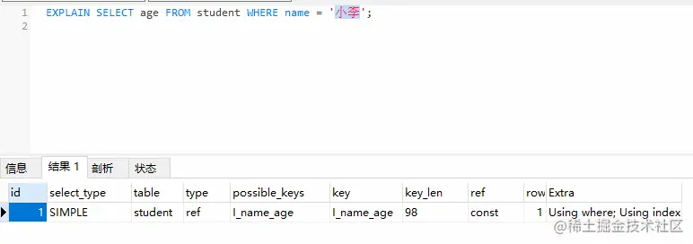

# 数据库中的存储结构

**数据库管理存储空间的基本单位是页（Page）**。

- 在数据库中，不论读一行，还是读多行，都是将这些行所在的页进行加载。
- 一个页中可以存储多个行记录（Row）


## 页、区、段和表空间的关系是：


一个表空间包括了一个或多个段

- 表空间（Tablespace）是一个逻辑容器，表空间存储的对象是段。
- **一个表空间中可以有一个或多个段，但是一个段只能属于一个表空间。**
- 数据库由一个或多个表空间组成，表空间从管理上可以划分为系统表空间、用户表空间、撤销表空间、临时表空间等。
- 在 InnoDB 中存在两种表空间的类型：共享表空间和独立表空间。
  - 如果是共享表空间就意味着多张表共用一个表空间。
  - 如果是独立表空间，就意味着每张表有一个独立的表空间。
  - 独立的表空间可以在不同的数据库之间进行迁移。
  - 查看 InnoDB 的表空间类型: `show variables like 'innodb_file_per_table';`
    - innodb_file_per_table=ON，这就意味着每张表都会单独保存为一个.ibd 文件。

一个段包括了一个或多个区

- 区在文件系统是一个连续分配的空间（在 InnoDB 中是连续的 64 个页）但段中不要求区与区间相邻。
- **段为数据库中的分配单位，根据数据库对象的不同以不同形式存在。**
  - 当我们创建数据表、索引的时候，就会相应创建对应的段，比如创建一张表时会创建一个表段，创建一个索引时会创建一个索引段。

一个区包括了多个页

- 在 InnoDB 存储引擎中，一个区会分配 64 个连续的页，
- 因为 InnoDB 中的页大小默认是 16KB，所以一个区的大小是 64*16KB=1MB。


## 数据页内的结构是怎样的

页（Page）如果按类型划分的话，常见的有数据页（保存 B+ 树节点）、系统页、Undo 页和事务数据页等。数据页是我们最常使用的页。

数据库 I/O 操作的最小单位是页，与数据库相关的内容都会存储在页结构里。

- 数据页包括七个部分，分别是文件头（File Header）、页头（Page Header）、最大最小记录（Infimum+supremum）、用户记录（User Records）、空闲空间（Free Space）、页目录（Page Directory）和文件尾（File Tailer）。
- 实际上，我们可以把这 7 个数据页分成 3 个部分。
  - 首先是文件通用部分，也就是文件头和文件尾。它们类似集装箱，将页的内容进行封装，通过文件头和文件尾校验的方式来确保页的传输是完整的。
    - 在文件头中有两个字段，分别是 FIL_PAGE_PREV 和 FIL_PAGE_NEXT，它们的作用相当于指针，分别指向上一个数据页和下一个数据页。连接起来的页相当于一个双向的链表。
    - 页之间是双向链表，物理上不一定连续，是逻辑上的连续
  - 第二个部分是记录部分，页的主要作用是存储记录，所以“最小和最大记录”和“用户记录”部分占了页结构的主要空间。另外空闲空间是个灵活的部分，当有新的记录插入时，会从空闲空间中进行分配用于存储新记录。
  - 第三部分是索引部分，这部分重点指的是页目录，它起到了记录的索引作用，因为在页中，记录是以单向链表的形式进行存储的。
- 


# 磁盘I/O的角度理解SQL查询的成本


数据库存储的基本单位是页，对于一棵 B+ 树的索引来说，是先从根节点找到叶子节点，也就是先查找数据行所在的页，再将页读入到内存中，在内存中对页的记录进行查找，从而得到想要数据。你看，虽然我们想要查找的，只是一行记录，但是对于磁盘 I/O 来说却需要加载一页的信息，因为页是最小的存储单位。

那么对于数据库来说，如果我们想要查找多行记录，查询时间是否会成倍地提升呢？其实数据库会采用缓冲池的方式提升页的查找效率。


## 数据库缓冲池

磁盘 I/O 需要消耗的时间很多，而在内存中进行操作，效率则会高很多，为了能让数据表或者索引中的数据随时被我们所用，DBMS 会申请占用内存来作为数据缓冲池，这样做的好处是可以让磁盘活动最小化，从而减少与磁盘直接进行 I/O 的时间。要知道，这种策略对提升 SQL 语句的查询性能来说至关重要。如果索引的数据在缓冲池里，那么访问的成本就会降低很多。

缓冲池管理器会尽量将经常使用的数据保存起来，在数据库进行页面读操作的时候，首先会判断该页面是否在缓冲池中，如果存在就直接读取，如果不存在，就会通过内存或磁盘将页面存放到缓冲池中再进行读取。


如果我们执行 SQL 语句的时候更新了缓存池中的数据，那么这些数据会马上同步到磁盘上吗？

- 实际上，当我们对数据库中的记录进行修改的时候，首先会修改缓冲池中页里面的记录信息，然后数据库会以一定的频率刷新到磁盘上。注意并不是每次发生更新操作，都会立刻进行磁盘回写。缓冲池会采用一种叫做 checkpoint 的机制将数据回写到磁盘上，这样做的好处就是提升了数据库的整体性能。
- 比如，当缓冲池不够用时，需要释放掉一些不常用的页，就可以采用强行采用 checkpoint 的方式，将不常用的脏页回写到磁盘上，然后再从缓冲池中将这些页释放掉。这里脏页（dirty page）指的是缓冲池中被修改过的页，与磁盘上的数据页不一致。

**查看缓冲池的大小**

如果你使用的是 MySQL MyISAM 存储引擎，它只缓存索引，不缓存数据，对应的键缓存参数为 key_buffer_size，你可以用它进行查看。

如果你使用的是 InnoDB 存储引擎，可以通过查看 innodb_buffer_pool_size 变量来查看缓冲池的大小，命令如下：

```
mysql > show variables like 'innodb_buffer_pool_size'
```

你能看到此时 InnoDB 的缓冲池大小只有 8388608/1024/1024=8MB，我们可以修改缓冲池大小为 128MB，方法如下：


然后再来看下修改后的缓冲池大小，此时已成功修改成了 128MB：


在 InnoDB 存储引擎中，我们可以同时开启多个缓冲池，这里我们看下如何查看缓冲池的个数，使用命令：

```
mysql > show variables like 'innodb_buffer_pool_instances'
```

你能看到当前只有一个缓冲池。实际上innodb_buffer_pool_instances默认情况下为 8，为什么只显示只有一个呢？这里需要说明的是，如果想要开启多个缓冲池，你首先需要将innodb_buffer_pool_size参数设置为大于等于 1GB，这时innodb_buffer_pool_instances才会大于 1。你可以在 MySQL 的配置文件中对innodb_buffer_pool_size进行设置，大于等于 1GB，然后再针对innodb_buffer_pool_instances参数进行修改。

## 数据页加载的三种方式

如果缓冲池中没有该页数据，那么缓冲池有以下三种读取数据的方式，每种方式的读取效率都是不同的

**内存读取**:

- 如果该数据存在于内存中，基本上执行时间在 1ms 左右，效率还是很高的。


**随机读取**

- 如果数据没有在内存中，就需要在磁盘上对该页进行查找，整体时间预估在 10ms 左右，这 10ms 中有 6ms 是磁盘的实际繁忙时间（包括了寻道和半圈旋转时间），有 3ms 是对可能发生的排队时间的估计值，另外还有 1ms 的传输时间，将页从磁盘服务器缓冲区传输到数据库缓冲区中。这 10ms 看起来很快，但实际上对于数据库来说消耗的时间已经非常长了，因为这还只是一个页的读取时间。


**顺序读取**

- 顺序读取其实是一种批量读取的方式，因为我们请求的数据在磁盘上往往都是相邻存储的，顺序读取可以帮我们批量读取页面，这样的话，一次性加载到缓冲池中就不需要再对其他页面单独进行磁盘 I/O 操作了。如果一个磁盘的吞吐量是 40MB/S，那么对于一个 16KB 大小的页来说，一次可以顺序读取 2560（40MB/16KB）个页，相当于一个页的读取时间为 0.4ms。采用批量读取的方式，即使是从磁盘上进行读取，效率也比从内存中只单独读取一个页的效率要高。


## 通过 last_query_cost 统计 SQL 语句的查询成本

我们先前已经讲过，一条 SQL 查询语句在执行前需要确定查询计划，如果存在多种查询计划的话，MySQL 会计算每个查询计划所需要的成本，从中选择成本最小的一个作为最终执行的查询计划。

如果我们想要查看某条 SQL 语句的查询成本，可以在执行完这条 SQL 语句之后，通过查看当前会话中的 last_query_cost 变量值来得到当前查询的成本。这个查询成本对应的是 SQL 语句所需要读取的页的数量。

我以 product_comment 表为例，如果我们想要查询 comment_id=900001 的记录，然后看下查询成本，我们可以直接在聚集索引上进行查找:

```
mysql> SELECT comment_id, product_id, comment_text, user_id FROM product_comment WHERE comment_id = 900001;
```

然后再看下查询优化器的成本，实际上我们只需要检索一个页即可：

```
mysql> SHOW STATUS LIKE 'last_query_cost';
```


## 总结

SQL 查询是一个动态的过程，从页加载的角度来看，我们可以得到以下两点结论：

- 位置决定效率。如果页就在数据库缓冲池中，那么效率是最高的，否则还需要从内存或者磁盘中进行读取，当然针对单个页的读取来说，如果页存在于内存中，会比在磁盘中读取效率高很多。
- 批量决定效率。如果我们从磁盘中对单一页进行随机读，那么效率是很低的（差不多 10ms），而采用顺序读取的方式，批量对页进行读取，平均一页的读取效率就会提升很多，甚至要快于单个页面在内存中的随机读取。

所以说，遇到 I/O 并不用担心，方法找对了，效率还是很高的。我们首先要考虑数据存放的位置，如果是经常使用的数据就要尽量放到缓冲池中，其次我们可以充分利用磁盘的吞吐能力，一次性批量读取数据，这样单个页的读取效率也就得到了提升。


# SQL 索引（Index）基本介绍

## 常用sql语法

```sql
-- 查看表索引
SHOW INDEX FROM table_name;
-- 查询 Schema 中所有的索引
SELECT DISTINCT
    TABLE_NAME,
    INDEX_NAME
FROM INFORMATION_SCHEMA.STATISTICS
WHERE TABLE_SCHEMA = 'schemaname';


-- 创建普通索引的基本语法(多个为组合索引)
CREATE INDEX index_name ON table_name ( column1, column2.....);
-- 修改表结构的方式添加普通索引(多个为组合索引)
ALTER TABLE table_name ADD INDEX index_name ON (column1, column2.....);

-- 创建唯一索引
CREATE UNIQUE INDEX index_name ON table_name (column1)
ALTER TABLE table_name ADD UNIQUE index_name ON (column1)
可以通过`ALTER TABLE table_name ADD UNIQUE (column1,column2);`创建唯一组合索引：

-- 全文索引
ALTER TABLE table_name ADD FULLTEXT (column1);
CREATE FULLTEXT INDEX index_name ON table_name (column1)

-- 索引一经创建不能修改，如果要修改索引，只能删除重建。
-- 删除索引
ALTER TABLE table_name DROP INDEX index_name;
-- 或者
DROP INDEX index_name ON table_name;

-- 创建索引时更换索引的数据结构
-- 通过USING关键字显示指定索引的数据结构（必须要为当前引擎支持的结构） 这里指定的是HASH
CREATE INDEX index_name ON table_name (column1, column2.....) [ASC|DESC]) USING HASH;
```


## 索引（Index）介绍

索引其实是一种数据结构，其功能是帮助我们快速匹配查找到需要的数据行，是数据库性能优化最常用的工具之一。其作用相当于超市里的导购员、书本里的目录。

数据库中的索引，就好比一本书的目录，它可以帮我们快速进行特定值的定位与查找，从而加快数据查询的效率。

- 索引就是帮助数据库管理系统高效获取数据的数据结构。
- 如果我们不使用索引，就必须从第 1 条记录开始扫描，直到把所有的数据表都扫描完，才能找到想要的数据。

索引并不是越多越好，假如这本书1000页，有500也是目录，它当然效率低，目录是要占纸张的,而索引是要占磁盘空间的。

**索引的种类（划分）**

刚刚我们说了索引是一种数据结构：`MySQL`索引支持的**数据结构**如下：

- `B+Tree`类型：`MySQL`中最常用的索引结构，大部分引擎支持，有序。
- `Hash`类型：大部分存储引擎都支持，字段值不重复的情况下查询最快，无序。
- `R-Tree`类型：`MyISAM`引擎支持，也就是空间索引的默认结构类型。
- `T-Tree`类型：`NDB-Cluster`引擎支持，主要用于`MySQL-Cluster`服务中。
- **`B+`树和哈希索引是最常见的索引结构，**几乎大部分存储引擎都实现了
- 但除开列出的几种索引结构外，`MySQL`索引支持的数据结构还有`R+、R*、QR、SS、X`树等结构。

索以功能逻辑划分索引：主键索引、唯一索引、普通索引、全文索引、组合索引

- 非主键字段上建立的索引一般被称为辅助索引或、二级索引或次级索引
- 普通索引是基础的索引，没有任何约束，主要用于提高查询效率。
- 唯一索引就是在普通索引的基础上增加了数据唯一性的约束，在一张数据表里可以有多个唯一索引。
- 主键索引在唯一索引的基础上增加了不为空的约束，也就是 NOT NULL+UNIQUE，一张表里最多只有一个主键索引。
- 全文索引用的不多，MySQL 自带的全文索引只支持英文。我们通常可以采用专门的全文搜索引擎，比如 ES(ElasticSearch) 和 Solr。
- （普通索引、唯一索引和主键索引）都是一类索引，只不过对数据的约束性逐渐提升。

按索引指向的列的个数可分为，单列索引、复合索引（多列索引）。

从存储方式来看，`MySQL`的索引主要可分为两大类：

- 聚簇索引：也被称为聚集索引、簇类索引
- 非聚簇索引：也叫非聚集索引、非簇类索引、二级索引、辅助索引、次级索引
- 


## 主键（聚簇）索引和（非聚集）索引

非聚焦和聚焦是从物理存储的角度上来说的：

- 一个表有且仅有一个聚集（clustered）索引，聚集索引在innodb中是主键的同义词，除主键之外的其他索引都是非聚集索引，非聚集索引在innodb中是二级索引的同义词。
- 二级索引保存的不是行数据的物理位置，而是是行的主键，所以二级索引实际上会查询两次，先查询对应的主键，再根据主键从聚集索引中查出物理地址(回表)


在主键字段上建立的索引被称为主键索引，它是一种特殊的唯一索引，不允许有空值。 主键索引和唯一索引的区别如下：

- 主键会自动添加唯一索引，所以主键列不需要添加索引

  - ```
    alter table tableName add primary key(name1)
    ```

- **主键索引一定是唯一性索引，唯一性索引并不一定就是主键索。** 
- **一个表中可以有多个唯一性索引，但只能有一个主键索引。**
- **主键不允许有空值，而唯一索引允许有空值**
-  **主键可以被其他字段作外键引用，而唯一性索引不能**


主键索引 （primary key）和 非主键唯一索引（unique index）的区别并比较谁更快？

- 在B+树中，将节点分为 叶子结点 和 非叶子节点
- 索引全部存于非叶子节点上，一个节点可以保存多个索引，
- 数据全部存于叶子节点上，根据叶子节点的内容不同，InnoDB索引分为主键索引和非主键索引。
  - **非主键索引的叶子节点存放的是主键的值，而主键索引的叶子节点存放的是整行数据。**
- 这样我们也明白为什么**非主键索引也被称为二级索引，而主键索引也成为聚簇索引。**
  - 二级证明要查找两次：非主键索引找到叶子节点得到主键的值，在根据主键去索引树中搜索一次得到整行数据
  - **这个过程也被称为回表。**
- 也就是说，非主键索引查询会比主键查询多搜索一棵树。

**所以：每一个表只能有一个聚集索引，因为数据行本身只能按一个顺序存储。**


**聚集和非聚集索引的使用场景和优势：**

- 聚集索引与非聚集索引的原理不同，也有各自的使用场景和优势：

- 聚集索引的叶子节点存储的就是我们的数据记录，非聚集索引的叶子节点存储的是数据位置**。**
- **非聚集索引增删改不会影响数据表的物理存储顺序。**
- 一个表只能有一个聚集索引，因为只能有一种排序存储的方式，但可以有多个非聚集索引，也就是多个索引目录提供数据检索。

总结：

- **使用聚集索引的时候，数据的查询效率高，但如果对数据进行插入，删除，更新等操作，效率会比非聚集索引低。（非聚集索引不会影响数据表的物理存储顺序）**


## 组合索引(复合索引、联合索引)

除了业务逻辑和物理实现方式，索引还可以按照字段个数进行划分，分成单一索引和联合索引。

- **索引列为一列时为单一索引；多个列组合在一起创建的索引叫做联合索引。**

组合索引(也叫复合索引、联合索引)，即一个索引包含多个列。

```sql
 -- usernname长度为 16，这里用 10。这是因为一般情况下名字的长度不会超过10，这样会加速索引查询速度，还会减少索引文件的大小，提高 INSERT的更新速度。
 ALTER TABLE mytable ADD INDEX name_city_age (username(10),city,age);
```

建立上面组合索引，其实是相当于分别建立了下面三组组合索引：

- [ usernname,city,age] 、[ usernname,city]、[ usernname]

- **遵循最左前缀原则**
  - 简单的理解就是只从最左面的开始组合。组合索引的**第一个字段必须出现在查询组句**中，并且**不能跳跃**，
  - 不能跳跃：**[ usernname,age]组合实际上只用到了usernname的索引，age并没有用到！**


where**索引的字段可以是任意顺序的**：假设在test表有组合索引(col1,col2)

- WHERE col1=“1” AND clo2=“2” 和 WHERE col2=“2” AND clo1=“1”  都会用到索引(col1,col2)，效率没有区别

- **mysql执行优化器会对其进行优化**，**当不考虑索引时，where条件顺序对效率没有影响**，**真正有影响的是是否用到了索引**！

  

联合索引好处：

- 建一个联合索引(col1,col2,col3)，实际相当于建了(col1),(col1,col2),(col1,col2,col3)三个索引。每多一个索引，都会增加写操作的开销和磁盘空间的开销。对于大量数据的表，使用联合索引会大大的减少开销！
- 联合索引可以利用覆盖索引机制提高效率
- 索引列多,通过联合索引筛选出的数据越少，相比单列索引效率高


**联合索引存在最左匹配原则：**

最左匹配原则，也就是按照最左优先的方式进行索引的匹配。联合索引的最左原则就是说，索引是一种顺序结构，我们按照什么顺序创建索引，就只能按照这个顺序使用索引，这容易理解。

- 假设我们有X、Y、Z三个字段，创建联合索引（X, Y, Z），可以理解成，数据库按照不同的权重排列了XYZ，形成了一个新值。
- 查询“X=9 AND Y=8 AND Z=7”的过程，就是在一个由小到大排列的数值序列中寻找“987”，可以很快找到。
- 查询“Y=8 AND Z=7”，就用不上索引了，因为可能存在187、287、387、487...，这样就必须扫描所有数值。
- 查询“Z=7 AND Y=8 AND X=9”
  - SQL条件语句中的字段顺序不重要，因为在逻辑查询优化阶段会自动进行 查询重写。
  - 对于等值查询，mysql优化器会自动调整顺序的。比如（a,b,c,d)联合索引，查询条件 where a=1 and b= 2 and d >4 and c=3,mysql里也是用到了联合索引的。
- **综上，使用联合索引的时候，<u>查询字段可以少</u>，但只能从右侧开始减少，不能从左侧。**
- 如果我们遇到了范围条件查询，比如<、<=、>、>=、between等。那么范围列后的列就无法使用到索引


# **覆盖索引（covering index ，或称为索引覆盖）：机制**

覆盖索引（covering index ，或称为索引覆盖）即从非主键索引中就能查到的记录，而**不需要查询主键索引中的记录，避免了回表的产生减少了树的搜索次数**，显著提升性能。

**如何确定数据库成功使用了覆盖索引呢？**

- row Extra中Using index表明我们成功使用了覆盖索引




联合索引的 `B+ Tree` 存储结构:

- 创建的联合索引为 （`b，c,d`） a是主键
- 我们创建了一个联合索引也会生成一个索引树，同样是 `B+ Tree` 的结构，只不过 `它的 data 部分存储的是联合索引所在行的主键值`
- 拿到 联合索引所在行的主键值 后，在通过 **主键索引 B+ Tree** 就可以直接拿到具体的行数据了（2个不同的B+ Tree）

## 联合索引的覆盖索引案例

`select b,c, d from t1 where b = 15 and c = 16 and d = 17 ` 和 `select a,b,c,d from t1 where b=15 and c=16 and d=17`


- 分析上图，满足条件的结果，是不是完整的显示在了叶子节点上！【我们 `select` 查询的内容不是全表，是 `b，c，d` 三个字段，在叶子节点上，这`3`个字段是不是都已经有对应的值了】
- `a` 是主键列，但是在联合索引的叶子节点上存储了对应的主键值，所以**依旧不需要回表操作**

结论：

- **使用覆盖索引，我们需要 select 出来的列，都已经存在于索引树的叶子节点上，所以不需要回表操作**
- **如果我们 select 出来的某列，不在该联合索引的叶子节点上（比如上表的 e 列），那就需要根据对应索引值，去主键索引树上回表查询对应的 e 列值了**


# 索引的原理和相关数据结构

**索引其实是一种数据结构，其功能是帮助我们快速匹配查找到需要的数据行。**

数据库服务器有两种存储介质，分别为硬盘和内存。内存属于临时存储，容量有限，而且当发生意外时（比如断电或者发生故障重启）会造成数据丢失；硬盘相当于永久存储介质，这也是为什么我们需要把数据保存到硬盘上。

虽然内存的读取速度很快，但我们还是需要将索引存放到硬盘上，这样的话，当我们在硬盘上进行查询时，也就产生了硬盘的 I/O 操作。相比于内存的存取来说，硬盘的 I/O 存取消耗的时间要高很多。我们通过索引来查找某行数据的时候，需要计算产生的磁盘 I/O 次数，当磁盘 I/O 次数越多，所消耗的时间也就越大。**如果我们能让索引的数据结构尽量减少硬盘的 I/O 操作，所消耗的时间也就越小。**


## 什么是B树： Balance Tree

如果用二叉树作为索引的实现结构，会让树变得很高，增加硬盘的 I/O 次数，影响数据查询的时间。因此一个节点就不能只有 2 个子节点，而应该允许有 M 个子节点 (M>2)。

- B 树的出现就是为了解决这个问题，B 树的英文是 Balance Tree，也就是平衡的多路搜索树，它的高度远小于平衡二叉树的高度。在文件系统和数据库系统中的索引结构经常采用 B 树来实现。

B 树作为平衡的多路搜索树，它的每一个节点最多可以包括 M 个子节点，M 称为 B 树的阶。

- 同时你能看到，每个磁盘块中包括了关键字和子节点的指针。如果一个磁盘块中包括了 x 个关键字，那么指针数就是 x+1。对于一个 100 阶的 B 树来说，如果有 3 层的话最多可以存储约 100 万的索引数据。对于大量的索引数据来说，采用 B 树的结构是非常适合的，因为树的高度要远小于二叉树的高

一个 M 阶的 B 树（M>2）有以下的特性：

- 根节点的儿子数的范围是[2,M]。
- 每个中间节点包含 k-1 个关键字和 k 个孩子，孩子的数量 = 关键字的数量 +1，k 的取值范围为[ceil(M/2), M]。
- 叶子节点包括 k-1 个关键字（叶子节点没有孩子），k 的取值范围为[ceil(M/2), M]。
- 假设中间节点节点的关键字为：Key[1], Key[2], …, Key[k-1]，且关键字按照升序排序，即 Key[i]
- 所有叶子节点位于同一层。


然后我们来看下如何用 B 树进行查找。假设我们想要查找的关键字是 9，那么步骤可以分为以下几步：

- 我们与根节点的关键字 (17，35）进行比较，9 小于 17 那么得到指针 P1；
- 按照指针 P1 找到磁盘块 2，关键字为（8，12），因为 9 在 8 和 12 之间，所以我们得到指针 P2；
- 按照指针 P2 找到磁盘块 6，关键字为（9，10），然后我们找到了关键字 9。

你能看出来在 B 树的搜索过程中，我们比较的次数并不少，但如果把数据读取出来然后在内存中进行比较，这个时间就是可以忽略不计的。而读取磁盘块本身需要进行 I/O 操作，消耗的时间比在内存中进行比较所需要的时间要多，是数据查找用时的重要因素，B 树相比于平衡二叉树来说磁盘 I/O 操作要少，在数据查询中比平衡二叉树效率要高。

- 真正比较的次数，时间复杂度确实有降低，但是不是量级上的降低，但是降低了 磁盘I/O操作的次数 这个就比较明显地提高效率


## 什么是 B+ 树

B+ 树基于 B 树做出了改进，主流的 DBMS 都支持 B+ 树的索引方式，比如 MySQL。**B+ 树和 B 树的差异在于以下几点：**

- 有 k 个孩子的节点就有 k 个关键字。也就是孩子数量 = 关键字数，而 B 树中，孩子数量 = 关键字数 +1。
- 非叶子节点的关键字也会同时存在在子节点中，并且是在子节点中所有关键字的最大（或最小）。
- 非叶子节点仅用于索引，不保存数据记录，跟记录有关的信息都放在叶子节点中。而 B 树中，非叶子节点既保存索引，也保存数据记录。
  - B+ 树的中间节点并不直接存储数据。
  - B树叶子结点没有使用双向链表串连；B+树叶子结点使用双向链表进行串连，为了支持区间查询。
- 所有关键字都在叶子节点出现，叶子节点构成一个有序链表，而且叶子节点本身按照关键字的大小从小到大顺序链接。
- B+树的查询效率更加稳定：由于非终结点并不是最终指向文件内容的结点，而只是叶子结点中关键字的索引。所以任何关键字的查找必须走一条从根结点到叶子结点的路。所有关键字查询的路径长度相同，导致每一个数据的查询效率相当。
- B+树的磁盘读写代价更低：B+树的内部节点并没有指向关键字具体信息的指针，因此其内部节点相对B树更小，如果把所有同一内部节点的关键字存放在同一盘块中，那么盘块所能容纳的关键字数量也越多，一次性读入内存的需要查找的关键字也就越多，相对IO读写次数就降低了。
- 由于B+树的数据都存储在叶子结点中，分支结点均为索引，方便扫库，只需要扫一遍叶子结点即可，但是B树因为其分支结点同样存储着数据，我们要找到具体的数据，需要进行一次中序遍历按序来扫，所以B+树更加适合在区间查询的情况，所以通常B+树用于数据库索引。


下图就是一棵 B+ 树，阶数为 3，根节点中的关键字 1、18、35 分别是子节点（1，8，14），（18，24，31）和（35，41，53）中的最小值。每一层父节点的关键字都会出现在下一层的子节点的关键字中，因此在叶子节点中包括了所有的关键字信息，并且每一个叶子节点都有一个指向下一个节点的指针，这样就形成了一个链表。


比如，我们想要查找关键字 16，B+ 树会自顶向下逐层进行查找：

- 与根节点的关键字 (1，18，35) 进行比较，16 在 1 和 18 之间，得到指针 P1（指向磁盘块 2）
- 找到磁盘块 2，关键字为（1，8，14），因为 16 大于 14，所以得到指针 P3（指向磁盘块 7）
- 找到磁盘块 7，关键字为（14，16，17），然后我们找到了关键字 16，所以可以找到关键字 16 所对应的数据。

整个过程一共进行了 3 次 I/O 操作，看起来 B+ 树和 B 树的查询过程差不多，但是 B+ 树和 B 树有个根本的差异在于，B+ 树的中间节点并不直接存储数据。这样的好处都有什么呢？

- 首先，B+ 树查询效率更稳定。因为 B+ 树每次只有访问到叶子节点才能找到对应的数据，而在 B 树中，非叶子节点也会存储数据，这样就会造成查询效率不稳定的情况，有时候访问到了非叶子节点就可以找到关键字，而有时需要访问到叶子节点才能找到关键字。
- 其次，B+ 树的查询效率更高，这是因为通常 B+ 树比 B 树更矮胖（阶数更大，深度更低），查询所需要的磁盘 I/O 也会更少。同样的磁盘页大小，B+ 树可以存储更多的节点关键字。
- 不仅是对单个关键字的查询上，在查询范围上，B+ 树的效率也比 B 树高。这是因为所有关键字都出现在 B+ 树的叶子节点中，并通过有序链表进行了链接。而在 B 树中则需要通过中序遍历才能完成查询范围的查找，效率要低很多。

磁盘的 I/O 操作次数对索引的使用效率至关重要。虽然传统的二叉树数据结构查找数据的效率高，但很容易增加磁盘 I/O 操作的次数，影响索引使用的效率。因此在构造索引的时候，我们更倾向于采用“矮胖”的数据结构。

- B 树和 B+ 树都可以作为索引的数据结构，在 MySQL 中采用的是 B+ 树，B+ 树在查询性能上更稳定，在磁盘页大小相同的情况下，树的构造更加矮胖，所需要进行的磁盘 I/O 次数更少，更适合进行关键字的范围查询。


## Hash索引的底层原理


Hash 本身是一个函数，又被称为散列函数，它可以帮助我们大幅提升检索数据的效率。

- Hash索引有很大的限制，如联合索引、模糊查询、范围查询，以及列里有重复值多。
- 需要遍历链表中所有行指针，逐一进行比较，直到找到所有符合条件的
- Hash索引仅能满足=, <>, IN查询，不能使用范围查询。

Hash 算法是通过某种确定性的算法（比如 MD5、SHA1、SHA2、SHA3）将输入转变为输出。

- 相同的输入永远可以得到相同的输出，假设输入内容有微小偏差，在输出中通常会有不同的结果。如果你想要验证两个文件是否相同，那么你不需要把两份文件直接拿来比对，只需要让对方把 Hash 函数计算得到的结果告诉你即可，然后在本地同样对文件进行 Hash 函数的运算，最后通过比较这两个 Hash 函数的结果是否相同，就可以知道这两个文件是否相同。

键值 key 通过 Hash 映射找到桶 bucket。在这里桶（bucket）指的是一个能存储一条或多条记录的存储单位。一个桶的结构包含了一个内存指针数组，桶中的每行数据都会指向下一行，形成链表结构，当遇到 Hash 冲突时，会在桶中进行键值的查找。

什么是 Hash 冲突呢？

- **如果桶的空间小于输入的空间，不同的输入可能会映射到同一个桶中，这时就会产生 Hash 冲突，**如果 Hash 冲突的量很大，就会影响读取的性能。
- 通常 Hash 值的字节数比较少，简单的 4 个字节就够了。在 Hash 值相同的情况下，就会进一步比较桶（Bucket）中的键值，从而找到最终的数据行。
- Hash 值的字节数多的话可以是 16 位、32 位等，比如采用 MD5 函数就可以得到一个 16 位或者 32 位的数值，32 位的 MD5 已经足够安全，重复率非常低。

Hash 索引与 B+ 树索引的区别：

- Hash 索引不能进行范围查询，而 B+ 树可以。**这是因为 Hash 索引指向的数据是无序的，而 B+ 树的叶子节点是个有序的链表。**
- Hash 索引不支持联合索引的最左侧原则（即联合索引的部分索引无法使用），而 B+ 树可以。对于联合索引来说，Hash 索引在计算 Hash 值的时候是将索引键合并后再一起计算 Hash 值，所以不会针对每个索引单独计算 Hash 值。因此如果用到联合索引的一个或者几个索引时，联合索引无法被利用。
- Hash 索引不支持 ORDER BY 排序，因为 Hash 索引指向的数据是无序的，因此无法起到排序优化的作用，而 B+ 树索引数据是有序的，可以起到对该字段 ORDER BY 排序优化的作用。同理，我们也无法用 Hash 索引进行模糊查询，而 B+ 树使用 LIKE 进行模糊查询的时候，LIKE 后面前模糊查询（比如 % 开头）的话就可以起到优化作用。

对于等值查询来说，通常 Hash 索引的效率更高，不过也存在一种情况，就是索引列的重复值如果很多，效率就会降低。这是因为遇到 Hash 冲突时，需要遍历桶中的行指针来进行比较，找到查询的关键字，非常耗时。所以，Hash 索引通常不会用到重复值多的列上，比如列为性别、年龄的情况等。

MySQL 中的 Memory 存储引擎支持 Hash 存储，如果我们需要用到查询的临时表时，就可以选择 Memory 存储引擎，把某个字段设置为 Hash 索引，比如字符串类型的字段，进行 Hash 计算之后长度可以缩短到几个字节。当字段的重复度低，而且经常需要进行等值查询的时候，采用 Hash 索引是个不错的选择。

另外 MySQL 的 InnoDB 存储引擎还有个“自适应 Hash 索引”的功能，就是当某个索引值使用非常频繁的时候，它会在 B+ 树索引的基础上再创建一个 Hash 索引，这样让 B+ 树也具备了 Hash 索引的优点。


## Hash 索引与 B+ 树索引

你能看到 Hash 索引存在着很多限制，相比之下在数据库中 B+ 树索引的使用面会更广，不过也有一些场景采用 Hash 索引效率更高，比如在键值型（Key-Value）数据库中，Redis 存储的核心就是 Hash 表。

- 另外 MySQL 中的 Memory 存储引擎支持 Hash 存储，如果我们需要用到查询的临时表时，就可以选择 Memory 存储引擎，把某个字段设置为 Hash 索引，比如字符串类型的字段，进行 Hash 计算之后长度可以缩短到几个字节。当字段的重复度低，而且经常需要进行等值查询的时候，采用 Hash 索引是个不错的选择。
- 另外 MySQL 的 InnoDB 存储引擎还有个“自适应 Hash 索引”的功能，就是当某个索引值使用非常频繁的时候，它会在 B+ 树索引的基础上再创建一个 Hash 索引，这样让 B+ 树也具备了 Hash 索引的优点。

**Hash 索引与 B+ 树索引的区别:**

- Hash 索引不能进行范围查询，而 B+ 树可以。这是因为 Hash 索引指向的数据是无序的，而 B+ 树的叶子节点是个有序的链表。
- Hash 索引不支持联合索引的最左侧原则（即联合索引的部分索引无法使用），而 B+ 树可以。对于联合索引来说，Hash 索引在计算 Hash 值的时候是将索引键合并后再一起计算 Hash 值，所以不会针对每个索引单独计算 Hash 值。因此如果用到联合索引的一个或者几个索引时，联合索引无法被利用。
- Hash 索引不支持 ORDER BY 排序，因为 Hash 索引指向的数据是无序的，因此无法起到排序优化的作用，而 B+ 树索引数据是有序的，可以起到对该字段 ORDER BY 排序优化的作用。同理，我们也无法用 Hash 索引进行模糊查询，而 B+ 树使用 LIKE 进行模糊查询的时候，LIKE 后面前模糊查询（比如 % 开头）的话就可以起到优化作用。
- 对于等值查询来说，通常 Hash 索引的效率更高，不过也存在一种情况，就是索引列的重复值如果很多，效率就会降低。这是因为遇到 Hash 冲突时，需要遍历桶中的行指针来进行比较，找到查询的关键字，非常耗时。所以，Hash 索引通常不会用到重复值多的列上，比如列为性别、年龄的情况等。


# 从数据页的角度理解B+树查询


数据库中的存储结构是怎样的:

在数据库中，不论读一行，还是读多行，都是将这些行所在的页进行加载。也就是说，数据库管理存储空间的基本单位是页（Page）。

- 一个页中可以存储多个行记录（Row），同时在数据库中，还存在着区（Extent）、段（Segment）和表空间（Tablespace）。行、页、区、段、表空间的关系如下图所示：
- 

从图中你能看到一个表空间包括了一个或多个段，一个段包括了一个或多个区，一个区包括了多个页，而一个页中可以有多行记录，这些概念我简单给你讲解下。

- 区（Extent）是比页大一级的存储结构，在 InnoDB 存储引擎中，一个区会分配 64 个连续的页。因为 InnoDB 中的页大小默认是 16KB，所以一个区的大小是 64*16KB=1MB。

- 段（Segment）由一个或多个区组成，区在文件系统是一个连续分配的空间（在 InnoDB 中是连续的 64 个页），不过在段中不要求区与区之间是相邻的。段是数据库中的分配单位，不同类型的数据库对象以不同的段形式存在。当我们创建数据表、索引的时候，就会相应创建对应的段，比如创建一张表时会创建一个表段，创建一个索引时会创建一个索引段。

- 表空间（Tablespace）是一个逻辑容器，表空间存储的对象是段，在一个表空间中可以有一个或多个段，但是一个段只能属于一个表空间。数据库由一个或多个表空间组成，表空间从管理上可以划分为系统表空间、用户表空间、撤销表空间、临时表空间等。

- 在 InnoDB 中存在两种表空间的类型：共享表空间和独立表空间。如果是共享表空间就意味着多张表共用一个表空间。如果是独立表空间，就意味着每张表有一个独立的表空间，也就是数据和索引信息都会保存在自己的表空间中。独立的表空间可以在不同的数据库之间进行迁移。

  - 你可以通过下面的命令来查看 InnoDB 的表空间类型：innodb_file_per_table=ON，这就意味着每张表都会单独保存为一个.ibd 文件

  - ```
    mysql > show variables like 'innodb_file_per_table';
    ```

### 数据页内的结构是怎样的

页（Page）如果按类型划分的话，常见的有数据页（保存 B+ 树节点）、系统页、Undo 页和事务数据页等。数据页是我们最常使用的页。

- 表页的大小限定了表行的最大长度，不同 DBMS 的表页大小不同。

在 SQL Server 的页大小为 8KB，而在 Oracle 中我们用术语“块”（Block）来代表“页”，Oralce 支持的块大小为 2KB，4KB，8KB，16KB，32KB 和 64KB。

数据库 I/O 操作的最小单位是页，与数据库相关的内容都会存储在页结构里。数据页包括七个部分，分别是文件头（File Header）、页头（Page Header）、最大最小记录（Infimum+supremum）、用户记录（User Records）、空闲空间（Free Space）、页目录（Page Directory）和文件尾（File Tailer）。


实际上，我们可以把这 7 个数据页分成 3 个部分。

首先是文件通用部分，也就是文件头和文件尾。它们类似集装箱，将页的内容进行封装，通过文件头和文件尾校验的方式来确保页的传输是完整的。

在文件头中有两个字段，分别是 FIL_PAGE_PREV 和 FIL_PAGE_NEXT，它们的作用相当于指针，分别指向上一个数据页和下一个数据页。连接起来的页相当于一个双向的链表，如下图所示：


需要说明的是采用链表的结构让数据页之间不需要是物理上的连续，而是逻辑上的连续。

我们之前讲到过 Hash 算法，这里文件尾的校验方式就是采用 Hash 算法进行校验。举个例子，当我们进行页传输的时候，如果突然断电了，造成了该页传输的不完整，这时通过文件尾的校验和（checksum 值）与文件头的校验和做比对，如果两个值不相等则证明页的传输有问题，需要重新进行传输，否则认为页的传输已经完成。

- 第二个部分是记录部分，页的主要作用是存储记录，所以“最小和最大记录”和“用户记录”部分占了页结构的主要空间。另外空闲空间是个灵活的部分，当有新的记录插入时，会从空闲空间中进行分配用于存储新记录，如下图所示：

- 

- 第三部分是索引部分，这部分重点指的是页目录，它起到了记录的索引作用，因为在页中，记录是以单向链表的形式进行存储的。单向链表的特点就是插入、删除非常方便，但是检索效率不高，最差的情况下需要遍历链表上的所有节点才能完成检索，因此在页目录中提供了二分查找的方式，用来提高记录的检索效率。这个过程就好比是给记录创建了一个目录：

  - 将所有的记录分成几个组，这些记录包括最小记录和最大记录，但不包括标记为“已删除”的记录。
  - 第 1 组，也就是最小记录所在的分组只有 1 个记录；最后一组，就是最大记录所在的分组，会有 1-8 条记录；其余的组记录数量在 4-8 条之间。这样做的好处是，除了第 1 组（最小记录所在组）以外，其余组的记录数会尽量平分。
  - 在每个组中最后一条记录的头信息中会存储该组一共有多少条记录，作为 n_owned 字段。
  - 页目录用来存储每组最后一条记录的地址偏移量，这些地址偏移量会按照先后顺序存储起来，每组的地址偏移量也被称之为槽（slot），每个槽相当于指针指向了不同组的最后一个记录。如下图所示：
  - 
  - 页目录存储的是槽，槽相当于分组记录的索引。我们通过槽查找记录，实际上就是在做二分查找。这里我以上面的图示进行举例，5 个槽的编号分别为 0，1，2，3，4，我想查找主键为 9 的用户记录，我们初始化查找的槽的下限编号，设置为 low=0，然后设置查找的槽的上限编号 high=4，然后采用二分查找法进行查找。
  - 首先找到槽的中间位置 p=(low+high)/2=(0+4)/2=2，这时我们取编号为 2 的槽对应的分组记录中最大的记录，取出关键字为 8。因为 9 大于 8，所以应该会在槽编号为 (p,high]的范围进行查找
  - 接着重新计算中间位置 p’=(p+high)/2=(2+4)/2=3，我们查找编号为 3 的槽对应的分组记录中最大的记录，取出关键字为 12。因为 9 小于 12，所以应该在槽 3 中进行查找。
  - 遍历槽 3 中的所有记录，找到关键字为 9 的记录，取出该条记录的信息即为我们想要查找的内容。

  从数据页的角度看 B+ 树是如何进行查询的

  MySQL 的 InnoDB 存储引擎采用 B+ 树作为索引，而索引又可以分成聚集索引和非聚集索引（二级索引），这些索引都相当于一棵 B+ 树，如图所示。一棵 B+ 树按照节点类型可以分成两部分：

  - 叶子节点，B+ 树最底层的节点，节点的高度为 0，存储行记录。
  - 非叶子节点，节点的高度大于 0，存储索引键和页面指针，并不存储行记录本身。
  - 我们刚才学习了页结构的内容，你可以用页结构对比，看下 B+ 树的结构。
    - 在一棵 B+ 树中，每个节点都是一个页，每次新建节点的时候，就会申请一个页空间。同一层上的节点之间，通过页的结构构成一个双向的链表（页文件头中的两个指针字段）。非叶子节点，包括了多个索引行，每个索引行里存储索引键和指向下一层页面的页面指针。最后是叶子节点，它存储了关键字和行记录，在节点内部（也就是页结构的内部）记录之间是一个单向的链表，但是对记录进行查找，则可以通过页目录采用二分查找的方式来进行。
    - 当我们从页结构来理解 B+ 树的结构的时候，可以帮我们理解一些通过索引进行检索的原理：

B+ 树是如何进行记录检索的？

如果通过 B+ 树的索引查询行记录，首先是从 B+ 树的根开始，逐层检索，直到找到叶子节点，也就是找到对应的数据页为止，将数据页加载到内存中，页目录中的槽（slot）采用二分查找的方式先找到一个粗略的记录分组，然后再在分组中通过链表遍历的方式查找记录。

普通索引和唯一索引在查询效率上有什么不同？

我们创建索引的时候可以是普通索引，也可以是唯一索引，那么这两个索引在查询效率上有什么不同呢？

唯一索引就是在普通索引上增加了约束性，也就是关键字唯一，找到了关键字就停止检索。而普通索引，可能会存在用户记录中的关键字相同的情况，根据页结构的原理，当我们读取一条记录的时候，不是单独将这条记录从磁盘中读出去，而是将这个记录所在的页加载到内存中进行读取。InnoDB 存储引擎的页大小为 16KB，在一个页中可能存储着上千个记录，因此在普通索引的字段上进行查找也就是在内存中多几次“判断下一条记录”的操作，对于 CPU 来说，这些操作所消耗的时间是可以忽略不计的。所以对一个索引字段进行检索，采用普通索引还是唯一索引在检索效率上基本上没有差别。


#  不存在理想索引和三星索引的介绍

我之前讲过页这个结构，表和索引都会存储在页中，不同的 DBMS 默认的页的大小是不同的，同时我们也了解到 DBMS 会有缓冲池的机制，在缓冲池里需要有足够多的空间，存储经常被使用到的页，尽可能减少直接的磁盘 I/O 操作。这种策略对 SQL 查询的底层执行来说非常重要，可以从物理层面上最大程度提升 SQL 的查询效率。

但同时我们还需要关注索引的设计，如果只是针对 SQL 查询，我们是可以设计出理想的索引的，不过在实际工作中这种理想的索引往往会带来更多的资源消耗。


## 索引片和过滤因子：

索引片就是 SQL 查询语句在执行中需要扫描的一个索引片段，我们会根据索引片中包含的匹配列的数量不同，**将索引分成窄索引（比如包含索引列数为 1 或 2）和宽索引（包含的索引列数大于 2）。**

- **如果索引片越宽，那么需要顺序扫描的索引页就越多；如果索引片越窄，就会减少索引访问的开销。**

宽索引需要顺序扫描的索引页很多，不过它也可以避免通过索引找到主键，再通过主键回表进行数据查找的情况。

​	**回表指的就是数据库根据索引找到了数据行之后，还需要通过主键再次到数据表中读取数据的情况。**

过滤因子：

- 索引片的设计中，我们还需要考虑一个因素，那就是过滤因子，它描述了谓词的选择性。在 WHERE 条件语句中，每个条件都称为一个谓词，谓词的选择性也等于满足这个条件列的记录数除以总记录数的比例。
- 举个例子，我们在 player 数据表中，定义了 team_id 和 height 字段，我们也可以设计个 gender 字段，这里 gender 的取值都为 male。
- 在 player 表中记录比较少，一共 37 条记录，不过我们也可以统计以下字段：gender、team_id、height 和 name，以便评估过滤因子的筛选能力，如下表所示：
- 
- 你能看到gender='male'不是个好过滤因子，因为所有球员都是男性，同样team_id=1001也不是个好过滤因子，因为这个比例在这个特定的数据集中高达 54%，相比之下height=2.08具有一定的筛选性，过滤因子能力最强的是 name 字段。
- 这时如果我们创建一个联合的过滤条件（height, team_id），那么它的过滤能力是怎样的呢？
- 
- 联合过滤因子有更高的过滤能力，这里还需要注意一个条件，那就是条件列的关联性应该尽量相互独立，否则如果列与列之间具有相关性，联合过滤因子的能力就会下降很多。比如城市名称和电话区号就有强相关性，这两个列组合到一起不会加强过滤效果。
- 你能看到过滤因子决定了索引片的大小（注意这里不是窄索引和宽索引），过滤因子的条件过滤能力越强，满足条件的记录数就越少，SQL 查询需要扫描的索引片也就越小。同理，如果我们没有选择好索引片中的过滤因子，就会造成索引片中的记录数过多的情况。

## 针对 SQL 查询的理想索引设计：三星索引

刚才我介绍了宽索引和窄索引，有些时候宽索引可以提升 SQL 的查询效率，那么你可能会问，如果针对 SQL 查询来说，有没有一个标准能让 SQL 查询效率最大化呢？

实际上，存在着一个三星索引的标准，这就好比我们在学习数据表设计时提到的三范式一样。**三星索引具体指的是：**

- 在 WHERE 条件语句中，找到所有等值谓词中的条件列，将它们作为索引片中的开始列；
- 将 GROUP BY 和 ORDER BY 中的列加入到索引中；
- 将 SELECT 字段中剩余的列加入到索引片中。

**你能看到这样操作下来，索引片基本上会变成一个宽索引，把能添加的相关列都加入其中。**

- 首先，如果我们要通过索引查找符合条件的记录，就需要将 WHERE 子句中的等值谓词列加入到索引片中，这样索引的过滤能力越强，最终扫描的数据行就越少。
  - 在一条 SQL 查询中，我们希望 **where子句中的等值谓词列是在索引片中的，这样就可以局部扫描，而不是全表扫描。 而局部扫描的效率，在于索引的过滤能力，过滤越强，最终扫描的行越少。**

- 另外，如果我们要对数据记录分组或者排序，都需要重新扫描数据记录。**为了避免进行 file sort 排序**，可以把 GROUP BY 和 ORDER BY 中涉及到的列加入到索引中，**因为创建了索引就会按照索引的顺序来存储数据，这样再对这些数据按照某个字段进行分组或者排序的时候，就会提升效率。**

- 最后，我们取数据的时候，可能会存在回表情况。回表就是通过索引找到了数据行，但是还需要通过主键的方式在数据表中查找完成的记录。这是因为 SELECT 所需的字段并不都保存在索引中，**因此我们可以将 SELECT 中的字段都保存在索引中避免回表的情况**，从而提升查询效率。


## 为什么很难存在理想的索引设计

从三星索引的创建过程中，你能看到三星索引实际上分析了在 SQL 查询过程中所有可能影响效率的环节，通过在索引片中添加索引的方式来提升效率。通过上面的原则，我们可以很快创建一个 SQL 查询语句的三星索引（有时候可能只有两星，比如同时拥有范围谓词和 ORDER BY 的时候）。

但就同三范式一样，很多时候我们并没有遵循三范式的设计原则，而是采用了反范式设计。同样，有时候我们并不能需要完全遵循三星索引的原则，原因主要有以下两点：

- 采用三星索引会让索引片变宽，这样每个页能够存储的索引数据就会变少，从而增加了页加载的数量。从另一个角度来看，如果数据量很大，比如有 1000 万行数据，过多索引所需要的磁盘空间可能会成为一个问题，对缓冲池所需空间的压力也会增加
- 增加了索引维护的成本。如果我们为所有的查询语句都设计理想的三星索引，就会让数据表中的索引个数过多，这样索引维护的成本也会增加。举个例子，当我们添加一条记录的时候，就需要在每一个索引上都添加相应的行（存储对应的主键值），假设添加一行记录的时间成本是 10ms（磁盘随机读取一个页的时间），那么如果我们创建了 10 个索引，添加一条记录的时间就可能变成 0.1s，如果是添加 10 条记录呢？就会花费近 1s 的时间。从索引维护的成本来看消耗还是很高的。当然对于数据库来说，数据的更新不一定马上回写到磁盘上，但即使不及时将脏页进行回写，也会造成缓冲池中的空间占用过多，脏页过多的情况。

你能看到针对一条 SQL 查询来说，三星索引是个理想的方式，但实际运行起来我们要考虑更多维护的成本，在索引效率和索引维护之间进行权衡。

三星索引会让索引变宽，好处就是不需要进行回表查询，减少了磁盘 I/O 的次数，弊端就是会造成频繁的页分裂和页合并，对于数据的插入和更新来说，效率会降低不少。


# 那我们该如何设计索引呢？

首先一张表的索引个数不宜过多，否则一条记录的增加和修改，会因为过多的索引造成额外的负担。针对这个情况，当你需要新建索引的时候，首先考虑在原有的索引片上增加索引，也就是采用复合索引的方式，而不是新建一个新的索引。另外我们可以定期检查索引的使用情况，对于很少使用到的索引可以及时删除，从而减少索引数量。

同时，在索引片中，我们也需要控制索引列的数量，通常情况下我们将 WHERE 里的条件列添加到索引中，而 SELECT 中的非条件列则不需要添加。除非 SELECT 中的非条件列数少，并且该字段会经常使用到。

另外单列索引和复合索引的长度也需要控制，在 MySQL InnoDB 中，系统默认单个索引长度最大为 767 bytes，如果单列索引长度超过了这个限制，就会取前缀索引，也就是取前 255 字符。这实际上也是告诉我们，字符列会占用较大的空间，在数据表设计的时候，尽量采用数值类型替代字符类型，尽量避免用字符类型做主键，同时针对字符字段最好只建前缀索引。


# 索引使用


## 不需要创建索引的场景

**其实索引不是万能的，在有些情况下使用索引反而会让效率变低。**

- 在数据表中的数据行数比较少的情况下，比如不到 1000 行，是不需要创建索引的。
  - 索引的价值是帮我们从海量数据中找到想要的数据，如果数据量少，索引就发挥不出作用了。

- 当数据重复度大，比如高于 10% 的时候，也不需要对这个字段使用索引。
  - 如果你想要在 100 万行数据中查找其中的 50 万行（比如性别为男的数据），一旦创建了索引，你需要先访问 50 万次索引，然后再访问 50 万次数据表，这样加起来的开销比不使用索引可能还要大。

- 还要根据数值的分布情况来考虑是否需要创建索引，比如男生和女生比例是1：9这个时候对这个字段加索引也没有意义。
- **索引的目的是快速定位少量数据，如果定位到的数据量过多（重复数据），就失去了索引的意义。**
- WHERE 条件（包括 GROUP BY、ORDER BY）里用不到的字段**不需要创建索引**，索引的价值是快速定位，如果起不到定位的字段通常是不需要创建索引的。
- **最后一种情况是，频繁更新的字段不一定要创建索引。因为更新数据的时候，也需要更新索引，如果索引太多，在更新索引的时候也会造成负担，从而影响效率。什么情况下索引失效**

使用索引可以帮助我们从海量的数据中快速定位想要查找的数据，不过索引也存在一些不足，比如占用存储空间、降低数据库写操作的性能等，如果有多个索引还会增加索引选择的时间。

- **当我们使用索引时，需要平衡索引的利（提升查询效率）和弊（维护索引所需的代价）。**

在实际工作中，我们还需要**基于需求和数据本身的分布情况来确定是否使用索引**，尽管索引不是万能的，但数据量大的时候不使用索引是不可想象的，毕竟索引的本质，是帮助我们提升数据检索的效率。


## 创建索引的场景：

字段的数值有唯一性的限制

- 索引本身可以起到约束的作用，比如唯一索引、主键索引都是可以起到唯一性约束的，因此在我们的数据表中，如果某个字段是唯一性的，就可以直接创建唯一性索引，或者主键索引。

频繁作为 WHERE 查询条件的字段，尤其在数据表大的情况下

- 在数据量大的情况下，某个字段在 SQL 查询的 WHERE 条件中经常被使用到，那么就需要给这个字段创建索引了。创建普通索引就可以大幅提升数据查询的效率。

需要经常 GROUP BY 和 ORDER BY 的列

- 索引就是让数据按照某种顺序进行存储或检索，因此当我们使用 GROUP BY 对数据进行分组查询，或者使用 ORDER BY 对数据进行排序的时候，就需要对分组或者排序的字段进行索引。

UPDATE、DELETE 的 WHERE 条件列，一般也需要创建索引

- where字段:有索引，有利于更新或删除。set字段:无索引，有利于更新，因为无需维护索引。

DISTINCT 字段需要创建索引

做多表 JOIN 连接操作时，创建索引需要注意以下的原则

- 首先，连接表的数量尽量不要超过 3 张，因为每增加一张表就相当于增加了一次嵌套的循环，数量级增长会非常快，严重影响查询的效率。
- 其次，对 WHERE 条件创建索引，因为 WHERE 才是对数据条件的过滤。如果在数据量非常大的情况下，没有 WHERE 条件过滤是非常可怕的。
- 最后，对用于连接的字段创建索引，并且该字段在多张表中的类型必须一致。比如 user_id 在 product_comment 表和 user 表中都为 int(11) 类型，而不能一个为 int 另一个为 varchar 类型


# 索引失效场景

https://xiaolincoding.com/mysql/base/how_select.html

## 隐式转换

user_id 是字符串类型，但是我们传入一个整型的数字并没有报错，而是 mysql 帮我们做了转换并且进行了全表扫描查询。

- 字符串类型的索引查询语句中必须加单引号，否则 MySQL 不会使用该索引。
- mybatis中尤其注意：# {user_id} 就会加上引号，${user_id}不会加上引号

```
explain SELECT * from order_test t where t.`user_id` = '11223344';
explain SELECT * from order_test t where t.`user_id` = 11223344;
```

## 什么情况下索引失效

https://bbs.huaweicloud.com/blogs/333163

联合索引不满足最左匹配原则

- 最左原则也就是需要从左到右的使用索引中的字段，一条 SQL 语句可以只使用联合索引的一部分，但是需要从最左侧开始，否则就会失效。我在讲联合索引的时候举过索引失效的例子。

使用了select *

- 在《阿里巴巴开发手册》的ORM映射章节中有一条【强制】的规范：在表查询中，一律不要使用 * 作为查询的字段列表，需要哪些字段必须明确写明。说明:1)增加查询分析器解析成本。2)增减字段容易与 resultMap 配置不一致。3)无用字段增加网络 消耗，尤其是 text 类型的字段。
- **但禁止使用select * 语句可能会带来的附带好处就是：某些情况下可以走覆盖索引。**

索引列参与运算：索引列参与了运算，会导致全表扫描，索引失效。

索引列参使用了函数，参与了函数处理，会导致全表扫描，索引失效。

LIKE 进行模糊查询的时候，前面不能是 %开头，如`%qbc`

- 模糊查询时(like语句)，模糊匹配的占位符位于条件的首部，索引失效。

参数类型与字段类型不匹配，导致类型发生了隐式转换，索引失效。

- 这种情况还有一个特例，如果字段类型为int类型，而查询条件添加了单引号或双引号，则Mysql会参数转化为int类型，

在 WHERE 子句中，如果在 OR 前的条件列进行了索引，而在 OR 后的条件列没有进行索引，那么索引会失效。

- 查询条件使用or关键字，其中一个字段没有创建索引，则会导致整个查询语句索引失效;
- 如果or两边同时使用“>”和“<”，则索引也会失效。

查询条件使用is null时正常走索引，使用is not null时，不走索引。

- 判断索引列是否为 NOT NULL，往往需要走全表扫描，因此我们最好在设计数据表的时候就将字段设置为 NOT NULL 约束比如你可以将 INT 类型的字段，默认值设置为 0。将字符类型的默认值设置为空字符串 ('')。

order by导致索引失效