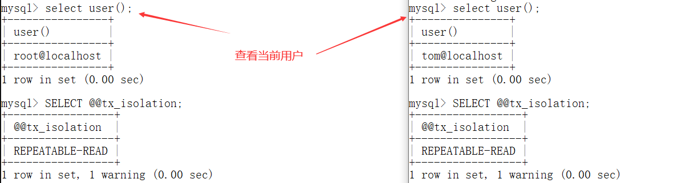
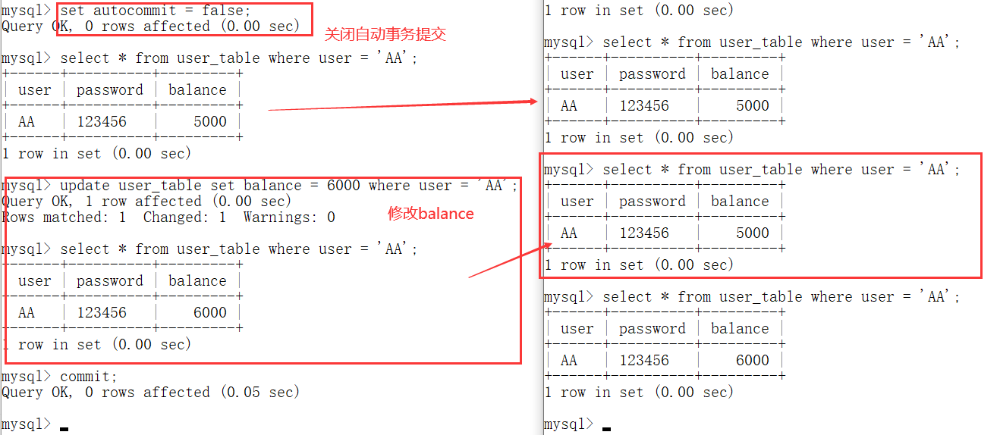
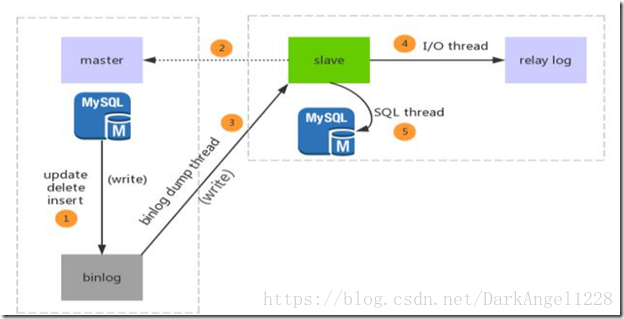

[toc]

---

# 事务

## 事物是什么：

在执行SQL语句的时候，某些业务要求，一系列操作必须全部执行，而不能仅执行一部分。例如，一个转账操作：

```mysql
要求从id=1的账户给id=2的账户转账100元
-- 第一步：将id=1的A账户余额减去100
UPDATE accounts SET balance = balance - 100 WHERE id = 1;
-- 第二步：将id=2的B账户余额加上100
UPDATE accounts SET balance = balance + 100 WHERE id = 2;
```

这两条SQL语句必须一起执行或者一起撤销：如果由于某些原因第一条语句成功，第二条语句失败，就必须全部撤销。

- **这种把多条语句作为一个整体进行操作的功能，被称为数据库事务**
- 事务是由一系列相关的SQL语句组成的最小逻辑工作单元。

<span style="color: #ff0000;"><b>事务可以确保：该事务范围内的所有操作:要么全部成功要么全部失败。如果事务失败不会对数据库数据有任何改动（就和没有执行这些SQL一样）。</b></span>

- 在多用户数据库中，对数据并发访问（data concurrency）及数据一致性（data consistency）进行控制是两项极为重要的工作。
- **Oracle以事务为单位**来处理数据，保证数据的一致性。

---


## 数据库事务具有ACID 这4个特性:

原子性(Atomicity)、一致性(Consistency)、隔离性(Isolation)、持久性(Durability)，简称为ACID。

- **原子性（Atomicity）:** 事务是一个不可分割的工作单位，<u>事务中的所有操作要么全做，要么全不做。</u>
- **一致性（Consistency）:** 事务必须使数据库<u>从一个一致性状态变换到另外一个一致性状态。</u>
  - 事务开始前数据库处于一致状态，事务结束后数据库必须任然处于一致状态
- **隔离性（Isolation）:** 事务的隔离性是指一个事务的执行不能被其他事务干扰即：
  - 一个事务内部的**操作**及**使用的数据**<u>对并发的其他事务是隔离的（暂时不一致的数据其他事务不能使用）</u>，并发执行的各个事务之间不能互相干扰。
  - *<u>事务所处的状态要么是开始的状态，要么是完成之后的状态，绝对不可能是中间状态。</u>*
- **持久性（Durability）:** 持久性是指一个事务一旦被提交，它对数据库中数据的改变就是永久性的。（数据一旦提交，就不可回滚。）
  - 即使是数据库遇到故障也不会对其有任何影响。

---


## 事务的隔离级别：

### 并发事务会产生的问题：

>  对于**同时运行的多个事务**, 当这些事务访问数据库中**相同的数据时**, 如果没有采取必要的隔离机制, 就会导致各种并发问题:

- **脏读(Dirty Read)：**
  - 一个事务T1读取到了另外一个事务T2 <u>更新但是没有提交的数据</u>，若 T2 回滚, T1读取的内容就是临时且**无效的**。
- **不可重复读(Nonrepeatable Read)：**
  - 在同一事务中，两次读取同一数据，但是得到内容不同。
  - 如T2, T1 读取了一个字段, 然后 T2 **更新**了该字段。之后, T1再次读取这个字段, 但是值不同了。
- **幻读(Phantom Read)：**
  - 同一事务中，用同样的操作读取两次，得到的记录数不相同。
  - 如T2, T1 读取一个表, 然后 T2 在该表中**插入**了一些新的行。之后T1 再次读取这个表, 发现得到的记录数不同了（多了几个字段）
- **丢失更新(Lost Update)：**
  - 事务T1读取了数据，并执行了一些操作，然后更新数据。事务T2也做相同的事，<u>则T1和T2更新数据时可能会覆盖对方的更新，而引起错误。</u>


### 事务的隔离性

>  **数据库事务的隔离性:**数据库系统必须具有隔离并发运行各个事务的能力, 使它们不会相互影响, 避免各种并发问题。

一个事务与其他事务隔离的程度称为**隔离级别**：

- 数据库规定了多种事务隔离级别, 不同隔离级别对应不同的干扰程度。

- <span style="color: #ff0000;"><b>隔离级别越高，数据一致性就越好,但是数据库事务并发执行性能越差，能处理的操作越少。</b></span>

- 因此在实际项目开发中为了考虑并发性能**一般使用不可重复读隔离级别**，它能避免丢失更新和脏读，

  - 尽管不可重复读和幻读不能避免，可以在可能出现的场合使用悲观锁或乐观锁来解决这些问题。

    

**Oracle 支持三种事务隔离级别：**

- `READ COMMITED：已提交读`，`SERIALIZABLE：串行化`，以及 SQL92 中没有包含的`只读模式（read-only mode）`。
- 
Oracle 默认的事务隔离级别为: `READ COMMITED（已提交读）`

**Mysql 支持 4 种事务隔离级别。**

- Mysql 默认的事务隔离级别为: `REPEATABLE READ(可重复读)。`


### 事务隔离级别：

1级. `Read Uncommitted(读未提交)：`

- 允许其它事务读取事务**未提交的**数据。
- 脏读，不可重复读，幻读的问题都会出现。

2级.` Read Committed(读已提交：不可重复读) ：`

- 只允许其它事务读取事务**已经提交的**数据。
- 不允许脏读，但不可重复读和幻读的问题会出现。

3级. `Repeatable Read(可重复读)：`

- 当本事务A读取记录R1期间，**禁止其他事务修改R1**。

- 不允许脏读和不可重复读，但是幻读的问题会出现。

4级.` Serializable (串行化，序列化)：`

- **最严苛的事务隔离级别**，所有事务按顺序串行化执行。
- 所有问题都可避免。


## 查看事务的隔离级别

> 每启动一个 mysql 程序, 就会获得一个单独的数据库连接:
>
> 每个数据库连接都有一个**全局变量 @@tx_isolation,** 表示当前的事务隔离级别。

- 查看当前的隔离级别: 

  ```mysql
  SELECT @@tx_isolation;
  ```

- 设置当前 mySQL 连接的隔离级别:  

  ```mysql
  set  transaction isolation level read committed;
  ```

- 设置数据库系统的全局的隔离级别:

  ```mysql
  set global transaction isolation level read committed;
  ```


---

## MySql中事务案例：

先登录root用户：

- 创建mysql数据库用户：

  ```mysql
  create user tom identified by 'abc123';
  ```

- 授予权限

  ```mysql
  #授予通过网络方式登录的tom用户，对所有库所有表的全部权限，密码设为abc123.
  grant all privileges on *.* to tom@'%'  identified by 'abc123'; 
  
   #给tom用户使用本地命令行方式，授予test数据库下的所有表的插删改查的权限。
  grant select,insert,delete,update on test.* to tom@localhost identified by 'abc123'; 
  
  flush privileges; //刷新系统权限表
  
   格式：grant 权限 on 数据库.* to 用户名@登录主机 identified by "密码";　
   //test用户对所有数据库都有 select,delete,update,create,drop 权限。
   grant select,delete,update,create,drop on *.* to test@"%" identified by "1234";
  
  ```

然后两个用户（root和tom用户）分别登录：




体现了事务的重要性：

- 在root用户中关闭了事务的自动提交，然后修改balance的值
- 在tom用户中查询发现，balance的值没有变化
  - 这就防止了脏读
- root用户用 `commit;`命令手动提交后，tom用户再进行读取发现balance的值发生了变化。




---


## Oracle 中的事务

oracle事物的基本语法有：
```mysql
    set transaction :设置事物属性。
    commit :提交事物。
    rollback :回滚事物。
    savepoint :设置保存点。
    rollback to savepoint :回滚到保存点。- 
```

oracle事物的大概可以分为两种事物，一种是`显式事物`，另外一种是`隐式事物`。

1. 显式事物：顾名思义就是**开发者主动控制事物的提交和回滚**，可以利用命令来控制事物的提交。
   - 如：常见的PL/SQL语句块就是这种类型的事物，必须利用commit提交。

2. 隐式事物：指的是oracle数据库**自己控制事物的提交和回滚**。
   - 比如oracle的DDL语句（create、drop、alter等）、DCL语句（grant、revoke）等都是一经执行直接持久化到数据库，不需要开发者自己手动提交。
   - **或者是DML语句在oracle数据库设置了自动提交：set autocommit on，也可以不需要主动提交就可以直接持久化到数据库**。

用户可以在每个事务开始时使用以下语句设定事务的隔离级别
- 已提交读模式： SET TRANSACTION ISOLATION LEVEL＝READ COMMITTED;
- 串行模式： SET TRANSACTION ISOLATION LEVEL＝ SERIALIZABLE;
- 只读模式： SET TRANSACTION＝ READ ONLY;

如果在每个事务开始时都使用 SET TRANSACTION 语句，将加重网络及处理器的负担。
**用户可以使用 ALTER SESSION语句 改变一个会话所有内事务的默认隔离级别：**
- ALTER SESSION SET ISOLATION_LEVEL SERIALIZABLE;
- ALTER SESSION SET ISOLATION_LEVEL READ COMMITTED;（无法设置会话级别的只读隔离模式）

---

# 函数依赖和范式

## 函数依赖

**函数依赖 （X → Y）是什么**： 

- 类似于函数关系 y = f(x)，在x的值确定的情况下，y的值一定是确定的。（注意y值一定x值不一定一定）

- 若在一张表中，在属性（或属性组）**X的值确定的情况下，必定能确定属性Y的值**，那么就可以说Y函数依赖于X，写作 X → Y。

**有三种函数依赖关系：**

- 部分函数依赖：
  - 设X,Y是关系R的两个属性集合，**若X’是X的真子集且存在X’→Y**，**则称Y部分函数依赖于X**。
  - 由此，我们知道。**只有当函数依赖的决定方是组合属性时，讨论部分函数依赖才有意义**，当函数依赖的决定方是单属性时，只能是完全函数依赖。
  - 例子：上表中（学号，身份证号，姓名）当然学号属性取值是唯一的，在R关系中，（学号，身份证号）->（姓名），（学号）->（姓名），（身份证号）->（姓名）；所以姓名部分函数依赖与（学号，身份证号）. 

- 完全函数依赖：

  -  设X,Y是关系R的两个属性集合，`X’`是X的真子集，存在X→Y，但每一个`X’`都有`X’!→Y`，则称**Y完全函数依赖于X**。
  - 例子：学生基本信息表R（学号，班级，姓名）假设不同的班级学号有相同的，班级内学号不能相同，在R关系中，（学号，班级）->（姓名），但是（学号）->(姓名)不成立，（班级）->(姓名)不成立，所以姓名完全函数依赖与（学号，班级）；

- 传递函数依赖：

  - 所谓传递函数依赖指：如果存在`A → B → C`的决定关系，**则C传递函数依赖于A。**

  - 在关系模式R(U)中，设X，Y，Z是U的不同的属性子集，**如果X确定Y、Y确定Z，且有X不包含Y，Y不确定X**，（X∪Y）∩Z=空集合，则称Z传递函数依赖(transitive functional dependency) 于X。

  -  例子:

    - > 假定学生关系表为Student(学号, 姓名, 年龄, 所在学院, 学院地点, 学院电话)，关键字为单一关键字"学号"，因为存在如下决定关系：  (学号) → (姓名, 年龄, 所在学院, 学院地点, 学院电话)  这个数据库是符合2NF的，但是不符合3NF，因为存在如下决定关系：  (学号) → (所在学院) → (学院地点, 学院电话)  即存在非关键字段"学院地点"、"学院电话"对关键字段"学号"的传递函数依赖。
      >
      >   它也会存在数据冗余、更新异常、插入异常和删除异常的情况，读者可自行分析得知。  把学生关系表分为如下两个表：  学生：(学号, 姓名, 年龄, 所在学院)；  学院：(学院, 地点, 电话)。  这样的数据库表是符合第三范式的，消除了数据冗余、更新异常、插入异常和删除异常。

## 范式

第一范式（1NF）关系中的每个属性都不可再分（原子性）

第二范式（2NF）**在第一范式基础上**确保每一列与主键**相关**[ 消除部分依赖 ]

- 第二范式（2NF）就是非主属性完全依赖于主关键字。所谓完全依赖是指不能存在仅依赖主关键字一部分的属性（**只有当函数依赖的决定方是组合属性时，讨论部分函数依赖才有意义，当函数依赖的决定方是单属性时，只能是完全函数依赖**。 ）

第三范式(3NF)  满足第二范式的条件下，**属性不依赖于其它非主属性**，则称R为第三范式模式。[ 消除传递依赖 ]

- 第三范式（3NF）要求一个数据库表中不包含已在其它表中已包含的非主关键字信息。


---

#是

事务控制语句：

- BEGIN 或 START TRANSACTION 显式地开启一个事务；
- COMMIT 也可以使用 COMMIT WORK，不过二者是等价的。COMMIT 会提交事务，并使已对数据库进行的所有修改成为永久性的；
- ROLLBACK 也可以使用 ROLLBACK WORK，不过二者是等价的。回滚会结束用户的事务，并撤销正在进行的所有未提交的修改；
- SAVEPOINT identifier，SAVEPOINT 允许在事务中创建一个保存点，一个事务中可以有多个 SAVEPOINT；
- RELEASE SAVEPOINT identifier 删除一个事务的保存点，当没有指定的保存点时，执行该语句会抛出一个异常；
- ROLLBACK TO identifier 把事务回滚到标记点；
- SET TRANSACTION 用来设置事务的隔离级别。InnoDB 存储引擎提供事务的隔离级别有READ UNCOMMITTED、READ COMMITTED、REPEATABLE READ 和 SERIALIZABLE。


MYSQL 事务处理主要有两种方法：

- **BEGIN** 开始一个事务
- **ROLLBACK** 事务回滚
- **COMMIT** 事务确认

2、直接用 SET 来改变 MySQL 的自动提交模式:

- **SET AUTOCOMMIT=0** 禁止自动提交
- **SET AUTOCOMMIT=1** 开启自动提交


---


# 查询优化


---


# 聚簇索引和非聚簇索引

如复合索引、前缀索引、唯一索引，都是属于非聚簇索引，在有的书籍中，又将其称为辅助索引(secondary index)。在后文中，我们称其为非聚簇索引，其数据结构为B+树。


二、 主键、外键和索引的区别 

主键、外键和索引的区别？

|        | 主键                                       | 外键                                                 | 索引                               |
| ------ | ------------------------------------------ | ---------------------------------------------------- | ---------------------------------- |
| 定义： | 唯一标识一条记录，不能有重复的，不允许为空 | 表的外键是另一表的主键, 外键可以有重复的, 可以是空值 | 该字段没有重复值，但可以有一个空值 |
| 作用： | 用来保证数据完整性                         | 用来和其他表建立联系用的                             | 是提高查询排序的速度               |
| 个数： | 主键只能有一个                             | 一个表可以有多个外键                                 | 一个表可以有多个惟一索引           |

聚集索引和非聚集索引的区别？

聚集索引一定是唯一索引。但唯一索引不一定是聚集索引。 

聚集索引，在索引页里直接存放数据，而非聚集索引在索引页里存放的是索引，这些索引指向专门的数据页的数据。


---


# DELIMITER

目的：默认情况下`delimiter`是`;`,如果有一行命令以`;`结束，那么回车后mysql将会执行该命令。

- 但有时候，不希望MySQL这么做，在为可能输入较多的语句，且语句中包含有`;`。 


解决方式：将DELIMITER 设置为 $$ 然后再语句**最后**改为默认的`;`

```mysql
DELIMITER $$    -- 定结束符为"$$"
 
 sql语句

$$ 
DELIMITER ;    -- 定结束符为";"
```

 	


---


# 存储函数

使用`CREATE FUNCTION`关键字

```mysql
CREATE FUNCTION func_name ([param_name type[,...]])
RETURNS type
[characteristic ...] 
BEGIN
	routine_body
END;

案例：
DELIMITER $$ -- ELIMITER与定界符之间，一定要有一个空格

    CREATE FUNCTIONusername_from_user(user_id INT) RETURNSVARCHAR(20)
    BEGIN -- 和上面一样
    RETURN (SELECT username FROM users2 WHERE id=user_id);
    END
$$
DELIMITER;
 
```

> 存储过程的时候一般都会**用DELIMITER`$$`.....END`$$ `DELIMITER ;放在开头和结束，**目的就是避免mysql把存储过程内部的";"解释成结束符号，最后通过“DELIMITER ;”来告知存储过程结束。


参数说明：

- func_name ：存储函数的名称,**名字不能重名**

- param_name type：可选项，指定存储函数的参数。
  - param_name 参数名
  - type参数：用于指定存储函数的参数类型(MySQL数据库中所有支持的类型)。
- RETURNS type：指定返回值的类型。
  - RETURNS 关键字
  - type是mysql中任意数据类型
- characteristic：可选项，指定存储函数的特性。

- routine_body：SQL代码内容。
  - 表示储存过程中的代码；代码一般写在`begin.....end`中来标识sql语句的开始和结束


查看存储函数

```mysql
SHOW FUNCTION STATUS LIKE 存储函数名;
SHOW CREATE FUNCTION 存储函数名;
```

删除存储过程的语法如下：

```mysql
DROP FUNCTION [ IF EXISTS ] <函数名>
```


---


# 存储过程

存储过程思想上很简单，就是数据库 SQL 语言层面的代码封装与重用。

- 创建的存储过程保存在数据库的数据字典中。

### 存储过程和存储函数的区别

|               存储函数               |         存储过程         |
| :----------------------------------: | :----------------------: |
|           不能拥有输出参数           |     可以拥有输出参数     |
|        必须包含一条RETURN语句        |   不允许包含RETURN语句   |
| 可以直接调用存储函数，不需要CALL语句 | 需要CALL语句调用存储过程 |


# 主从复制

主从复制：建立一个**和主数据库完全一样**的数据库称为**从数据库**；主数据库一般是准实时的业务数据库。


### 主从复制的原理（重中之重，面试必问）

- 数据库有个`bin-log`二进制文件，**记录了所有sql语句**。

- 把主数据库的`bin-log`文件的sql语句复制过来，在从数据的relay-log重做日志文件中再执行一次这些sql语句即可。

**主从复制：具体需要三个线程来操作（重中之重，面试必问）**

- binlog输出线程：**每当有从库连接到主库的时候**，主库都会创建一个线程然后发送binlog内容到从库。
- 从库I/O线程：当START SLAVE语句在从库开始执行之后，从库创建一个I/O线程。
  
  - 从库I/O线程读取主库的binlog输出线程发送的更新并拷贝这些更新到本地文件，其中包括relay log文件。
- 从库的SQL线程：从库创建一个SQL线程，这个线程读取从库I/O线程写到relay log的更新事件并执行。

- **总结：**

  - ##### 可以知道，对于每一个主从复制的连接，都有三个线程。拥有多个从库的主库为每一个连接到主库的从库创建一个binlog输出线程，每一个从库都有它自己的I/O线程和SQL线程。

**原理图解：**

- 步骤一：主库db的更新事件(update、insert、delete)被写到binlog
- 步骤二：从库发起连接，连接到主库
- 步骤三：此时主库创建一个binlog dump thread线程，把binlog的内容发送到从库
- 步骤四：从库启动之后，创建一个I/O线程，读取主库传过来的binlog内容并写入到relay log.
- 步骤五：还会创建一个SQL线程，从relay log里面读取内容，从Exec_Master_Log_Pos位置开始执行读取到的更新事件，将更新内容写入到slave的db.
- 注：上面的解释是解释每一步做了什么，**整个mysql主从复制是异步的**，不是按照上面的步骤执行的。




同步操作通过 3 个线程实现，其基本步骤如下：

```
主服务器将数据的更新记录到二进制日志中（记录被称作二进制日志事件）-- 主库线程；
从库将主库的二进制日志复制到本地的中继日志（relay log）-- 从库 I/O 线程；
从库读取中继日志中的事件，将其重放到数据中 -- 从库 SQL 线程。
```


### 主从复制的作用主要包括

- 数据冗余：主从复制实现了数据的热备份，是持久化之外的一种数据冗余方式。
- 故障恢复：当主节点出现问题时，可以由从节点提供服务，实现快速的故障恢复；实际上是一种服务的冗余。
- 负载均衡：在主从复制的基础上，配合读写分离，可以由**主节点提供写服**务，由**从节点提供读服务**（即写Redis数据时应用连接主节点，读Redis数据时应用连接从节点），分担服务器负载；尤其是在写少读多的场景下，通过多个从节点分担读负载，可以大大提高Redis服务器的并发量。
  - 业务量越来越大，I/O访问频率过高，单机无法满足，此时做多库的存储，降低磁盘I/O访问的频率，提高单个机器的I/O性能。
- 使用主从复制，**让主库负责写，从库负责读**，这样，即使主库出现了锁表的情景，通过读从库也可以保证业务的正常运作。通过做主从复制（读写分离）来减轻主数据库的负载。

