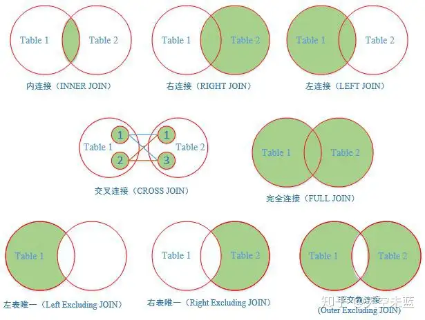
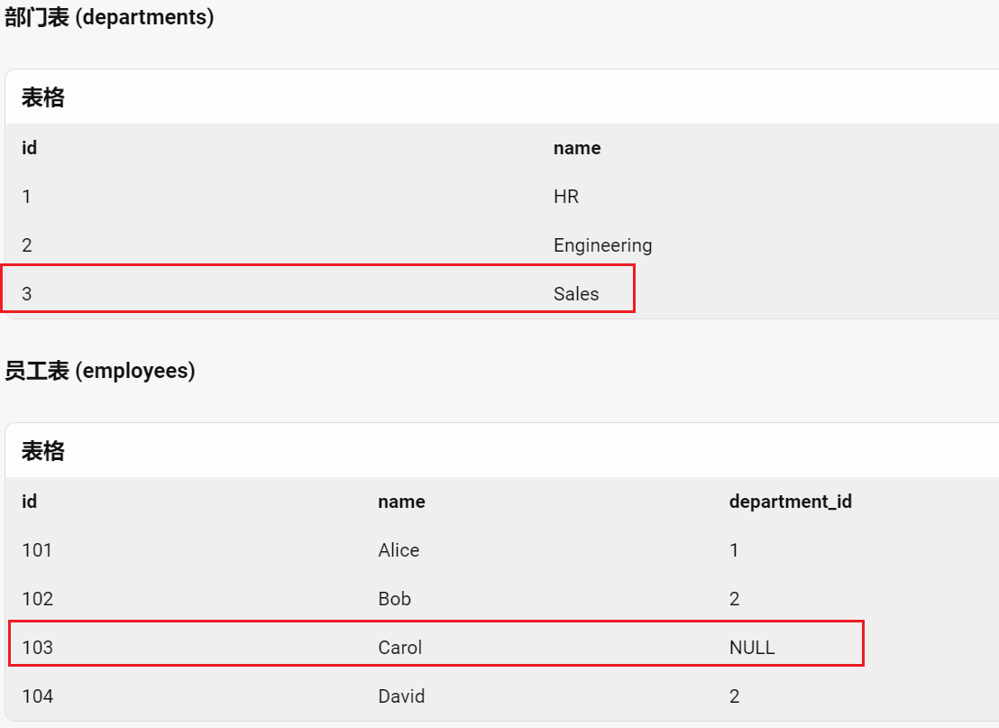
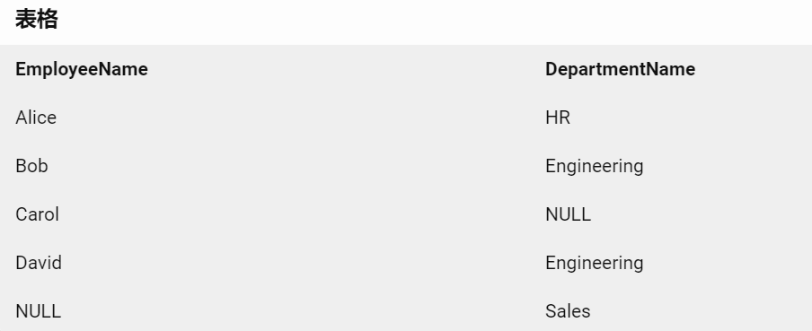
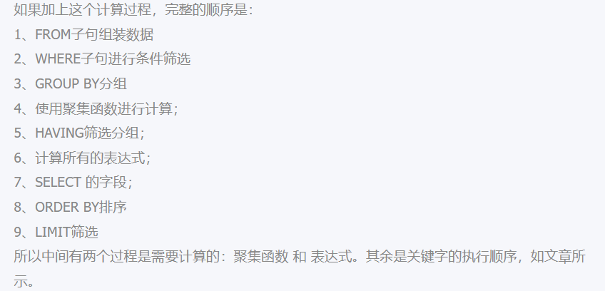

# 多表/关联/联合查询

https://zhuanlan.zhihu.com/p/68136613



## inner join 内连接、等值连接、自连接

- 下面写法是一样的
- 使用场景：内连接、等值连接、自连接 是一个东西吧本质就是**根据条件去筛选表a 和表b 之间的交集**

```sql
-- 内连接 语法是
SELECT *
FROM student A
INNER JOIN major B   
ON  A.学号=B.学号
-- 省去了INNER，直接写JOIN ，语法不同与INNER JOIN没有区别
SELECT *
FROM student A
JOIN major B  
ON  A.学号=B.学号

-- 等值链接
-- 自连接：当表a和表b 是一个表是就是自连接
SELECT *
FROM student A, major B
WHERE A.学号=B.学号 
```


## 左、右连接 ，全连接 

左连接（左外连接）关键字：left join on 或者 left outer join on

右连接（右外连接）关键字：right join on 或者 right outer join on

没有与之匹配的项则以NULL值代替。

```SQL
select * from a_table a left join b_table b on a.a_id = b.b_id;

select * from a_table a right join b_table b on a.a_id = b.b_id;
```

全链接、完全连接  FULL JOIN

- 显示两张表的并集，如果其中一张表的记录在另一张表中没有匹配的行，则对应的数据项填充NULL

```SQL
select a.*,b.* from a full join b on a.id=b.parent_id	
```




```sql
-- 使用全连接查询员工和部门信息
SELECT e.name AS EmployeeName, d.name AS DepartmentName
FROM employees e
-- 和full join 一样的效果写法不同
FULL OUTER JOIN departments d ON e.department_id = d.id;
-- 查询没有关联的数据
-- where  e.department_id IS NULL OR d.id IS NULL
```

结果是



## 交叉连接 、笛卡尔积

结果是笛卡尔积，就是第一个表的行数乘以第二个表的行数。

```SQL
SELECT * FROM a CROSS JOIN b
```


# SELECT检索数据

## SELECT 的执行顺序

查询是 RDBMS 中最频繁的操作。我们在理解 SELECT 语法的时候，还需要了解 SELECT 执行时的底层原理。只有这样，才能让我们对 SQL 有更深刻的认识。

select 的执行顺序：在 MySQL 和 Oracle 中，SELECT 执行顺序基本相同

- ```
  FROM > WHERE > GROUP BY > HAVING > SELECT的字段 > DISTINCT > ORDER BY > LIMIT
  ```

- 比如你写了一个 SQL 语句，那么它的关键字顺序和执行顺序是下面这样的：

- ```sql
  SELECT DISTINCT player_id, player_name, count(*) as num #顺序5
  FROM player JOIN team ON player.team_id = team.team_id #顺序1
  WHERE height > 1.80 #顺序2
  GROUP BY player.team_id #顺序3
  HAVING num > 2 #顺序4
  ORDER BY num DESC #顺序6
  LIMIT 2 #顺序7
  ```

- 上面sql的完整的顺序是：



在 SELECT 语句执行这些步骤的时候，**每个步骤都会产生一个虚拟表**，然后将这个虚拟表传入下一个步骤中作为输入。需要注意的是，这些步骤隐含在 SQL 的执行过程中，对于我们来说是不可见的。

SELECT 是先执行 FROM 这一步的。在这个阶段，如果是多张表联查，还会重复下面的几个步骤：直到所有表都被处理完为止。

- 首先先通过 CROSS JOIN 求笛卡尔积，相当于得到虚拟表 vt（virtual table）1-1；
- 通过 ON 进行筛选，在虚拟表 vt1-1 的基础上进行筛选，得到虚拟表 vt1-2；
- 添加外部行。如果我们使用的是左连接、右链接或者全连接，就会涉及到外部行，也就是在虚拟表 vt1-2 的基础上增加外部行，得到虚拟表 vt1-3。

## 什么情况下用 SELECT*，如何提升 SELECT 查询效率

所以如果我们不需要把所有列都检索出来，还是先指定出所需的列名，因为写清列名，可以减少数据表查询的网络传输量，而且考虑到在实际的工作中，我们往往不需要全部的列名，因此你需要养成良好的习惯，写出所需的列名。

## COUNT(*) ，  COUNT(1) ，COUNT(具体字段)

在MySQL InnoDB存储引擎中**，COUNT(*)和COUNT(1)都是对的所有结果进行的COUNT**。如果有WHERE子句，则是对所有符合筛选条件的数据行进行统计。如果没有WHERE子句，则是对数据表的数据行数进行统计。

- 因此COUNT(*)和COUNT(1)本质上没有区别，执行的复杂度都是O(N)，也就是采用全表扫描，进行循环+计数的方式进行统计。
- 在InnoDB引擎中，如果是采用COUNT(*)和COUNT(1)来统计数据行数，要尽量采用二级索引，因为主键采用的索引是聚簇索引，聚簇索引包含的信息多，明显会大于二级索引（非聚簇索引）。
- 对于查找具体的行来说，采用主键索引效率更高。而对于COUNT(*)和COUNT(1)这种，不需要查找具体的行，只是统计行数来说，系统会自动采用占用空间更小的二级索引来进行统计。 如果有多个二级索引的时候，会使用key_len小的二级索引进行扫描。当没有二级索引的时候，才会采用主键索引来进行统计。

如果是MySQL MyISAM存储引擎，统计数据表的行数只需要O(1)复杂度，这是因为每张MyISAM的数据表都有一个meta信息有存储了row_count值。而一致性由表级锁来保证。而InnoDB支持事务，采用行级锁和MVCC机制，所以无法像MyISAM一样，只维护一个row_count变量。因此就需要采用扫描全表，进行循环+计数的方式来完成统计。

需要注意的是，在实际执行中COUNT(*)和COUNT(1)执行时间可能略有差别，不过你还是可以把这两个在执行效率上看成是相等的。


优化总结：

 一般情况下：`COUNT(*) = COUNT(1) > COUNT(字段) `

- 所以尽量使用`COUNT(*)`，当然如果你要统计的是就是某个字段的非空数据行数，那另当别论。毕竟执行效率比较的前提是要结果一样才行。 

如果要统计`COUNT(*)`，尽量在数据表上建立二级索引，系统会自动采用key_len小的二级索引进行扫描，这样当我们使用SELECT COUNT(*)的时候效率就会提升，有时候提升几倍甚至更高都是有可能的。


## DISTINCT 去除重复行

关于单个表的 SELECT 查询，还有一个非常实用的操作，就是从结果中去掉重复的行。使用的关键字是 DISTINCT。

- DISTINCT 需要放到所有列名的前面
- DISTINCT 其实是**对后面所有列名的组合**进行去重

```
SQL：SELECT DISTINCT attack_range FROM heros

SQL：SELECT DISTINCT attack_range, name FROM heros
```


## ORDER BY

使用 ORDER BY 子句有以下几个点需要掌握：

- 排序的列名：ORDER BY 后面可以有一个或多个列名，如果是多个列名进行排序，会按照后面第一个列先进行排序，当第一列的值相同的时候，再按照第二列进行排序，以此类推。
- 排序的顺序：ORDER BY 后面可以注明排序规则，ASC 代表递增排序，DESC 代表递减排序。如果没有注明排序规则，默认情况下是按照 ASC 递增排序。我们很容易理解 ORDER BY 对数值类型字段的排序规则，但如果排序字段类型为文本数据，就需要参考数据库的设置方式了，这样才能判断 A 是在 B 之前，还是在 B 之后。比如使用 MySQL 在创建字段的时候设置为 BINARY 属性，就代表区分大小写。
- 非选择列排序：ORDER BY 可以使用非选择列进行排序，所以即使在 SELECT 后面没有这个列名，你同样可以放到 ORDER BY 后面进行排序。
- ORDER BY 的位置：ORDER BY 通常位于 SELECT 语句的最后一条子句，否则会报错。


## 约束返回结果的数量

我们可以约束返回结果的数量，使用 LIMIT 关键字。

```
SQL：SELECT name, hp_max FROM heros ORDER BY hp_max DESC LIMIT 5
```

有一点需要注意，约束返回结果的数量，在不同的 DBMS 中使用的关键字可能不同。在 MySQL、PostgreSQL、MariaDB 和 SQLite 中使用 LIMIT 关键字，而且需要放到 SELECT 语句的最后面。如果是 SQL Server 和 Access，需要使用 TOP 关键字，比如：

```
SQL：SELECT TOP 5 name, hp_max FROM heros ORDER BY hp_max DESC
```

如果是 DB2，使用FETCH FIRST 5 ROWS ONLY这样的关键字：

```
SQL：SELECT name, hp_max FROM heros ORDER BY hp_max DESC FETCH FIRST 5 ROWS ONLY
```

如果是 Oracle，你需要基于 ROWNUM 来统计行数：

```
SQL：SELECT name, hp_max FROM heros WHERE ROWNUM <=5 ORDER BY hp_max DESC
```


# EXISTS 查询和 IN 查询

**IN表是外边和内表进行hash连接，是先执行子查询。** 

**EXISTS是对外表进行循环，然后在内表进行查询。**

- EXISTS 子查询用来判断条件是否满足，满足的话为 True，不满足为 False。

 **IN有一个缺陷是不能判断NULL，因此如果字段存在NULL值，则会出现返回，因为最好使用NOT EXISTS。**

in 和 exists的区别: 如果子查询得出的结果集记录较少，主查询中的表较大且又有索引时应该用in, 反之如果外层的主查询记录较少，子查询中的表大，又有索引时使用exists。

-  **因此如果外表数据量大，则用IN，如果外表数据量小，用EXISTS。**

其实我们区分in和exists主要是造成了**驱动顺序的改变(这是性能变化的关键)**

- 如果是exists，那么以外层表为驱动表，先被访问，
- 如果是IN，那么先执行子查询，
- 所以我们会以驱动表的快速返回为目标，那么就会考虑到索引及结果集的关系了 ，
- 另外IN时不对NULL进行处理。

案例:

- 比如 EXISTS 查询和 IN 查询在某些情况下可以得到相同的结果，但是具体执行起来，哪个效率更高呢？

```
SELECT * FROM A WHERE cc IN (SELECT cc FROM B)
SELECT * FROM A WHERE EXISTS (SELECT cc FROM B WHERE B.cc=A.cc)
```

- 在查询过程中，我们需要判断表 A 和表 B 的大小。如果在有索引的情况下，表 A 比表 B 大，那么 IN 子查询的效率比 EXISTS 子查询效率高。


# **on** 和 **where** 的运用

外连接中ON 和 where 筛选会对效率有很大影响：

- 外连接执行顺序  FROM - ON -  JOIN-  WHERE
- 先进行on的过滤, 而后才进行join, 这样就避免了两个大表产生全部数据的笛卡尔积的庞大数据. 
- 这些步骤执行时, 每个步骤都会产生一个虚拟表，该虚拟表被用作下一个步骤的输入。这些虚拟表对调用者（客户端应用程序或者外部查询）不可用。只是最后一步生成的表才会返回 给调用者。
- **on** 条件是在生成临时表时使用的条件，它不管 **on** 中的条件是否为真，都会返回主表中的记录。
- **where** 条件是在临时表生成好后，再对临时表进行过滤的条件。

可以看到第一条sql 会慢于第二条sql ，效率取决于临时表的数据量

- **建议：尽可能在on后面的条件（ON条件）限制**

```sql
-- 根据on条件:tab1.size = tab2.size 生成临时表A ， 在临时表A中执行 tab2.name='AAA'过滤
select * from tab1 left join tab2 on tab1.size = tab2.size where tab2.name='AAA'
-- 根据on tab1.size = tab2.size and tab2.name='AAA' 生成临时表A (条件不为真也会返回左表中的记录)
select * from tab1 left join tab2 on tab1.size = tab2.size and tab2.name='AAA'
```


# Postgresql取并集，交集，差集

`UNION` 并集 ： `select1 UNION  select2`

- `UNION` 会移除所有重复的行，要保留重复的行，需要使用 `UNION ALL`。
- `UNION` 可能将第一个查询的结果集放在第二个查询的结果集之前、之后或之间。可以使用 [`ORDER BY`](https://pg.sjk66.com/postgresql/order-by.html) 对合并后的结果集进行排序。

`INTERSECT` 交集 : `select1 INTERSECTselect2`

`EXCEPT`  差集:  `select1 EXCEPT select2`

其中 select1 和 select2 的SELECT子句中

- 字段的个数和顺序必须相同
- 查询中的相应字段必须具有兼容的数据类型
  - （如果int和bigint结果取bigint,varchar(5)和varchar(10)结果取varchar(10)），字段名可以不同，但是最终结果会以第一个SELECT子句中字段名称返回。


```sql
CREATE TABLE employees (
 employee_id serial PRIMARY KEY,
 employee_name VARCHAR (255) NOT NULL
);

CREATE TABLE keys (
 employee_id INT PRIMARY KEY,
 effective_date DATE NOT NULL,
 FOREIGN KEY (employee_id) REFERENCES employees (employee_id)
);

CREATE TABLE hipos (
 employee_id INT PRIMARY KEY,
 effective_date DATE NOT NULL,
 FOREIGN KEY (employee_id) REFERENCES employees (employee_id)
);

INSERT INTO employees (employee_name)
VALUES
 ('Joyce Edwards'),
 ('Diane Collins'),
 ('Alice Stewart'),
 ('Julie Sanchez'),
 ('Heather Morris'),
 ('Teresa Rogers'),
 ('Doris Reed'),
 ('Gloria Cook'),
 ('Evelyn Morgan'),
 ('Jean Bell');

INSERT INTO keys
VALUES
 (1, '2000-02-01'),
 (2, '2001-06-01'),
 (5, '2002-01-01'),
 (7, '2005-06-01');

INSERT INTO hipos
VALUES
 (9, '2000-01-01'),
 (2, '2002-06-01'),
 (5, '2006-06-01'),
 (10, '2005-06-01');
 
-- 在最后一个查询后面加上 ORDER BY 可以对对合并后的结果集进行排序
SELECT employee_id FROM keys
INTERSECT
SELECT employee_id FROM hipos 
ORDER BY employee_id;


```


# DISTINCT 去重

`DISTINCT` 放在 `SELECT` 语句中，用于删除结果集中重复的行，`DISTINCT` 子句为每组重复项保留一行，它可用于数据表的一列或多列。

如果指定多个字段，则 `DISTINCT` 子句将根据这些字段的值的组合来评估重复项。

```sql
SELECT  DISTINCT field_1, field_2 FROM table_name;
```

PostgreSQL 还提供了 `DISTINCT ON(表达式)`，用来在多字段里，依然使用第一个字段来判断是否重复。

- 从 `SELECT` 语句返回的行的顺序是不可预知的，因此每个副本组的“第一行”也是不可预知的。所以，我们建议在使用 `DISTINCT ON(表达式)` 的语句时，总是使用 `ORDER BY` 子句进行[排序](https://pg.sjk66.com/postgresql/order-by.html)，以便使返回的结果集更清晰明了。
- 注意：`DISTINCT ON(表达式)`里的 `表达式`，必须与 `ORDER BY` 子句的第一个表达式一致。

```sql
SELECT  DISTINCT ON(field_1), field_2
FROM table_name
ORDER BY  field_1, field_2;
```


# 分页

`select * from persons limit A offset B;`

- A就是你需要多少行；B就是查询的起点位置。
- select * from persons limit 5 offset 0 ;   起点0开始查询，返回5条数据。

`select * from persons limit 5 ;`

- 即读取 5 条数据：

`select * from persons order by lastname limit 5 offset 0;` 

- 按规则排序，同时也要分页：


# with as语句:定义临时表

- with  as 子句定义的查询在后面字句中可以使用，但是with中不能嵌套with
- 如果定义了with 子句但是不使用会报错ora-32035
- with子句只能被select查询块引用，with子句后必须接着select 语句
- with定义的内存临时表一旦被select 语句检索一次，系统就会在内存中清理掉这张临时表

```sql
-- 可以同时定义多个临时表
With 
	Subtable1 as (select 1...), //as和select中的括号都不能省略
	Subtable2 as (select 2...), //后面的没有with，逗号分割，同一个主查询同级别地方，with子查询只能定义一次

	Subtablen as (select n...) //与下面的实际查询之间没有逗号
select * from Subtable1;


WITH  
	Q1 AS (SELECT 3 + 5 S ),  
    Q2 AS (SELECT 3 * 5 M ),  
    Q3 AS (SELECT S, M, S + M, S * M FROM Q1, Q2)  
SELECT * FROM Q3; 
-- 会报错：with定义的内存临时表一旦被select 语句检索一次，系统就会在内存中清理掉这张临时表
SELECT * FROM Q2; 
```

WITH中可以不仅可以使用SELECT语句，同时还能使用DELETE，UPDATE，INSERT语句。因此，可以使用WITH，在一条SQL语句中进行不同的操作，如下例所示。

```sql
WITH moved_rows AS (
  DELETE FROM t_student where name = '张三'
  RETURNING *
)
INSERT INTO products_log SELECT * FROM moved_rows;
SELECT * FROM t_student where name = '张三';
SELECT * FROM  products_log;
```

WITH使用注意事项

1、WITH中的数据修改语句会被执行一次，并且肯定会完全执行，无论主语句是否读取或者是否读取所有其输出。而WITH中的SELECT语句则只输出主语句中所需要记录数。

2、WITH中使用多个子句时，这些子句和主语句会并行执行，所以当存在多个修改子语句修改相同的记录时，它们的结果不可预测。

3、所有的子句所能“看”到的数据集是一样的，所以它们看不到其它语句对目标数据集的影响。这也缓解了多子句执行顺序的不可预测性造成的影响。

4、如果在一条SQL语句中，更新同一记录多次，只有其中一条会生效，并且很难预测哪一个会生效。

5、如果在一条SQL语句中，同时更新和删除某条记录，则只有更新会生效。

6、目前，任何一个被数据修改CTE的表，不允许使用条件规则，和ALSO规则以及INSTEAD规则。


# 递归CTE语法：with recursive

- https://juejin.cn/post/6844904061414670350
- https://www.modb.pro/db/12389
- https://www.cnblogs.com/ricklz/p/12590618.html

处理不确定深度的层级结构，比如组织机构，一个常用的设计是在一张表里面保存 ID 和 Parent_ID ，并且通过自联结的办法构造一颗树。这种方式对写数据的过程很友好，但是查询过程就变得相对复杂。在不引入MPTT模型的前提下，必须通过递归算法来查询某个节点和下级子节点。

- 通过使用RECURSIVE关键字：一个WITH查询可以引用它自己的输出。

```sql
create table document_directories
(
    id         bigserial                                          not null
        constraint document_directories_pk
            primary key,
    name       text                                               not null,
    created_at timestamp with time zone default CURRENT_TIMESTAMP not null,
    updated_at timestamp with time zone default CURRENT_TIMESTAMP not null,
    parent_id  bigint                   default 0                 not null
);

comment on table document_directories is '文档目录';

comment on column document_directories.name is '名称';

comment on column document_directories.parent_id is '父级id';

INSERT INTO public.document_directories (id, name, created_at, updated_at, parent_id) VALUES (1, '中国', '2020-03-28 15:55:27.137439', '2020-03-28 15:55:27.137439', 0);
INSERT INTO public.document_directories (id, name, created_at, updated_at, parent_id) VALUES (2, '上海', '2020-03-28 15:55:40.894773', '2020-03-28 15:55:40.894773', 1);
INSERT INTO public.document_directories (id, name, created_at, updated_at, parent_id) VALUES (3, '北京', '2020-03-28 15:55:53.631493', '2020-03-28 15:55:53.631493', 1);
INSERT INTO public.document_directories (id, name, created_at, updated_at, parent_id) VALUES (4, '南京', '2020-03-28 15:56:05.496985', '2020-03-28 15:56:05.496985', 1);
INSERT INTO public.document_directories (id, name, created_at, updated_at, parent_id) VALUES (5, '浦东新区', '2020-03-28 15:56:24.824672', '2020-03-28 15:56:24.824672', 2);
INSERT INTO public.document_directories (id, name, created_at, updated_at, parent_id) VALUES (6, '徐汇区', '2020-03-28 15:56:39.664924', '2020-03-28 15:56:39.664924', 2);
INSERT INTO public.document_directories (id, name, created_at, updated_at, parent_id) VALUES (7, '漕宝路', '2020-03-28 15:57:14.320631', '2020-03-28 15:57:14.320631', 6);

WITH RECURSIVE res AS (
    SELECT id, name, parent_id FROM document_directories WHERE id = 5
    UNION
    SELECT dd.id, dd.name || ' > ' || res.name, dd.parent_id FROM res
    INNER JOIN document_directories dd ON dd.id = res.parent_id
)
select * from res


WITH RECURSIVE res(id, name, parent_id) AS (
    SELECT id, name, parent_id FROM document_directories WHERE id = 5
    UNION
    SELECT dd.id,dd.name || ' > ' || d.name,dd.parent_id FROM res d
    INNER JOIN document_directories dd ON dd.id = d.parent_id
)
select * from res
```

WITH RECURSIVE语句包含了两个部分

- non-recursive term（非递归部分），即上例中的union all前面部分
- recursive term（递归部分），即上例中union all后面部分 （有用到as后的CTE表）

迭代（递归）步骤：

- 第一次是执行非递归部分即： SELECT id, name, parent_id FROM document_directories WHERE id = 5
  - 将执行结果放入临时表res中
- 后续迭代执行的都是：
  - SELECT dd.id, dd.name || ' > ' || res.name, dd.parent_id FROM res  INNER JOIN document_directories dd ON dd.id = res.parent_id
  - 将执行结果放入临时表res中
- 直到没有数据，结束递归，将前几个步骤的结果集合并，即得到最终的WITH RECURSIVE的结果集
- 严格来讲，这个过程实现上是一个迭代的过程而非递归，不过RECURSIVE这个关键词是SQL标准委员会定立的，所以PostgreSQL也延用了RECURSIVE这一关键词。

案例二：

```sql
drop table if exists demo.tree_data;

create table tree_data (
    id integer,
    code text,
    pid integer,
    sort integer
);

insert into tree_data values(1, '中国', null, 1);
insert into tree_data values(2, '四川', 1, 1);
insert into tree_data values(3, '云南', 1, 2);
insert into tree_data values(4, '成都', 2, 1);
insert into tree_data values(5, '绵阳', 2, 2);	
insert into tree_data values(6, '武侯区', 4, 1);
insert into tree_data values(7, '昆明', 3, 1);	

with recursive cte as
(
  -- 先查询root节点  
  select
    id, code, pid, '' as pcode,
    code as branch
  from  tree_data where id = 1
  union all
  -- 通过cte递归查询root节点的直接子节点  
  select
    origin.id, origin.code, cte.id as pid, cte.code as pcode,
    cte.branch || '~' || origin.code
  from cte
  join tree_data as origin on origin.pid = cte.id
)
select
  id,code, pid, pcode, branch, 
  -- 通过计算分隔符的个数，模拟计算出树形的深度
  (length(branch)-length(replace(branch, '~', ''))) as lvl
from cte;
```

## WITH RECURSIVE 使用限制

1、 如果在recursive term中使用LEFT JOIN，自引用必须在“左”边
2、 如果在recursive term中使用RIGHT JOIN，自引用必须在“右”边
3、 recursive term中不允许使用FULL JOIN
4、 recursive term中不允许使用GROUP BY和HAVING
5、 不允许在recursive term的WHERE语句的子查询中使用CTE的名字
6、 不支持在recursive term中对CTE作aggregation
7、 recursive term中不允许使用ORDER BY
8、 LIMIT / OFFSET不允许在recursive term中使用
9、 FOR UPDATE不可在recursive term中使用
10、 recursive term中SELECT后面不允许出现引用CTE名字的子查询
11、 同时使用多个CTE表达式时，不允许多表达式之间互相访问（支持单向访问）
12、 在recursive term中不允许使用FOR UPDATE

CTE 优缺点

1、 可以使用递归 WITH RECURSIVE，从而实现其它方式无法实现或者不容易实现的查询
2、 当不需要将查询结果被其它独立查询共享时，它比视图更灵活也更轻量
3、 CTE只会被计算一次，且可在主查询中多次使用
4、 CTE可极大提高代码可读性及可维护性
5、 CTE不支持将主查询中where后的限制条件push down到CTE中，而普通的子查询支持

UNION与UNION ALL的区别

- UNION ALL不去重不排序(效率高)
- UNION去重且排序


# like 操作符 和 通配符 

`like`、`not like`在SQL中用于模糊查询，**`%`表示任意个字符，`_`表示单个任意字符，如果需要在模糊查询中查询这两个通配符，需要用`ESCAPE`进行转义**

`ilike 、not ilike`表示在模糊匹配字符串时不区分大小写，i即是ignore的意思。

```sql
-- 这里表明/作为转义符，所以就可以在模糊查询中将通配符作为普通字符来搜索。另外，因为左模糊查询效率低下，一般不推荐在应用中去使用。
select * from table where name like '张/_小%' escape '/';
```

**索引字段，like 搜索前不要加%.要不然会失效。**

## like 和 ILIKE

https://blog.csdn.net/lewky_liu/article/details/88047548

`like`、`not like`在SQL中用于模糊查询，`%`表示任意个字符，`_`表示单个任意字符，如果需要在模糊查询中查询这两个通配符，需要用`ESCAPE`进行转义

`ilike`表示在模糊匹配字符串时不区分大小写，i即是ignore的意思。

`not ilike`表示不模糊匹配字符串且不区分大小写。

```sql
-- 这里表明/作为转义符，所以就可以在模糊查询中将通配符作为普通字符来搜索。另外，因为左模糊查询效率低下，一般不推荐在应用中去使用。
select * from table where name like '张/_小%' escape '/';
```

## `~`和`~*`

`~`表示匹配正则表达式，且区分大小写。

`~*`表示匹配正则表达式，且不区分大小写。

`!~`是`~`的否定用法，表示不匹配正则表达式，且区分大小写。

`!~*`是`~*`的否定用法，表示不匹配正则表达式，且不区分大小写。

可以通过这两个操作符来实现like和ilike一样的效果，如下：

```
1.匹配以“张”开头的字符串
select * from table where name ~ '^张';

2.匹配以“小”结尾的字符串
select * from table where name ~ '小$';
```

PostgreSQL 还提供了一些运算符：

- `~~` 运算符和 `LIKE` 等效。
- `~~*` 运算符和 `ILIKE` 等效。
- `!~~` 运算符和 `NOT LIKE` 等效。
- `!~~*` 运算符和 `NOT ILIKE` 等效。


# 序列（Sequence）

语法：取值范围是 [-2147483647, 2147483647] 之间

- 整型数值

```
CREATE SEQUENCE sequencename
	[ INCREMENT increment ]		-- 自增数，默认是 1
	[ MINVALUE minvalue ]		-- 最小值
	[ MAXVALUE maxvalue ]		-- 最大值
	[ START start ]				-- 设置起始值
	[ CACHE cache ]				-- 是否预先缓存
	[ CYCLE ]					-- 是否到达最大值的时候，重新返回到最小值，默认为不循环
```

 **Sequence** 的函数

| **函数**                            | **返回类型** | **描述**                                                     |
| ----------------------------------- | ------------ | ------------------------------------------------------------ |
| nextval(regclass)                   | bigint       | 递增序列对象到它的下一个数值并且返回该值。这个动作是自动完成的。即使多个会话并发运行nextval，每个进程也会安全地收到一个唯一的序列值。 |
| currval(regclass)                   | bigint       | 在当前会话中返回最近一次`nextval`抓到的该序列的数值。(如果在本会话中从未在该序列上调用过 `nextval`，那么会报告一个错误。)请注意因为此函数返回一个会话范围的数值，而且也能给出一个可预计的结果，因此可以用于判断其它会话是否执行过`nextval。` |
| lastval()                           | bigint       | 返回当前会话里最近一次`nextval`返回的数值。这个函数等效于`currval`，只是它不用序列名为参数，它抓取当前会话里面最近一次`nextval`使用的序列。如果当前会话还没有调用过`nextval`，那么调用`lastval将`会报错。 |
| setval(regclass, bigint)            | bigint       | 重置序列对象的计数器数值。设置序列的`last_value`字段为指定数值并且将其`is_called`字段设置为`true`，表示下一次`nextval`将在返回数值之前递增该序列。 |
| setval(regclass, bigint, is_called) | bigint       | 重置序列对象的计数器数值。功能等同于上面的setval函数，只是`is_called`可以设置为`true`或`false`。如果将其设置为`false`，那么下一次`nextval`将返回该数值，随后的`nextval`才开始递增该序列。 |

```sql
SELECT setval('shipments_ship_id_seq', 1010);
SELECT nextval('shipments_ship_id_seq');
-- 删除序列
DROP SEQUENCE shipments_ship_id_seq;

#查看 r =普通表， i =索引，S =序列，v =视图，m =物化视图， c =复合类型，t = TOAST表，f =外部表
select * from pg_class where relkind='S';
```

查询序列的当前值，有两种办法：

1. `select currval('seqname')` 仅获得**当前会话**最后一次生成的值。实际执行中，必须先执行nextval后才能执行currval，这样会修改源[数据库](https://cloud.tencent.com/solution/database?from=10680)，不可取
2. `select last_value from seqname` 获得**所有会话**中最后一次生成的值

修改目标库序列的当前值，也有两种办法：

1. `select setval('seqname', val)` 修改序列当前值（**原子操作**）
2. `alter sequence seqname restart with val` 修改序列当前值（**阻塞性事务**，会阻塞其他会话的nextval操作）


# 截断表：TRUNCATE TABLE

`TRUNCATE TABLE  table_name` , 

- 删除所有的行数据，并重新创建整个表
- TRUNCATE TABLE语句删除并重新创建表，并使任何自动增量值都重置为其初始值（通常为1）。
- TRUNCATE TABLE与DELETE相比，它更快并且使用的系统资源更少，因为DELETE扫描表以生成受影响的行数，然后逐行删除行，并为每个删除的行在数据库日志中记录一个条目，而TRUNCATE TABLE只删除所有行而不提供任何其他信息。

