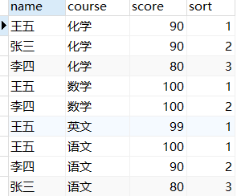
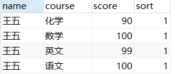
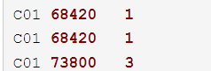
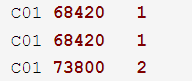

# PostgreSQL 分组排序和排序函数

https://blog.csdn.net/ZHUXIUQINGIT/article/details/100587839

https://blog.csdn.net/baidu_38432186/article/details/110238317

语法：`row_number() over( [partition by 字段 ] order by 字段[desc])`

- row_number()：为返回的记录定义各行编号
- partition by col1：根据col1字段进行分组
- order by col2：根据col2字段进行排序
- over()里头的分组以及排序的执行晚于 where group by order by 的执行。
- partition by 用于给结果集分组，如果没有指定那么它把整个结果集作为一个分组，它和聚合函数不同的地方在于它能够返回一个分组中的多条记录，而聚合函数一般只有一个反映统计值的记录。

```sql
-- 按照course分组并组内按照score排序
select *, row_number() over(partition by course order by score desc) as sort from t_student;

-- 找到没门学科第一名的学生信息
WITH T0 as(select *, row_number() over(partition by course order by score desc) as sort from t_student)
SELECT * FROM T0 where sort = 1;

```

 

## row_number() over()分组排序功能：

- row_nubmer(),这个排序函数的特点是相同数据,先查出的排名在前,没有重复值

```
-- employee表根据部门分组排序。
SELECT empno,WORKDEPT,SALARY, Row_Number() OVER (partition by workdept ORDER BY salary desc) rank FROM employee 
-- 对查询结果进行排序：（无分组）
SELECT empno,WORKDEPT,SALARY, Row_Number() OVER (ORDER BY salary desc) rank FROM employee   
```

## rank() over()是跳跃排序

```sql
select workdept,salary,rank() over(partition by workdept order by salary) as dense_rank_order from emp order by workdept;  
```

和row_number() over()区别是：可以看到分数相同的是并列第一然后2直接跳跃了



## dense_rank() over()是连续排序

- dense_rank() over()是连续排序，有两个第二名时仍然跟着第三名。相比之下row_number是没有重复值的 ．

```
select workdept,salary,dense_rank() over(partition by workdept order by salary) as dense_rank_order from emp order by workdept;  
```




总结一下：
row_numer()：按查出的记录数前后排序，序号不重复。即第1条记录序号为1，第2条记录序号2，第3条记录序号为3（不考虑3条记录的排序字段是否重复）。
rank()：跳跃排序，排序字段值相同的序号相同。例如3条记录中前2条排序字段值相同，第3条不同，则前3条记录的排序号为1,1,3。
dense_rank()：连续排序。例如前4条记录中，1和2的排序字段值相同，3和4的排序字段值相同，则4条记录的排序号为1,1,2,2。

