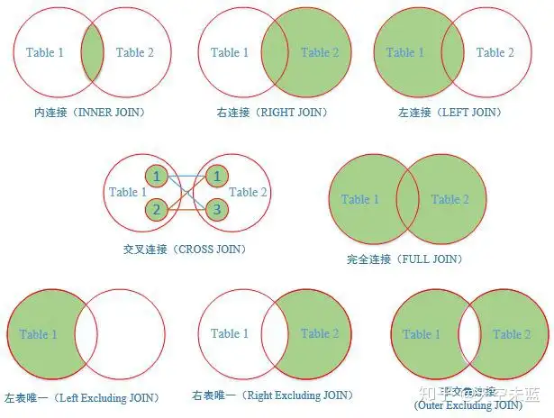
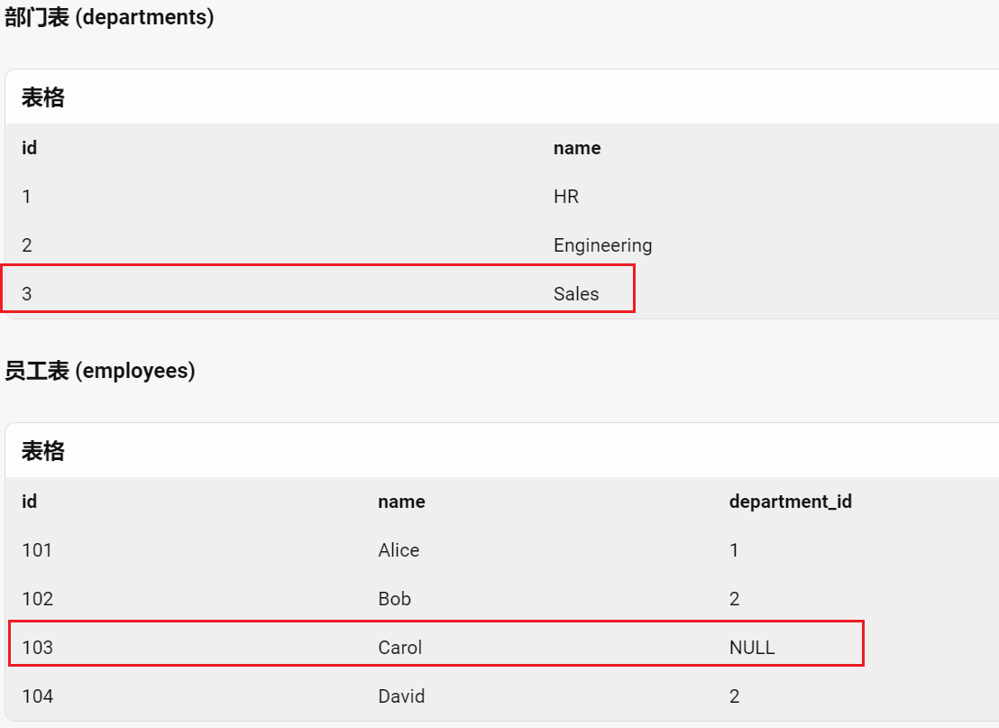
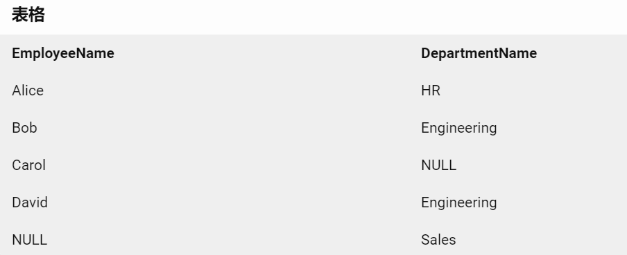

[TOC]


# 知识大纲（关键字）


查询语句的执行顺序：

select 中 聚合函数

select 中 case...when...then语句

select 中 top

默认值

select  相关面试题

from 多表查询，关联查询，链接查询

Where 条件语句，逻辑运算符，模糊查询，范围查询，空值判断，判空处理

分组，分组聚合

排序


# 多表/关联/联合查询

https://zhuanlan.zhihu.com/p/68136613



## inner join 内连接、等值连接、自连接

- 下面写法是一样的
- 使用场景：内连接、等值连接、自连接 是一个东西吧本质就是**根据条件去筛选表a 和表b 之间的交集**

```sql
-- 内连接 语法是
SELECT *
FROM student A
INNER JOIN major B   
ON  A.学号=B.学号
-- 省去了INNER，直接写JOIN ，语法不同与INNER JOIN没有区别
SELECT *
FROM student A
JOIN major B  
ON  A.学号=B.学号

-- 等值链接
-- 自连接：当表a和表b 是一个表是就是自连接
SELECT *
FROM student A, major B
WHERE A.学号=B.学号 
```


## 左、右连接 ，全连接 

左连接（左外连接）关键字：left join on 或者 left outer join on

右连接（右外连接）关键字：right join on 或者 right outer join on

没有与之匹配的项则以NULL值代替。

```SQL
select * from a_table a left join b_table b on a.a_id = b.b_id;

select * from a_table a right join b_table b on a.a_id = b.b_id;
```

全链接、完全连接  FULL JOIN

- 显示两张表的并集，如果其中一张表的记录在另一张表中没有匹配的行，则对应的数据项填充NULL

```SQL
select a.*,b.* from a full join b on a.id=b.parent_id	
```




```sql
-- 使用全连接查询员工和部门信息
SELECT e.name AS EmployeeName, d.name AS DepartmentName
FROM employees e
-- 和full join 一样的效果写法不同
FULL OUTER JOIN departments d ON e.department_id = d.id;
-- 查询没有关联的数据
-- where  e.department_id IS NULL OR d.id IS NULL
```

结果是




## 交叉连接 、笛卡尔积

结果是笛卡尔积，就是第一个表的行数乘以第二个表的行数。

```SQL
SELECT * FROM a CROSS JOIN b
```


# **on** 和 **where** 

外连接中ON 和 where 筛选会对效率有很大影响：

- 外连接执行顺序  FROM - ON -  JOIN-  WHERE
- 先进行on的过滤, 而后才进行join, 这样就避免了两个大表产生全部数据的笛卡尔积的庞大数据. 
- 这些步骤执行时, 每个步骤都会产生一个虚拟表，该虚拟表被用作下一个步骤的输入。这些虚拟表对调用者（客户端应用程序或者外部查询）不可用。只是最后一步生成的表才会返回 给调用者。
- **on** 条件是在生成临时表时使用的条件，它不管 **on** 中的条件是否为真，都会返回主表中的记录。
- **where** 条件是在临时表生成好后，再对临时表进行过滤的条件。

可以看到第一条sql 会慢于第二条sql ，效率取决于临时表的数据量

- **建议：尽可能在on后面的条件（ON条件）限制**

```sql
-- 根据on条件:tab1.size = tab2.size 生成临时表A ， 在临时表A中执行 tab2.name='AAA'过滤
select * from tab1 left join tab2 on tab1.size = tab2.size where tab2.name='AAA'
-- 根据on tab1.size = tab2.size and tab2.name='AAA' 生成临时表A (条件不为真也会返回左表中的记录)
select * from tab1 left join tab2 on tab1.size = tab2.size and tab2.name='AAA'
```


# sql注入联合查询

